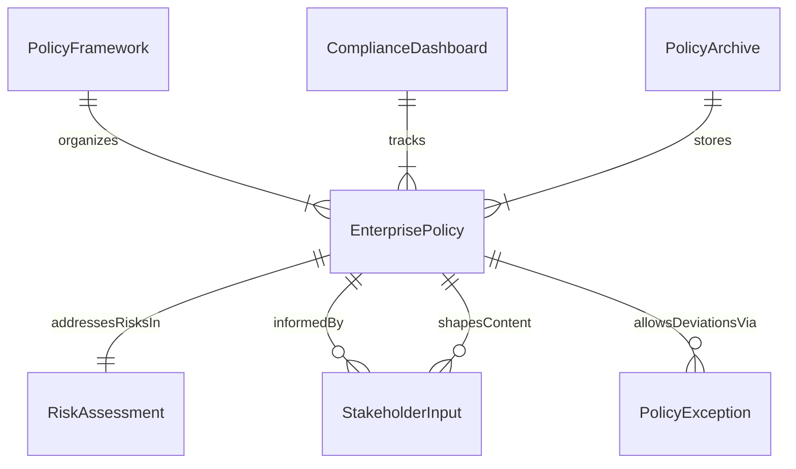
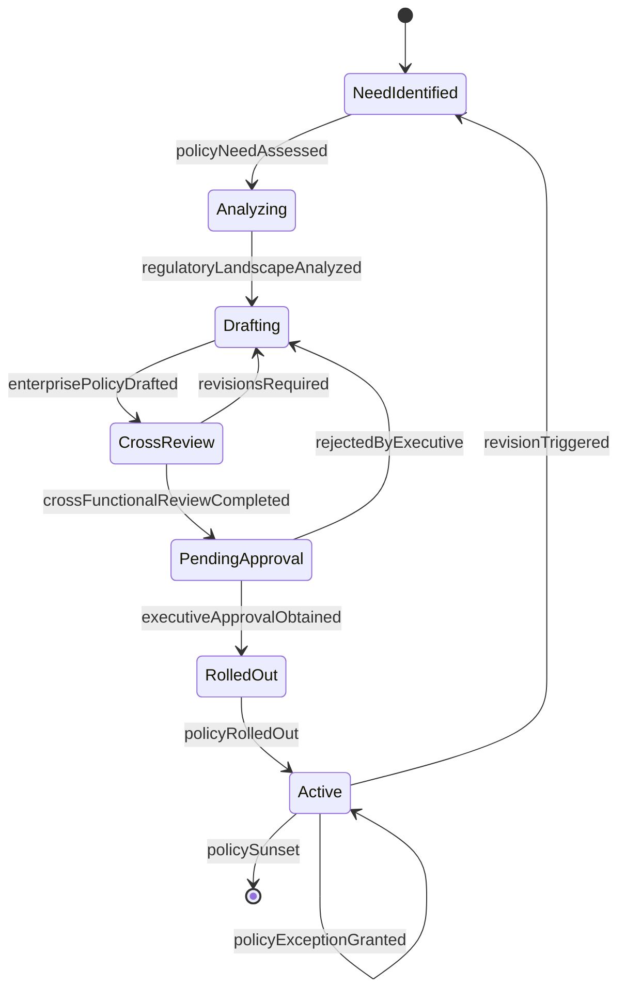
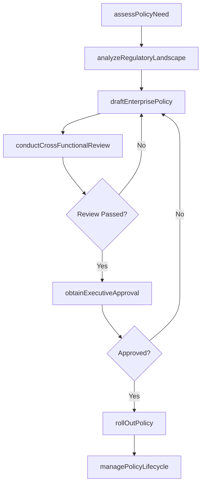
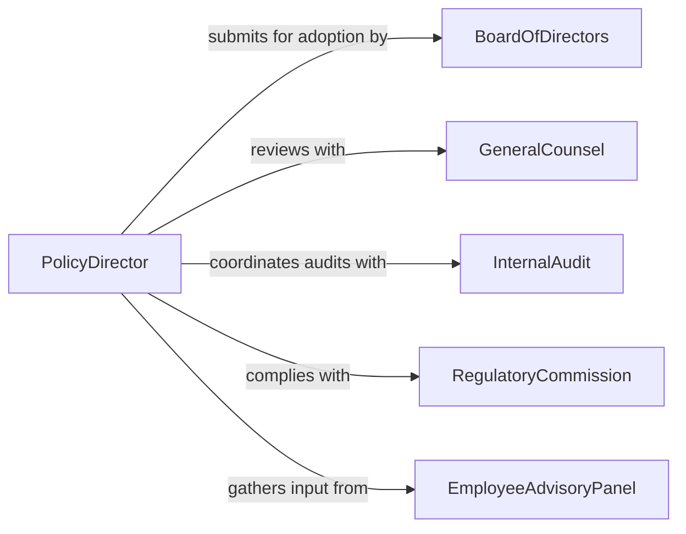

# Develop Business and Organizational Policies

> Business-as-Code definition for developing business and organizational policies including corporate governance, ethics, risk management, human resources, and operational policies that establish the rules and expectations for enterprise conduct.

## Overview

Business and organizational policy development involves analyzing strategic objectives, regulatory requirements, and operational risks to create formal governance documents that direct decision-making, standardize practices, and ensure compliance. This definition covers the end-to-end lifecycle from policy need identification through environmental analysis, drafting, cross-functional review, executive approval, enterprise rollout, and ongoing policy management.

## Actors

| Actor | Description |
|-------|-------------|
| BoardOfDirectors | Governing body approving enterprise-level policies |
| GeneralCounsel | Chief legal officer advising on regulatory compliance |
| InternalAudit | Department evaluating policy adherence and control effectiveness |
| RegulatoryCommission | Government authority whose rules shape business policies |
| IndustryPeerGroup | Network of comparable organizations benchmarking practices |
| EmployeeAdvisoryPanel | Cross-functional staff group providing workforce perspective |

## Roles

| Role | Description |
|------|-------------|
| ChiefOperatingOfficer | Executive sponsor of enterprise operational policies |
| PolicyDirector | Manages the enterprise policy framework and lifecycle |
| RiskManager | Assesses risks that policies must mitigate |
| HRPolicySpecialist | Develops employment and workforce policies |

## Entities

| Entity | Description |
|--------|-------------|
| EnterprisePolicy | Organization-wide rule governing business conduct |
| PolicyFramework | Hierarchical structure organizing all enterprise policies |
| RiskAssessment | Analysis of threats and vulnerabilities the policy addresses |
| StakeholderInput | Collected feedback from affected business units and employees |
| PolicyException | Documented deviation from standard policy granted under conditions |
| ComplianceDashboard | Real-time view of policy adherence across the organization |
| PolicyArchive | Version-controlled repository of all historical policy documents |

## Actions

| Action | Description |
|--------|-------------|
| assessPolicyNeed | Determine which business area requires a new or revised policy |
| analyzeRegulatoryLandscape | Survey applicable laws, regulations, and industry standards |
| draftEnterprisePolicy | Write the policy document with scope, requirements, and exceptions |
| conductCrossFunctionalReview | Collect input from legal, HR, operations, and finance |
| obtainExecutiveApproval | Present the policy for C-suite or board adoption |
| rollOutPolicy | Deploy the policy enterprise-wide with training and communication |
| managePolicyLifecycle | Monitor adherence, handle exceptions, and schedule revisions |

## Events

| Event | Description |
|-------|-------------|
| policyNeedAssessed | A business area requiring governance has been identified |
| regulatoryLandscapeAnalyzed | Applicable laws and standards have been surveyed |
| enterprisePolicyDrafted | Policy document has been written |
| crossFunctionalReviewCompleted | Stakeholder input has been collected across functions |
| executiveApprovalObtained | C-suite or board has adopted the policy |
| policyRolledOut | Enterprise-wide deployment and training have been completed |
| policyExceptionGranted | A documented deviation from standard policy has been approved |

## Searches

| Search | Description |
|--------|-------------|
| findPolicies | List enterprise policies by domain, status, or effective date |
| getExceptions | Retrieve approved policy exceptions by business unit |
| getComplianceMetrics | Look up adherence rates by policy or department |
| getRegulatoryMapping | View which regulations each policy addresses |
| getPolicyVersions | Find historical versions of a specific policy |

## Entity Relationships



## State Diagram



## Workflow



## Actor Relationships



## Usage

### Calling Actions

```typescript
import { developBusinessAndOrganizationalPolicies } from '@headlessly/develop-business-and-organizational-policies'

const policies = developBusinessAndOrganizationalPolicies()

// Assess the need for a new policy
const need = await policies.assessPolicyNeed({
  area: 'artificial-intelligence-governance',
  triggers: ['EU-AI-Act', 'customer-contract-requirements', 'board-directive'],
  affectedUnits: ['engineering', 'product', 'legal', 'customer-success']
})

// Draft the enterprise policy
const draft = await policies.draftEnterprisePolicy({
  needId: need.id,
  title: 'Responsible AI Use and Governance Policy',
  scope: 'All business units deploying or procuring AI systems',
  sections: [
    'purpose-and-scope',
    'AI-system-classification',
    'risk-assessment-requirements',
    'human-oversight-mandates',
    'transparency-and-documentation',
    'prohibited-uses',
    'exception-process',
    'enforcement-and-sanctions'
  ]
})

// Conduct cross-functional review
await policies.conductCrossFunctionalReview({
  draftId: draft.id,
  reviewers: [
    { unit: 'legal', reviewer: 'associate-general-counsel' },
    { unit: 'engineering', reviewer: 'vp-engineering' },
    { unit: 'product', reviewer: 'chief-product-officer' },
    { unit: 'hr', reviewer: 'chro' }
  ],
  deadline: '2026-05-15'
})
```

### Event-Driven Automation

```typescript
// Notify all business units on policy rollout
policies.policyRolledOut(async ({ policyId, title }) => {
  await notify({
    to: 'all-managers',
    message: `New enterprise policy: ${title} - mandatory training due within 30 days`
  })
})

// Escalate policy exceptions for review
policies.policyExceptionGranted(async ({ policyId, businessUnit, expirationDate }) => {
  await scheduleReminder({
    date: expirationDate,
    to: 'policy-director',
    message: `Policy exception for ${businessUnit} on ${policyId} expires - review for renewal or remediation`
  })
})
```
