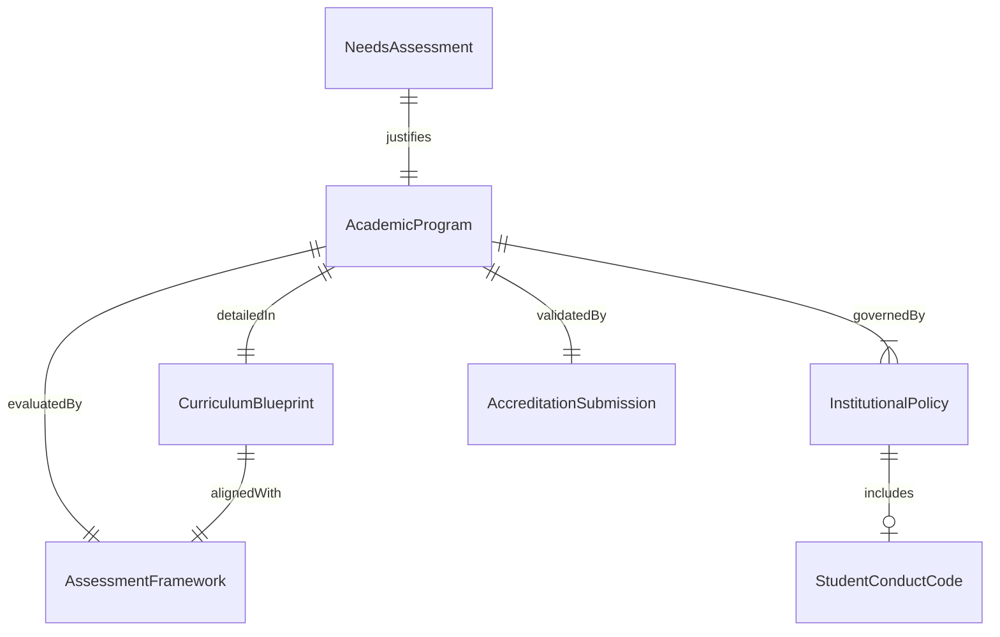
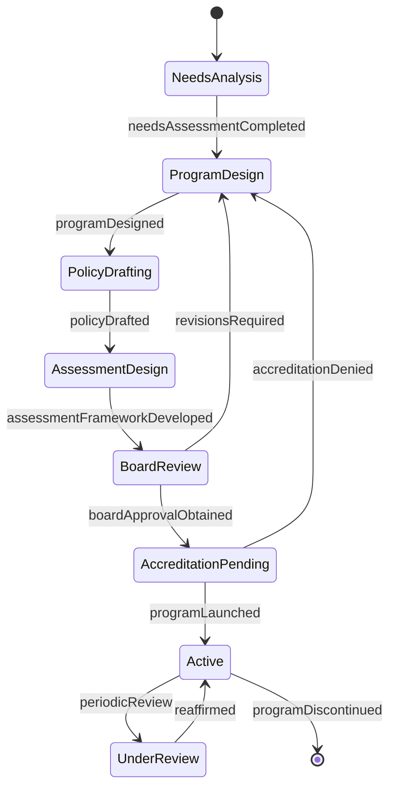
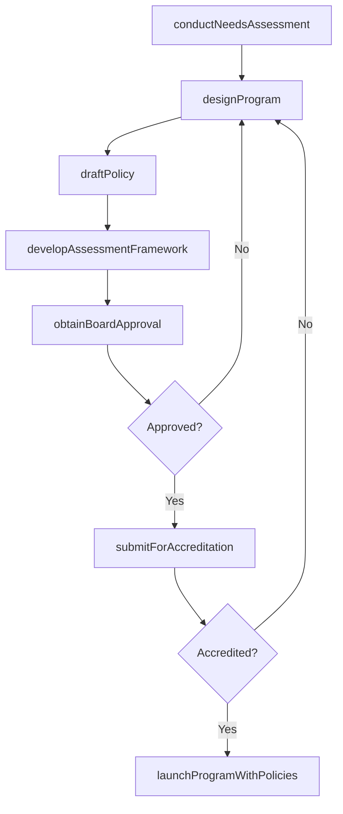
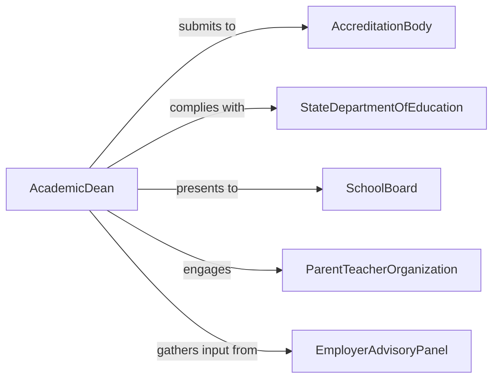

# Develop Educational Programs and Policies

> Business-as-Code definition for developing educational programs and policies including academic program design, institutional governance rules, student conduct codes, and assessment frameworks for K-12 districts, colleges, and training organizations.

## Overview

Developing educational programs and policies involves conducting needs assessments, designing curricula, establishing academic standards, drafting institutional governance rules, securing board and accreditation approval, and implementing programs with supporting policy infrastructure. This definition covers the integrated lifecycle where program design and policy development proceed in tandem to ensure that new academic offerings operate within a well-defined governance framework.

## Actors

| Actor | Description |
|-------|-------------|
| AccreditationBody | Regional or national agency evaluating program and institutional quality |
| StateDepartmentOfEducation | Government authority setting K-12 and higher education requirements |
| SchoolBoard | Elected or appointed body governing district-level education policy |
| ParentTeacherOrganization | Community group advocating for student and family interests |
| EmployerAdvisoryPanel | Industry representatives advising on workforce alignment |
| StudentGovernment | Elected student body providing the learner perspective |

## Roles

| Role | Description |
|------|-------------|
| AcademicDean | Oversees program development and curricular quality |
| CurriculumDeveloper | Designs course sequences, learning outcomes, and assessments |
| PolicyAdministrator | Drafts and manages institutional governance documents |
| InstitutionalResearcher | Provides enrollment, retention, and outcome data for planning |

## Entities

| Entity | Description |
|--------|-------------|
| AcademicProgram | Structured sequence of courses leading to a degree or credential |
| InstitutionalPolicy | Governance rule directing educational operations |
| CurriculumBlueprint | Detailed plan of courses, credits, and learning outcomes |
| NeedsAssessment | Analysis of market demand and workforce gaps |
| AccreditationSubmission | Application package for program or institutional approval |
| StudentConductCode | Rules governing student behavior and academic integrity |
| AssessmentFramework | System for measuring student learning and program effectiveness |

## Actions

| Action | Description |
|--------|-------------|
| conductNeedsAssessment | Analyze workforce demand, student interest, and competitive landscape |
| designProgram | Create the academic program structure, courses, and outcomes |
| draftPolicy | Write institutional governance rules supporting the program |
| developAssessmentFramework | Establish methods for measuring student and program outcomes |
| obtainBoardApproval | Present the program and policies for governing body adoption |
| submitForAccreditation | File the program and supporting documentation for external review |
| launchProgramWithPolicies | Begin enrollment and activate associated governance rules |

## Events

| Event | Description |
|-------|-------------|
| needsAssessmentCompleted | Market and workforce analysis has been finished |
| programDesigned | Academic structure and learning outcomes have been defined |
| policyDrafted | Institutional governance rules have been written |
| assessmentFrameworkDeveloped | Student and program outcome measures have been established |
| boardApprovalObtained | Governing body has adopted the program and policies |
| accreditationSubmitted | External review application has been filed |
| programLaunched | Enrollment has opened and governance rules are active |

## Searches

| Search | Description |
|--------|-------------|
| findPrograms | List academic programs by discipline, level, or approval status |
| getPolicies | Retrieve institutional policies by category or effective date |
| getEnrollmentProjections | Look up projected student demand for a program |
| getAccreditationStatus | Check the approval stage of a program submission |
| getAssessmentResults | Find student learning outcome data by program or cohort |

## Entity Relationships



## State Diagram



## Workflow



## Actor Relationships



## Usage

### Calling Actions

```typescript
import { developEducationalProgramsAndPolicies } from '@headlessly/develop-educational-programs-and-policies'

const edDev = developEducationalProgramsAndPolicies()

// Conduct needs assessment
const needs = await edDev.conductNeedsAssessment({
  institution: 'Central Valley Community College',
  discipline: 'healthcare-informatics',
  level: 'associate-degree',
  marketData: {
    regionalDemand: 'high',
    projectedJobGrowth: 0.18,
    competitorPrograms: 2,
    studentInterestSurvey: { respondents: 340, interested: 0.62 }
  }
})

// Design the academic program
const program = await edDev.designProgram({
  assessmentId: needs.id,
  name: 'Associate of Applied Science in Healthcare Informatics',
  credits: 64,
  duration: '4 semesters',
  courses: [
    { title: 'Introduction to Health Information Systems', credits: 3, semester: 1 },
    { title: 'Medical Terminology and Coding', credits: 3, semester: 1 },
    { title: 'Database Management for Healthcare', credits: 3, semester: 2 },
    { title: 'Health Data Analytics', credits: 3, semester: 3 },
    { title: 'Clinical Practicum', credits: 6, semester: 4 }
  ],
  outcomes: [
    'Manage electronic health record systems',
    'Analyze health data using standard informatics tools',
    'Apply HIPAA privacy and security requirements'
  ]
})

// Draft supporting institutional policy
await edDev.draftPolicy({
  programId: program.id,
  title: 'Clinical Practicum Placement and Supervision Policy',
  sections: [
    'eligibility-requirements',
    'site-affiliation-agreements',
    'supervision-ratios',
    'student-conduct-at-clinical-sites',
    'evaluation-and-grading',
    'liability-and-insurance'
  ]
})
```

### Event-Driven Automation

```typescript
// Notify enrollment management when program launches
edDev.programLaunched(async ({ programId, name }) => {
  await notify({
    to: 'enrollment-management',
    message: `${name} is now accepting applications - activate recruitment campaign`
  })
})

// Alert accreditation liaison on board approval
edDev.boardApprovalObtained(async ({ programId }) => {
  await edDev.submitForAccreditation({ programId })
})
```
