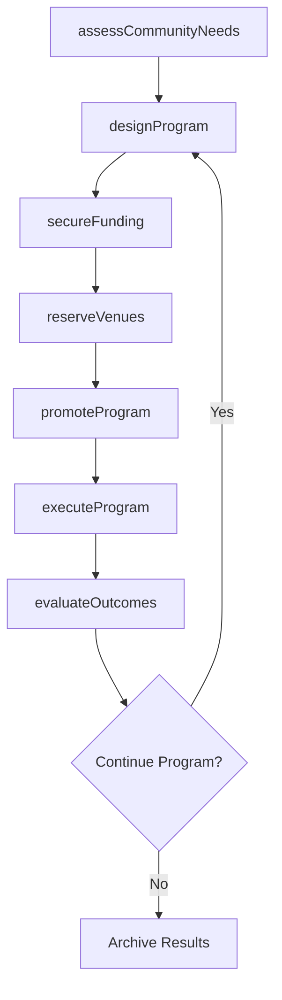
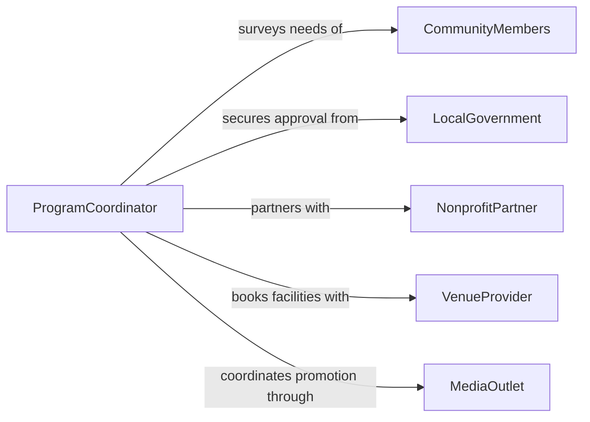

# Plan Community Programs Activities

> Business-as-Code definition for planning community programs and activities. Models the lifecycle from needs assessment through program design, promotion, execution, and evaluation.

## Overview

Planning community programs and activities involves identifying public needs, designing inclusive programming, securing funding and venues, and coordinating outreach to maximize participation. This activity spans recreation departments, public libraries, community centers, nonprofit organizations, and municipal agencies. Programs range from health and wellness workshops to cultural festivals, youth sports leagues, and senior enrichment activities.

## Actors

| Actor | Description |
|-------|-------------|
| CommunityMembers | Residents who participate in and provide feedback on public programs |
| LocalGovernment | Municipal authority that funds and approves community programming |
| NonprofitPartner | Organizations that co-sponsor or deliver specialized program content |
| VenueProvider | Facilities such as parks, community centers, and schools that host activities |
| MediaOutlet | Local press and social media channels that promote programs to the public |
| GrantAgency | Federal, state, or foundation funding sources for community initiatives |

## Roles

| Role | Description |
|------|-------------|
| ProgramCoordinator | Designs, schedules, and manages community programs end-to-end |
| OutreachSpecialist | Develops marketing materials and engagement strategies to reach residents |
| BudgetAnalyst | Tracks program funding, expenditures, and grant compliance |
| VolunteerManager | Recruits, trains, and schedules volunteer staff for activities |

## Entities

| Entity | Description |
|--------|-------------|
| Program | A structured series of activities designed for public participation |
| Activity | A single event or session within a broader community program |
| Budget | Financial plan covering venue, materials, staffing, and marketing costs |
| RegistrationList | Record of participants enrolled in a program or activity |
| FeedbackSurvey | Post-program evaluation collected from attendees |
| GrantApplication | Formal request for external funding to support a community program |

## Actions

| Action | Description |
|--------|-------------|
| assessCommunityNeeds | Survey residents and review demographic data to identify program gaps |
| designProgram | Define objectives, schedule, activities, and target audience |
| secureFunding | Apply for grants, allocate municipal funds, or arrange sponsorships |
| reserveVenues | Book facilities and confirm availability for program dates |
| promoteProgram | Launch outreach campaigns through flyers, social media, and press releases |
| executeProgram | Deliver scheduled activities with staff, volunteers, and materials |
| evaluateOutcomes | Collect feedback, measure attendance, and assess program effectiveness |

## Events

| Event | Description |
|-------|-------------|
| needsAssessed | Community needs survey has been completed and analyzed |
| programDesigned | Program objectives, schedule, and activities have been defined |
| fundingSecured | Budget has been approved and funding sources confirmed |
| venuesReserved | Facilities have been booked for all program dates |
| programPromoted | Marketing campaign has launched to the public |
| programExecuted | All scheduled activities have been delivered |
| outcomesEvaluated | Attendance data and feedback have been analyzed |

## Searches

| Search | Description |
|--------|-------------|
| findPrograms | List community programs by type, date range, audience, or status |
| getRegistrations | Retrieve participant enrollments for a specific program or activity |
| getFeedback | Access survey responses and satisfaction scores by program |
| getGrantStatus | Check application status and compliance for program funding sources |

## Workflow



## Actor Relationships



## Usage

### Calling Actions

```typescript
import { planCommunityProgramsActivities } from '@headlessly/plan-community-programs-activities'

const programs = planCommunityProgramsActivities()

// Assess community needs
const assessment = await programs.assessCommunityNeeds({
  district: 'downtown',
  demographics: ['seniors', 'youth', 'families'],
  surveyPeriod: { start: '2026-01-01', end: '2026-01-31' }
})

// Design a new summer program
const program = await programs.designProgram({
  name: 'Summer Youth Arts Festival',
  audience: 'youth-ages-12-18',
  activities: ['mural-painting', 'spoken-word', 'live-music'],
  schedule: { start: '2026-06-15', end: '2026-08-15', frequency: 'weekly' }
})

// Evaluate program outcomes
const evaluation = await programs.evaluateOutcomes({
  programId: program.id,
  metrics: ['attendance', 'satisfaction', 'community-impact']
})
```

### Event-Driven Automation

```typescript
// Send registration confirmations when program goes live
programs.programPromoted(async ({ programId, registrationUrl }) => {
  await notify({
    to: 'community-newsletter',
    message: `Registration is now open for ${programId}. Sign up at ${registrationUrl}`
  })
})

// Trigger grant reporting after program completion
programs.outcomesEvaluated(async ({ programId, attendance, satisfactionScore }) => {
  await generateGrantReport({
    programId,
    totalAttendees: attendance,
    avgSatisfaction: satisfactionScore
  })
})
```
