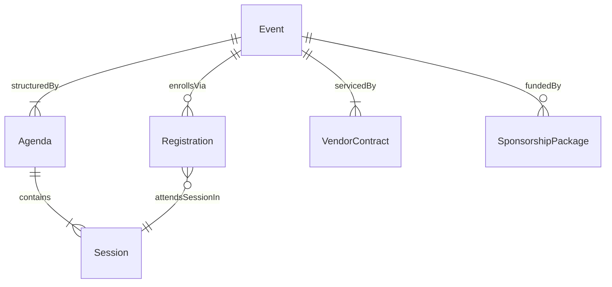
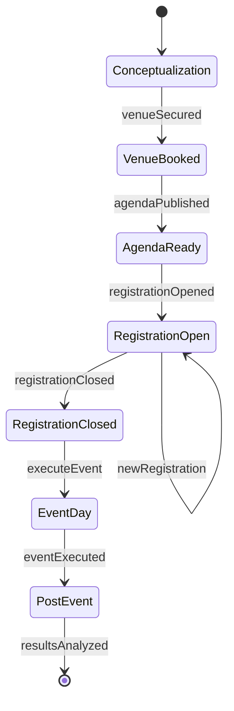
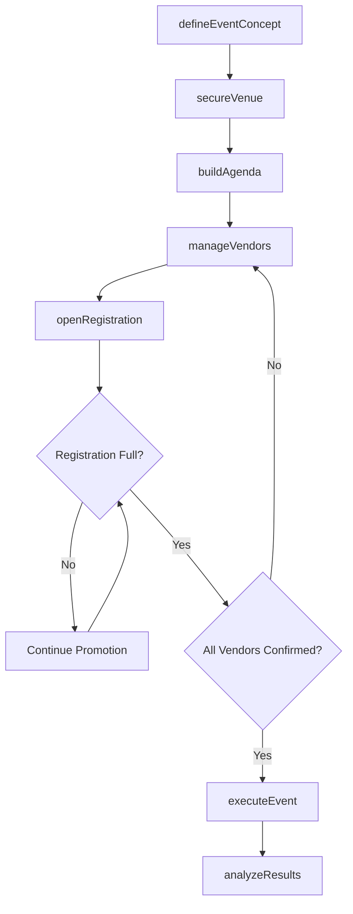
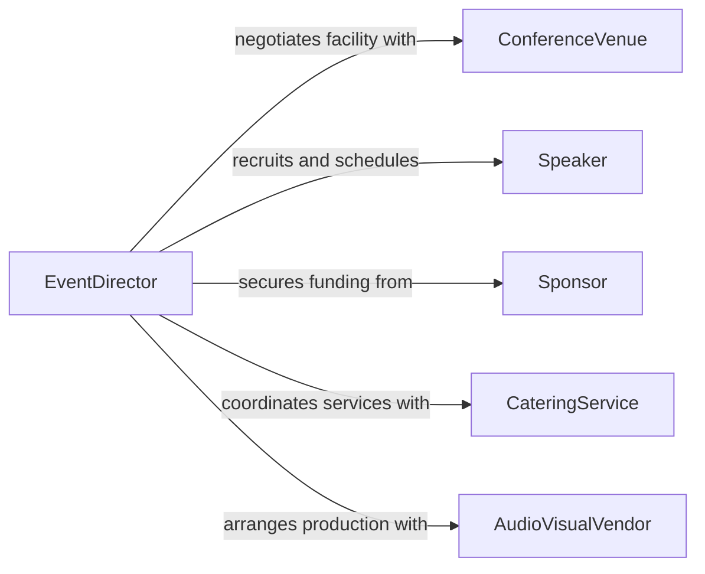

# Plan Conferences Programs Special Events

> Business-as-Code definition for planning conferences, programs, and special events. Models the end-to-end event lifecycle from concept development through logistics coordination, execution, and post-event analysis.

## Overview

Planning conferences, programs, and special events involves defining event objectives, coordinating venues and vendors, managing speaker lineups and agendas, handling registrations, and overseeing day-of execution. This activity supports professional associations, corporate marketing teams, educational institutions, and nonprofit organizations producing events that range from multi-day industry conferences to single-session workshops and gala dinners.

## Actors

| Actor | Description |
|-------|-------------|
| ConferenceVenue | Hotels, convention centers, or facilities that host the event |
| Speaker | Subject matter experts who present sessions, keynotes, or panels |
| Sponsor | Organizations that provide financial or in-kind support in exchange for visibility |
| Attendee | Registered participants who attend sessions and networking events |
| CateringService | Food and beverage providers for meals, receptions, and breaks |
| AudioVisualVendor | Suppliers of staging, sound, lighting, and streaming technology |

## Roles

| Role | Description |
|------|-------------|
| EventDirector | Leads overall event strategy, budget, and stakeholder management |
| LogisticsCoordinator | Manages venue setup, vendor contracts, and day-of operations |
| ProgramManager | Curates the agenda, speaker lineup, and session scheduling |
| RegistrationManager | Oversees attendee registration, ticketing, and communications |

## Entities

| Entity | Description |
|--------|-------------|
| Event | A conference, program, or special event with defined dates and objectives |
| Agenda | The schedule of sessions, breaks, and networking activities |
| Session | An individual presentation, workshop, or panel within the event |
| Registration | An attendee enrollment record with ticket type and payment status |
| VendorContract | An agreement with a supplier for event services or goods |
| SponsorshipPackage | A tiered offering of visibility and benefits for event sponsors |

## Actions

| Action | Description |
|--------|-------------|
| defineEventConcept | Establish event theme, objectives, target audience, and format |
| secureVenue | Evaluate, negotiate, and book the event facility |
| buildAgenda | Design the session schedule including speakers, topics, and time slots |
| openRegistration | Launch attendee registration with ticket tiers and early-bird pricing |
| manageVendors | Coordinate contracts, timelines, and deliverables with all service providers |
| executeEvent | Oversee day-of logistics, speaker coordination, and attendee experience |
| analyzeResults | Compile attendance data, survey feedback, and financial performance |

## Events

| Event | Description |
|-------|-------------|
| eventConceptDefined | Theme, format, and objectives have been established |
| venueSecured | Event facility has been contracted and confirmed |
| agendaPublished | Session schedule has been finalized and made public |
| registrationOpened | Attendee registration is live and accepting enrollments |
| registrationClosed | Registration period has ended |
| eventExecuted | The event has been held and all sessions delivered |
| resultsAnalyzed | Post-event metrics and feedback have been compiled |

## Searches

| Search | Description |
|--------|-------------|
| findEvents | List events by date, type, location, or status |
| getRegistrations | Retrieve attendee records by event, ticket type, or payment status |
| getSessions | List sessions by event, speaker, topic, or time slot |
| getSponsorships | View sponsor commitments and package details for an event |

## Entity Relationships



## State Diagram



## Workflow



## Actor Relationships



## Usage

### Calling Actions

```typescript
import { planConferencesProgramsSpecialEvents } from '@headlessly/plan-conferences-programs-special-events'

const events = planConferencesProgramsSpecialEvents()

// Define a new conference
const event = await events.defineEventConcept({
  name: 'TechForward 2026',
  format: 'multi-day-conference',
  targetAudience: 'software-engineering-leaders',
  dates: { start: '2026-09-15', end: '2026-09-17' },
  expectedAttendance: 1200
})

// Build the agenda
await events.buildAgenda({
  eventId: event.id,
  sessions: [
    { title: 'Keynote: The Future of Platform Engineering', speaker: 'speaker-chen', duration: 60 },
    { title: 'Workshop: Scaling Distributed Systems', speaker: 'speaker-patel', duration: 90 },
    { title: 'Panel: Engineering Culture at Scale', speakers: ['speaker-kim', 'speaker-ross'], duration: 45 }
  ]
})

// Open registration
await events.openRegistration({
  eventId: event.id,
  tiers: [
    { name: 'Early Bird', price: 599, limit: 300, deadline: '2026-07-01' },
    { name: 'Standard', price: 899, limit: 900 }
  ]
})
```

### Event-Driven Automation

```typescript
// Send confirmation when attendee registers
events.registrationOpened(async ({ eventId }) => {
  await enableWebhook({
    event: 'attendee.registered',
    url: '/api/send-confirmation-email'
  })
})

// Generate post-event report
events.eventExecuted(async ({ eventId, totalAttendees }) => {
  await events.analyzeResults({
    eventId,
    metrics: ['attendance-by-session', 'survey-nps', 'revenue-vs-budget']
  })
})
```
