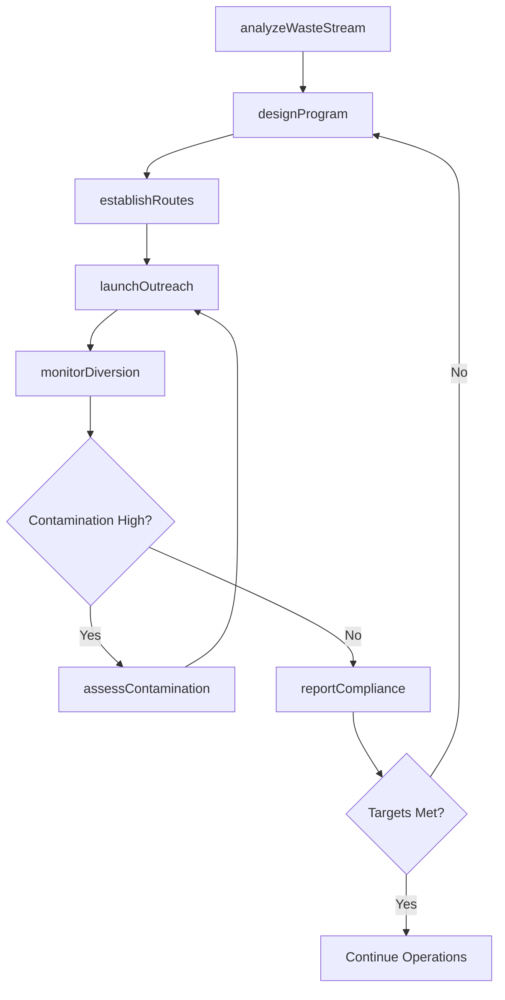
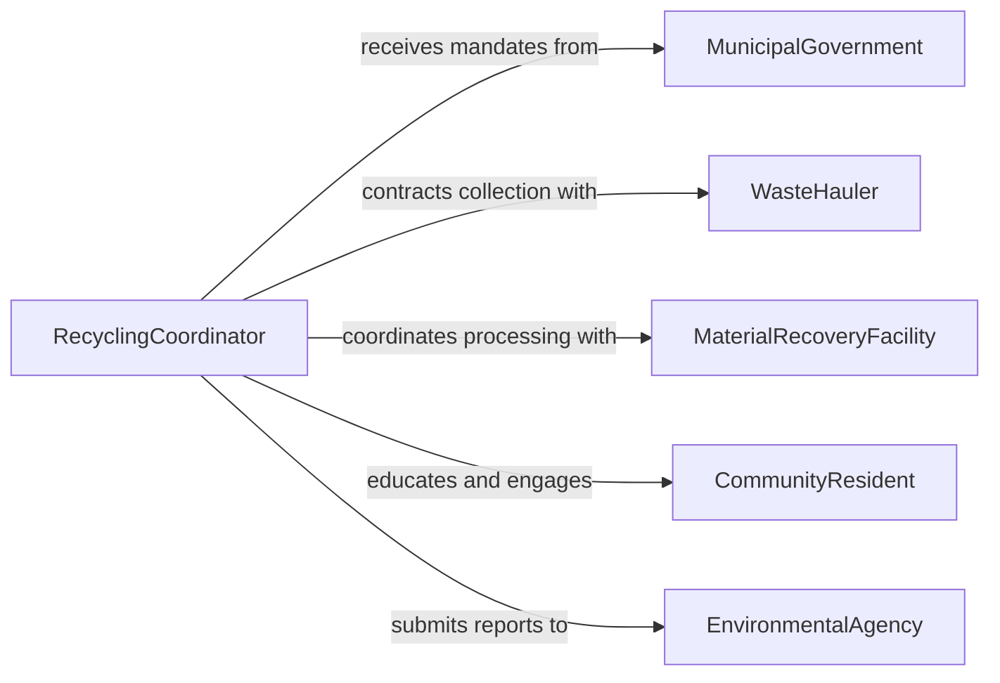

# Plan Implementation Promotion Recycling Programs

> Business-as-Code definition for planning the implementation and promotion of recycling programs. Models the lifecycle from waste stream analysis through program design, public outreach, collection logistics, and diversion rate monitoring.

## Overview

Planning recycling program implementation and promotion involves analyzing waste composition, designing collection systems, establishing processing partnerships, and conducting public education campaigns to increase participation and diversion rates. This activity supports municipal solid waste departments, corporate sustainability teams, and environmental nonprofit organizations working to reduce landfill dependency and meet regulatory recycling targets.

## Actors

| Actor | Description |
|-------|-------------|
| MunicipalGovernment | Sets recycling mandates, provides funding, and establishes collection ordinances |
| WasteHauler | Collects recyclable materials from residential and commercial locations |
| MaterialRecoveryFacility | Sorts and processes collected recyclables into marketable commodities |
| CommunityResident | Participates in curbside or drop-off recycling collection |
| EnvironmentalAgency | Regulates waste diversion targets and monitors compliance |
| CorporatePartner | Businesses that sponsor recycling initiatives or participate in commercial programs |

## Roles

| Role | Description |
|------|-------------|
| RecyclingCoordinator | Designs program logistics, collection schedules, and material acceptance lists |
| OutreachManager | Develops educational campaigns and community engagement strategies |
| ComplianceOfficer | Tracks diversion rates and ensures adherence to regulatory requirements |
| DataAnalyst | Monitors tonnage data, contamination rates, and program cost-effectiveness |

## Entities

| Entity | Description |
|--------|-------------|
| RecyclingProgram | A structured initiative for collecting and diverting recyclable materials |
| CollectionRoute | A geographic schedule for curbside or commercial pickup of recyclables |
| MaterialStream | A category of recyclable material such as paper, plastics, glass, or metals |
| OutreachCampaign | A coordinated set of educational and promotional activities |
| DiversionReport | A periodic analysis of material tonnage diverted from landfill |
| ContaminationLog | A record of non-recyclable materials found in recycling streams |

## Actions

| Action | Description |
|--------|-------------|
| analyzeWasteStream | Assess composition of solid waste to identify recyclable material opportunities |
| designProgram | Define accepted materials, collection methods, and processing partnerships |
| establishRoutes | Map collection zones and schedule pickup frequencies |
| launchOutreach | Deploy educational materials, community workshops, and digital campaigns |
| monitorDiversion | Track tonnage collected, processed, and diverted from landfill |
| assessContamination | Measure rates of non-recyclable material in collection streams |
| reportCompliance | Generate regulatory reports on diversion rates and program performance |

## Events

| Event | Description |
|-------|-------------|
| wasteStreamAnalyzed | Waste composition study has been completed |
| programDesigned | Recycling program parameters and logistics have been defined |
| routesEstablished | Collection zones and schedules have been mapped |
| outreachLaunched | Public education and promotion campaign has gone live |
| diversionMonitored | Tonnage and diversion rate data have been updated |
| contaminationFlagged | Contamination rate has exceeded acceptable threshold |
| complianceReported | Regulatory diversion report has been submitted |

## Searches

| Search | Description |
|--------|-------------|
| findPrograms | List recycling programs by municipality, material type, or status |
| getDiversionRates | Retrieve diversion percentages by period, zone, or material stream |
| getContaminationData | Access contamination rates and common contaminants by collection route |
| getOutreachMetrics | View campaign reach, engagement, and participation lift data |

## Workflow



## Actor Relationships



## Usage

### Calling Actions

```typescript
import { planImplementationPromotionRecyclingPrograms } from '@headlessly/plan-implementation-promotion-recycling-programs'

const recycling = planImplementationPromotionRecyclingPrograms()

// Analyze waste stream composition
const analysis = await recycling.analyzeWasteStream({
  municipality: 'city-of-aurora',
  samplePeriod: { start: '2026-01-01', end: '2026-01-31' },
  categories: ['paper', 'plastics', 'glass', 'metals', 'organics']
})

// Design a new curbside program
const program = await recycling.designProgram({
  name: 'Aurora Single-Stream Curbside Recycling',
  acceptedMaterials: ['paper', 'cardboard', 'plastics-1-5', 'glass', 'aluminum'],
  collectionMethod: 'single-stream-curbside',
  processingPartner: 'metro-mrf-east'
})

// Monitor diversion performance
const report = await recycling.monitorDiversion({
  programId: program.id,
  period: 'Q1-2026'
})
```

### Event-Driven Automation

```typescript
// Alert on high contamination rates
recycling.contaminationFlagged(async ({ routeId, contaminationRate }) => {
  await notify({
    to: 'outreach-team',
    message: `Route ${routeId} contamination at ${contaminationRate}% - targeted education needed`
  })
})

// Auto-generate quarterly compliance reports
recycling.diversionMonitored(async ({ programId, period, diversionRate }) => {
  if (isQuarterEnd(period)) {
    await recycling.reportCompliance({
      programId,
      period,
      diversionRate,
      submittedTo: 'state-environmental-agency'
    })
  }
})
```
