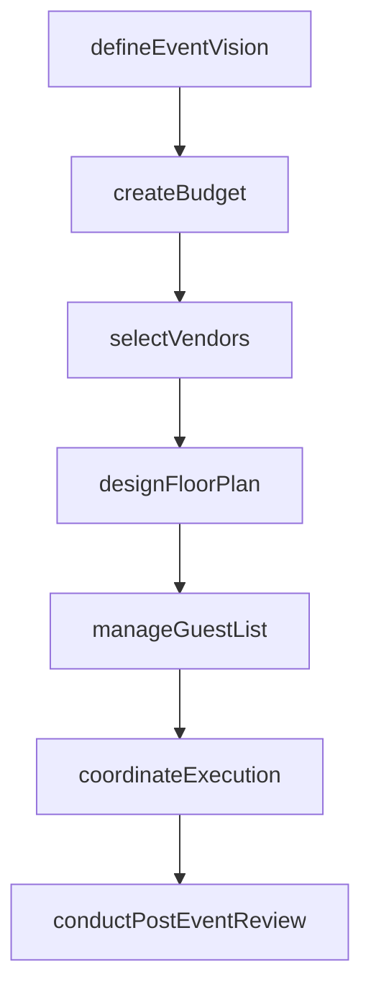
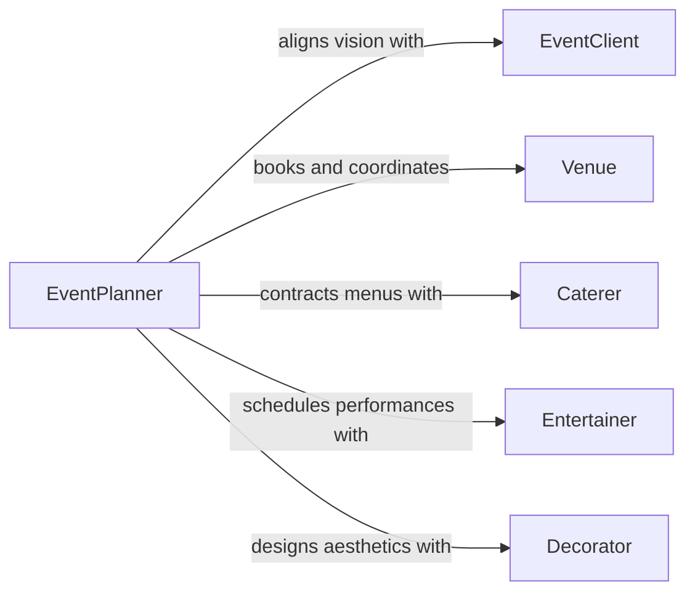

# Plan Special Events

> Business-as-Code definition for planning special events. Models the complete event planning lifecycle from concept and budgeting through vendor coordination, execution, and post-event review.

## Overview

Planning special events encompasses the design and coordination of galas, fundraisers, corporate celebrations, product launches, award ceremonies, and milestone commemorations. This activity involves establishing event objectives, managing budgets, selecting and negotiating with vendors, coordinating timelines, and overseeing on-site execution. It serves event planning firms, corporate marketing departments, nonprofit development teams, and hospitality organizations.

## Actors

| Actor | Description |
|-------|-------------|
| EventClient | The individual or organization commissioning the special event |
| Venue | The facility or location hosting the event |
| Caterer | Food and beverage service provider for the event |
| Entertainer | Musicians, DJs, performers, or speakers booked for the event |
| Decorator | Floral designers, lighting specialists, and decor providers |
| Photographer | Visual documentation professionals capturing the event |

## Roles

| Role | Description |
|------|-------------|
| EventPlanner | Leads concept development, vendor selection, and overall coordination |
| ProductionManager | Manages setup, teardown, and day-of technical logistics |
| GuestCoordinator | Handles invitations, RSVPs, seating arrangements, and guest communications |
| BudgetController | Tracks spending, manages vendor payments, and reconciles event finances |

## Entities

| Entity | Description |
|--------|-------------|
| Event | A special occasion with a defined date, venue, and purpose |
| GuestList | The roster of invited attendees with RSVP status |
| VendorAgreement | A contract specifying services, pricing, and delivery terms |
| EventBudget | The financial plan allocating funds across all event categories |
| Timeline | A detailed schedule of milestones from planning through day-of execution |
| FloorPlan | The spatial layout of tables, staging, bars, and guest flow |

## Actions

| Action | Description |
|--------|-------------|
| defineEventVision | Establish the event theme, style, guest count, and objectives |
| createBudget | Develop a detailed financial plan with line items for each category |
| selectVendors | Evaluate, negotiate, and contract service providers |
| designFloorPlan | Lay out seating, staging, catering stations, and guest circulation |
| manageGuestList | Track invitations, RSVPs, dietary requirements, and seating assignments |
| coordinateExecution | Oversee setup, vendor arrivals, event flow, and teardown |
| conductPostEventReview | Assess guest feedback, vendor performance, and budget accuracy |

## Events

| Event | Description |
|-------|-------------|
| eventVisionDefined | Theme, objectives, and guest count have been established |
| budgetApproved | Financial plan has been reviewed and approved by the client |
| vendorsSelected | All service provider contracts have been signed |
| floorPlanFinalized | Venue layout and seating arrangements have been confirmed |
| guestListFinalized | All RSVPs have been received and seating assigned |
| eventCompleted | The special event has been held and teardown finished |
| postEventReviewCompleted | Feedback and financials have been compiled and shared |

## Searches

| Search | Description |
|--------|-------------|
| findEvents | List special events by date, client, venue, or status |
| getGuestList | Retrieve guests by RSVP status, table assignment, or dietary need |
| getVendorContracts | View active vendor agreements for a specific event |
| getBudgetSummary | Access spending totals versus budget by category |

## Workflow



## Actor Relationships



## Usage

### Calling Actions

```typescript
import { planSpecialEvents } from '@headlessly/plan-special-events'

const events = planSpecialEvents()

// Define a corporate gala
const event = await events.defineEventVision({
  name: 'Annual Partners Gala 2026',
  type: 'corporate-gala',
  date: '2026-11-14',
  guestCount: 350,
  theme: 'Modern Elegance'
})

// Create the event budget
await events.createBudget({
  eventId: event.id,
  lineItems: [
    { category: 'venue', amount: 25000 },
    { category: 'catering', amount: 42000 },
    { category: 'entertainment', amount: 15000 },
    { category: 'decor', amount: 12000 },
    { category: 'photography', amount: 5000 }
  ]
})

// Manage the guest list
await events.manageGuestList({
  eventId: event.id,
  guests: [
    { name: 'Sarah Mitchell', company: 'Apex Partners', dietaryNeeds: 'vegetarian' },
    { name: 'James Thornton', company: 'Meridian Capital', dietaryNeeds: 'none' }
  ]
})
```

### Event-Driven Automation

```typescript
// Notify vendors when floor plan is confirmed
events.floorPlanFinalized(async ({ eventId, floorPlanUrl }) => {
  const vendors = await events.getVendorContracts({ eventId })
  for (const vendor of vendors) {
    await notify({
      to: vendor.contactEmail,
      message: `Floor plan confirmed for event ${eventId}. View layout: ${floorPlanUrl}`
    })
  }
})

// Generate summary report after event
events.eventCompleted(async ({ eventId }) => {
  await events.conductPostEventReview({
    eventId,
    metrics: ['guest-satisfaction', 'vendor-performance', 'budget-variance']
  })
})
```
