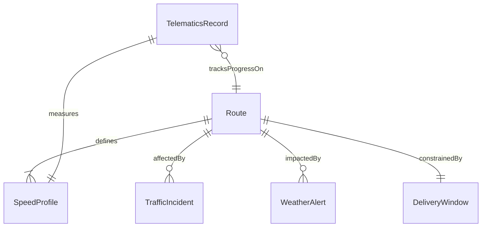
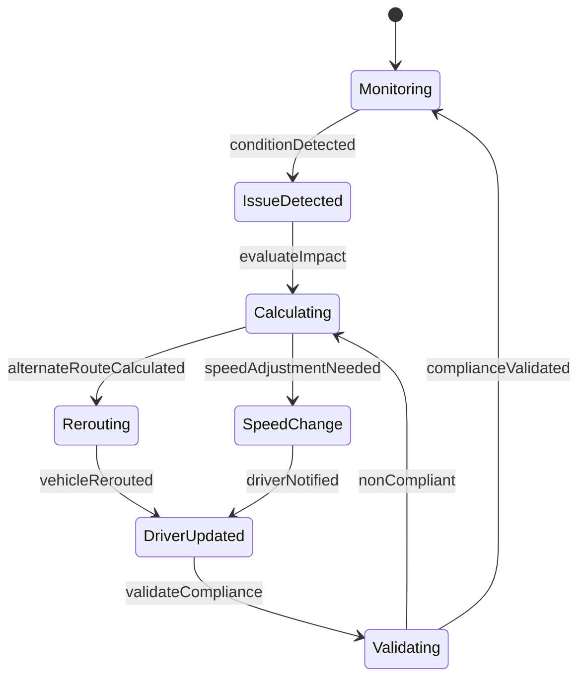
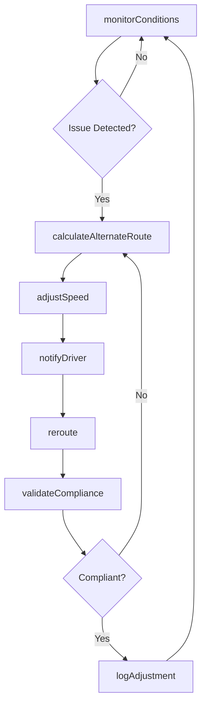
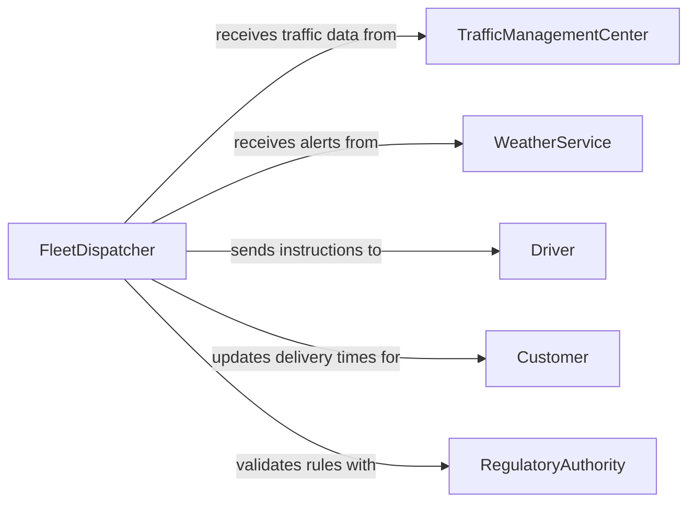

# Adjust Routes Speeds

> Business-as-Code definition for adjusting routes and speeds. Models the real-time decision-making process for modifying transportation routes and vehicle speeds in response to changing conditions.

## Overview

Adjusting routes and speeds involves monitoring real-time conditions such as traffic congestion, weather events, road closures, and delivery time windows to dynamically modify vehicle paths and velocity. This activity is critical for trucking and logistics companies, public transit agencies, delivery fleets, and emergency response organizations. Effective route and speed adjustment reduces fuel consumption, improves on-time delivery performance, and enhances driver safety.

## Actors

| Actor | Description |
|-------|-------------|
| TrafficManagementCenter | Provides real-time traffic flow data and incident alerts |
| WeatherService | Supplies forecasts and severe weather advisories affecting travel |
| DispatchCenter | Coordinates fleet movements and communicates route changes to drivers |
| Customer | The recipient expecting a delivery within a specified time window |
| RegulatoryAuthority | Enforces speed limits, hours-of-service rules, and road restrictions |

## Roles

| Role | Description |
|------|-------------|
| FleetDispatcher | Monitors vehicle locations and issues route or speed adjustments |
| Driver | Operates the vehicle and executes approved route modifications |
| RouteOptimizer | Analyzes telematics and traffic data to calculate alternative paths |
| SafetyManager | Reviews speed compliance and driver behavior data |

## Entities

| Entity | Description |
|--------|-------------|
| Route | A planned path from origin to destination with waypoints and estimated times |
| SpeedProfile | The target and actual speed parameters for a vehicle segment |
| TrafficIncident | A reported event such as an accident, construction, or road closure |
| WeatherAlert | A notification of adverse conditions affecting travel safety |
| DeliveryWindow | The scheduled timeframe for a pickup or drop-off |
| TelematicsRecord | GPS, speed, and vehicle diagnostics data collected in real time |

## Actions

| Action | Description |
|--------|-------------|
| monitorConditions | Continuously track traffic, weather, and road status along active routes |
| calculateAlternateRoute | Compute a new path that avoids identified hazards or delays |
| adjustSpeed | Modify target vehicle speed based on conditions or schedule requirements |
| reroute | Apply a new route to an active vehicle assignment |
| notifyDriver | Send updated route or speed instructions to the vehicle operator |
| logAdjustment | Record the reason, timing, and impact of each route or speed change |
| validateCompliance | Confirm that adjusted speeds and routes comply with regulations |

## Events

| Event | Description |
|-------|-------------|
| conditionDetected | A traffic incident, weather event, or closure has been identified |
| alternateRouteCalculated | A new path has been computed and is ready for dispatch |
| speedAdjusted | Vehicle target speed has been modified |
| vehicleRerouted | Driver has been assigned and acknowledged a new route |
| driverNotified | Route or speed change instructions have been delivered |
| adjustmentLogged | The modification has been recorded in the fleet management system |
| complianceValidated | Adjusted parameters have been confirmed within regulatory limits |

## Searches

| Search | Description |
|--------|-------------|
| findActiveRoutes | List routes currently in progress by fleet, driver, or region |
| getTrafficConditions | Retrieve real-time traffic and incident data for a route corridor |
| getSpeedHistory | Access historical speed profiles for a vehicle or route segment |
| getDeliveryStatus | Check estimated versus actual arrival times for active deliveries |

## Entity Relationships



## State Diagram



## Workflow



## Actor Relationships



## Usage

### Calling Actions

```typescript
import { adjustRoutesSpeeds } from '@headlessly/adjust-routes-speeds'

const routing = adjustRoutesSpeeds()

// Monitor conditions on an active route
const conditions = await routing.monitorConditions({
  routeId: 'route-i90-east-2026-03',
  vehicleId: 'truck-1147',
  checkpoints: ['mile-45', 'mile-120', 'mile-195']
})

// Calculate an alternate route around an incident
const alternate = await routing.calculateAlternateRoute({
  routeId: 'route-i90-east-2026-03',
  avoidSegments: ['i90-mile-80-to-95'],
  reason: 'multi-vehicle-accident',
  priority: 'minimize-delay'
})

// Reroute the vehicle
await routing.reroute({
  vehicleId: 'truck-1147',
  newRouteId: alternate.id,
  effectiveImmediately: true
})
```

### Event-Driven Automation

```typescript
// Automatically notify customers of delays
routing.vehicleRerouted(async ({ vehicleId, routeId, newEta }) => {
  const deliveries = await routing.getDeliveryStatus({ vehicleId })
  for (const delivery of deliveries) {
    if (newEta > delivery.scheduledArrival) {
      await notify({
        to: delivery.customerEmail,
        message: `Your delivery has been rerouted. New estimated arrival: ${newEta}`
      })
    }
  }
})

// Log compliance violations for review
routing.speedAdjusted(async ({ vehicleId, newSpeed, speedLimit }) => {
  if (newSpeed > speedLimit) {
    await escalate({
      to: 'safety-manager',
      message: `Vehicle ${vehicleId} speed adjustment of ${newSpeed} mph exceeds limit of ${speedLimit} mph`
    })
  }
})
```
