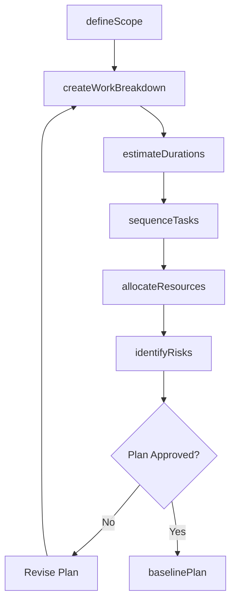
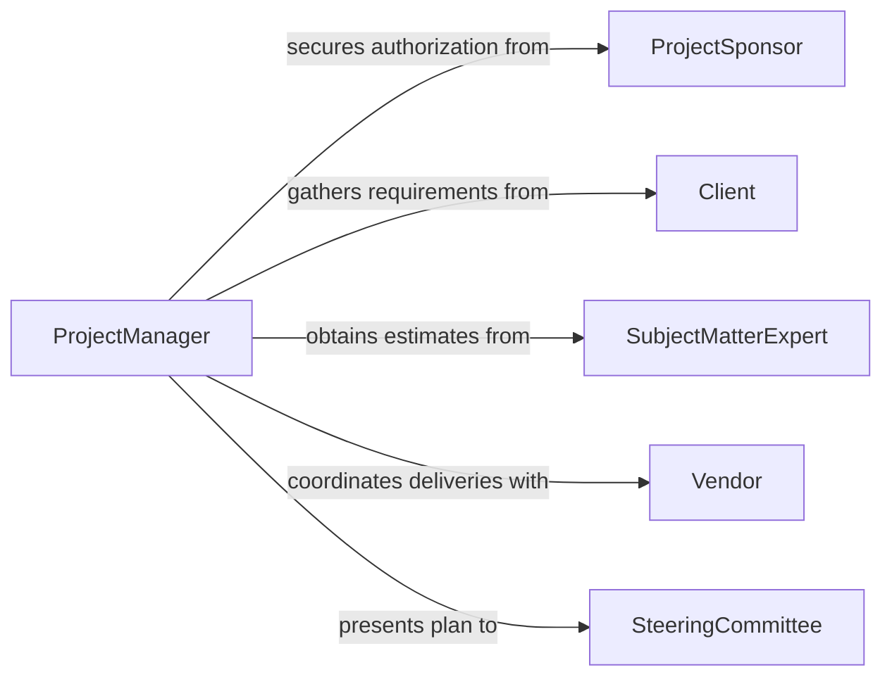

# Develop Detailed Project Plans

> Business-as-Code definition for developing detailed project plans. Models the full planning lifecycle from scope definition through work breakdown, scheduling, resource allocation, and baseline approval.

## Overview

Developing detailed project plans involves decomposing project scope into manageable work packages, estimating durations and costs, identifying dependencies, assigning resources, and establishing a baseline schedule and budget. This activity is fundamental to project management across construction, software development, product launches, infrastructure upgrades, and organizational change initiatives. A well-developed project plan provides the control framework for tracking progress, managing risks, and communicating status to stakeholders.

## Actors

| Actor | Description |
|-------|-------------|
| ProjectSponsor | Executive who authorizes the project and provides funding approval |
| Client | The internal or external party whose requirements the project must satisfy |
| SubjectMatterExpert | Provides technical estimates and feasibility assessments for plan components |
| Vendor | External supplier delivering goods or services required by the project |
| SteeringCommittee | Governance body that reviews and approves major project milestones |

## Roles

| Role | Description |
|------|-------------|
| ProjectManager | Develops, maintains, and communicates the project plan |
| Scheduler | Builds the detailed schedule with task dependencies and critical path analysis |
| ResourceManager | Allocates personnel, equipment, and facilities to project tasks |
| RiskAnalyst | Identifies, assesses, and plans mitigations for project risks |

## Entities

| Entity | Description |
|--------|-------------|
| ProjectPlan | The comprehensive document defining scope, schedule, budget, and resources |
| WorkBreakdownStructure | A hierarchical decomposition of project deliverables into work packages |
| Task | An individual unit of work with defined duration, dependencies, and assignees |
| Milestone | A significant checkpoint or deliverable date in the project timeline |
| ResourceAssignment | The allocation of a specific person or team to a project task |
| RiskRegister | A catalog of identified risks with probability, impact, and mitigation plans |

## Actions

| Action | Description |
|--------|-------------|
| defineScope | Document project objectives, deliverables, boundaries, and success criteria |
| createWorkBreakdown | Decompose deliverables into hierarchical work packages and tasks |
| estimateDurations | Determine time requirements for each task using expert judgment or analogous data |
| sequenceTasks | Establish task dependencies and identify the critical path |
| allocateResources | Assign personnel, equipment, and budget to each work package |
| identifyRisks | Catalog potential threats and opportunities with mitigation strategies |
| baselinePlan | Lock the approved schedule and budget as the project control baseline |

## Events

| Event | Description |
|-------|-------------|
| scopeDefined | Project objectives and deliverables have been documented and agreed |
| workBreakdownCreated | Deliverables have been decomposed into work packages |
| durationsEstimated | Time estimates for all tasks have been completed |
| tasksSequenced | Dependencies have been mapped and critical path identified |
| resourcesAllocated | Personnel and budget have been assigned to all work packages |
| risksIdentified | Risk register has been populated with assessments and mitigations |
| planBaselined | The project plan has been formally approved and locked |

## Searches

| Search | Description |
|--------|-------------|
| findProjects | List project plans by status, manager, department, or date range |
| getTasks | Retrieve tasks by project, assignee, milestone, or completion status |
| getCriticalPath | Identify the longest dependency chain determining project end date |
| getRisks | Access risk register entries by probability, impact, or mitigation status |

## Workflow



## Actor Relationships



## Usage

### Calling Actions

```typescript
import { developDetailedProjectPlans } from '@headlessly/develop-detailed-project-plans'

const planning = developDetailedProjectPlans()

// Define project scope
const project = await planning.defineScope({
  name: 'ERP System Migration',
  objectives: ['Migrate legacy ERP to cloud platform', 'Zero data loss', 'Complete by Q4 2026'],
  deliverables: ['data-migration', 'user-training', 'go-live-support'],
  budget: 2400000
})

// Create work breakdown structure
await planning.createWorkBreakdown({
  projectId: project.id,
  packages: [
    { name: 'Requirements Analysis', tasks: ['stakeholder-interviews', 'gap-analysis', 'requirements-doc'] },
    { name: 'Data Migration', tasks: ['schema-mapping', 'etl-development', 'validation-testing'] },
    { name: 'User Training', tasks: ['curriculum-design', 'training-delivery', 'certification'] }
  ]
})

// Baseline the approved plan
await planning.baselinePlan({
  projectId: project.id,
  approvedBy: 'steering-committee',
  approvalDate: '2026-04-01'
})
```

### Event-Driven Automation

```typescript
// Notify stakeholders when plan is baselined
planning.planBaselined(async ({ projectId, baselineDate }) => {
  await notify({
    to: 'project-stakeholders',
    message: `Project plan for ${projectId} has been baselined as of ${baselineDate}. Execution may begin.`
  })
})

// Escalate high-impact risks
planning.risksIdentified(async ({ projectId, risks }) => {
  const criticalRisks = risks.filter(r => r.impact === 'high' && r.probability >= 0.7)
  if (criticalRisks.length > 0) {
    await escalate({
      to: 'project-sponsor',
      message: `${criticalRisks.length} critical risks identified for ${projectId} requiring executive review`
    })
  }
})
```
