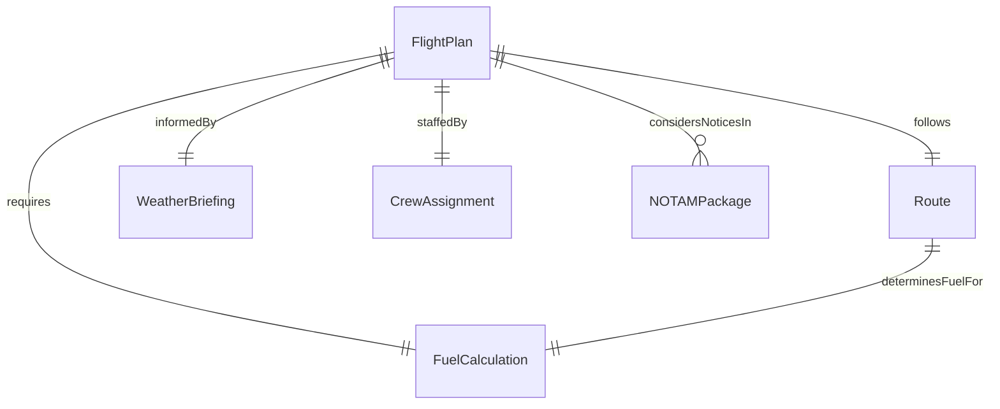
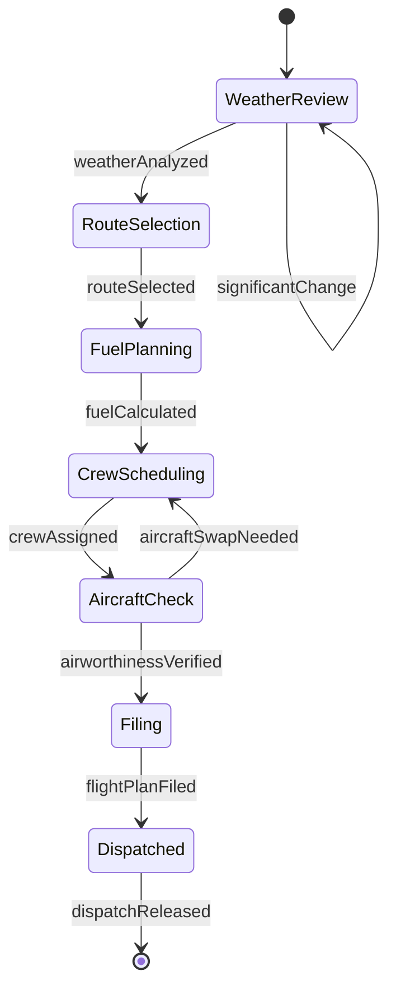
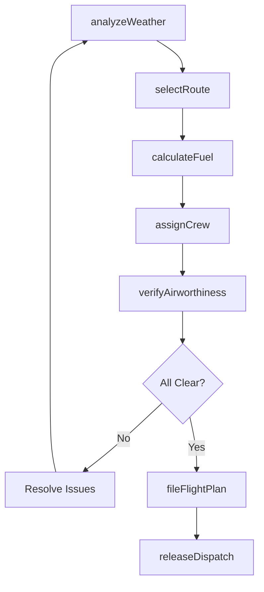
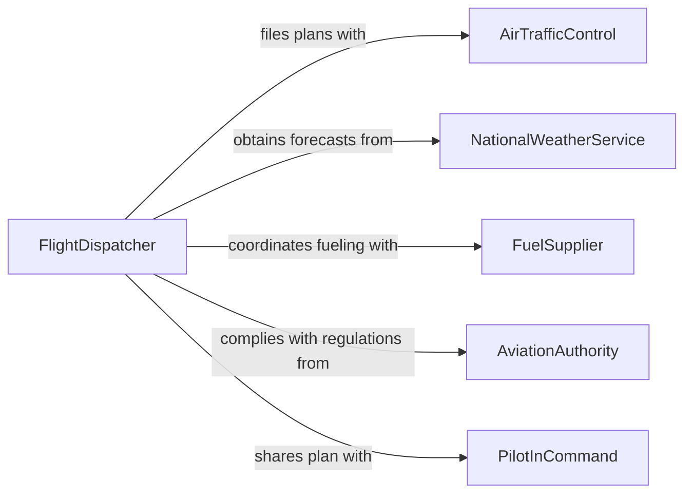

# Plan Flight Operations

> Business-as-Code definition for planning flight operations. Models the complete flight planning lifecycle from route selection and weather analysis through fuel calculation, crew scheduling, and dispatch release.

## Overview

Planning flight operations involves analyzing weather conditions, selecting optimal routes, calculating fuel requirements, verifying aircraft airworthiness, assigning crew members, and filing flight plans with air traffic control. This activity supports commercial airlines, cargo carriers, charter operators, and military aviation units. Thorough flight planning ensures regulatory compliance, passenger safety, operational efficiency, and fuel economy across domestic and international operations.

## Actors

| Actor | Description |
|-------|-------------|
| AirTrafficControl | Manages airspace allocation, route clearances, and separation services |
| NationalWeatherService | Provides aviation weather forecasts, SIGMETs, and turbulence advisories |
| FuelSupplier | Delivers aviation fuel to departure and alternate airports |
| AviationAuthority | Regulates flight operations through FAA, EASA, or equivalent standards |
| GroundHandler | Coordinates ramp services, baggage loading, and aircraft servicing |

## Roles

| Role | Description |
|------|-------------|
| FlightDispatcher | Develops the operational flight plan and shares responsibility for flight safety |
| PilotInCommand | Reviews and accepts the flight plan and holds final authority for the flight |
| CrewScheduler | Assigns flight crew members based on qualifications, duty time, and rest requirements |
| MaintenanceController | Confirms aircraft airworthiness and any deferred maintenance items |

## Entities

| Entity | Description |
|--------|-------------|
| FlightPlan | A documented route, altitude, fuel, and timing plan filed with authorities |
| Route | The planned airway segments and waypoints from departure to destination |
| FuelCalculation | The computed fuel load including trip, reserve, alternate, and contingency fuel |
| WeatherBriefing | A compiled assessment of en-route and terminal weather conditions |
| CrewAssignment | The allocation of captain, first officer, and cabin crew to a specific flight |
| NOTAMPackage | Notices to Air Missions affecting the planned route, airports, or airspace |

## Actions

| Action | Description |
|--------|-------------|
| analyzeWeather | Review current and forecast weather along the planned route and alternates |
| selectRoute | Choose the optimal airway routing based on weather, traffic, and fuel efficiency |
| calculateFuel | Determine required fuel load including reserves and contingency margins |
| assignCrew | Schedule qualified flight crew within duty time and rest regulations |
| verifyAirworthiness | Confirm aircraft maintenance status and minimum equipment list compliance |
| fileFlightPlan | Submit the completed flight plan to air traffic control authorities |
| releaseDispatch | Issue the formal dispatch release authorizing departure |

## Events

| Event | Description |
|-------|-------------|
| weatherAnalyzed | En-route and terminal weather briefing has been completed |
| routeSelected | Optimal airway routing has been determined |
| fuelCalculated | Required fuel load has been computed and verified |
| crewAssigned | Flight crew members have been scheduled and notified |
| airworthinessVerified | Aircraft has been confirmed fit for the planned operation |
| flightPlanFiled | Flight plan has been submitted to air traffic control |
| dispatchReleased | Formal authorization to proceed with the flight has been issued |

## Searches

| Search | Description |
|--------|-------------|
| findFlights | List flight plans by date, route, aircraft, or crew assignment |
| getWeatherBriefing | Retrieve aviation weather data for a specific route and time window |
| getCrewAvailability | Check pilot and cabin crew availability by qualification and duty status |
| getNOTAMs | Access active notices affecting airports, routes, or airspace sectors |

## Entity Relationships



## State Diagram



## Workflow



## Actor Relationships



## Usage

### Calling Actions

```typescript
import { planFlightOperations } from '@headlessly/plan-flight-operations'

const flights = planFlightOperations()

// Analyze weather for a planned route
const weather = await flights.analyzeWeather({
  departure: 'KJFK',
  destination: 'EGLL',
  alternates: ['LFPG', 'EHAM'],
  departureTime: '2026-04-10T14:00Z'
})

// Select optimal route
const route = await flights.selectRoute({
  departure: 'KJFK',
  destination: 'EGLL',
  weatherBriefingId: weather.id,
  optimizeFor: 'fuel-efficiency',
  altitude: 'FL370'
})

// Calculate fuel requirements
const fuel = await flights.calculateFuel({
  routeId: route.id,
  aircraftType: 'B777-300ER',
  payload: 45000,
  reserves: { alternate: 'LFPG', holding: 30, contingency: 0.05 }
})

// Release dispatch
await flights.releaseDispatch({
  flightNumber: 'BA178',
  routeId: route.id,
  fuelCalculationId: fuel.id,
  crewAssignmentId: 'crew-ba178-20260410'
})
```

### Event-Driven Automation

```typescript
// Alert dispatch on significant weather changes
flights.weatherAnalyzed(async ({ routeId, hazards }) => {
  const severe = hazards.filter(h => h.severity === 'severe')
  if (severe.length > 0) {
    await notify({
      to: 'dispatch-desk',
      message: `Severe weather on route ${routeId}: ${severe.map(h => h.type).join(', ')}`
    })
  }
})

// Notify crew when dispatch is released
flights.dispatchReleased(async ({ flightNumber, crewAssignmentId }) => {
  await notify({
    to: crewAssignmentId,
    message: `Dispatch released for ${flightNumber}. Report to briefing room.`
  })
})
```
