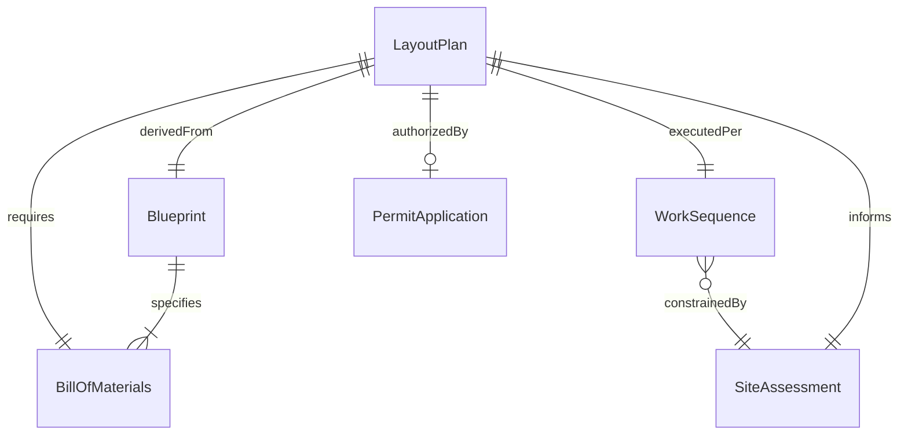
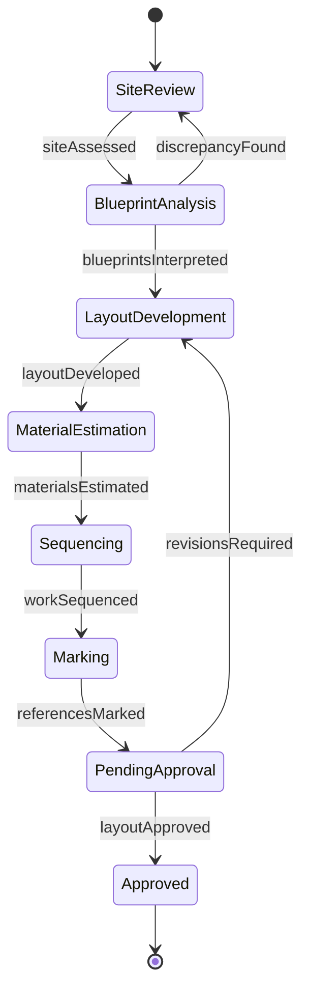
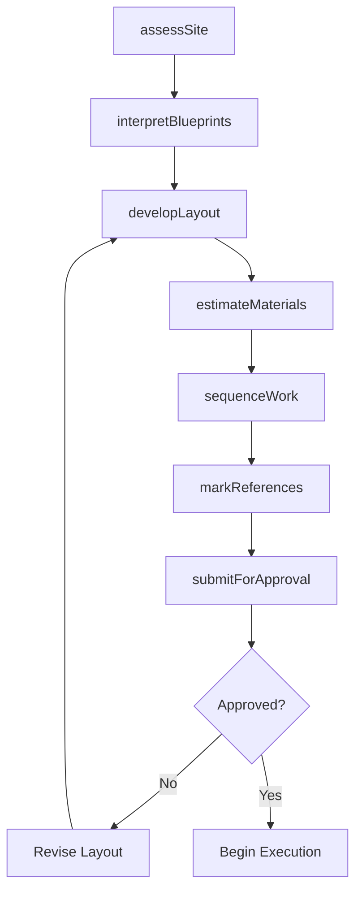
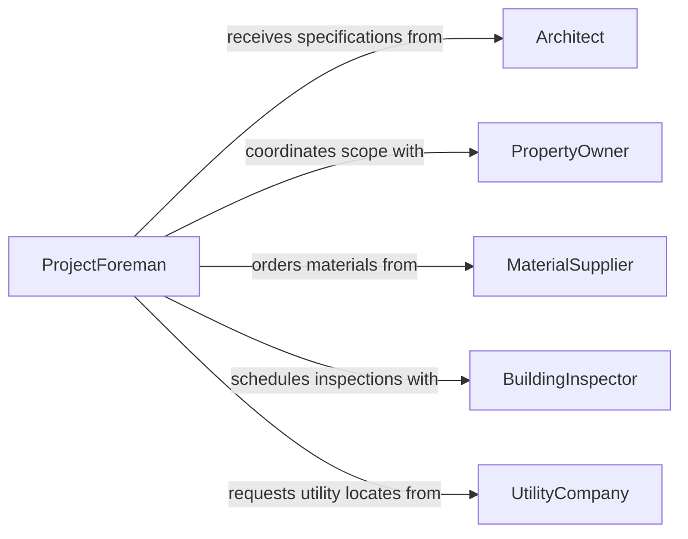

# Plan Layout Construction Installation Repairs

> Business-as-Code definition for planning the layout of construction, installation, or repair work. Models the lifecycle from site assessment and blueprint development through material estimation, work sequencing, and layout approval.

## Overview

Planning the layout of construction, installation, or repair work involves surveying site conditions, interpreting blueprints and specifications, determining material and equipment requirements, sequencing work phases, and marking physical reference points. This activity is essential for general contractors, electrical and mechanical trades, facility maintenance teams, and infrastructure developers working on new builds, tenant improvements, equipment installations, and structural repairs.

## Actors

| Actor | Description |
|-------|-------------|
| PropertyOwner | Commissions the construction, installation, or repair project |
| Architect | Produces design drawings and specifications for the work |
| BuildingInspector | Reviews layouts and completed work for code compliance |
| MaterialSupplier | Provides lumber, steel, pipe, wire, and other construction materials |
| UtilityCompany | Coordinates utility locates and service connections for the site |

## Roles

| Role | Description |
|------|-------------|
| ProjectForeman | Leads layout planning, crew coordination, and on-site execution |
| Estimator | Calculates material quantities, labor hours, and project costs |
| Drafter | Produces shop drawings and layout details from architectural plans |
| SafetyOfficer | Ensures layout plans account for fall protection, excavation safety, and egress |

## Entities

| Entity | Description |
|--------|-------------|
| LayoutPlan | A detailed spatial arrangement showing component placement and dimensions |
| Blueprint | Architectural or engineering drawings that define the design intent |
| BillOfMaterials | An itemized list of materials, quantities, and specifications required |
| WorkSequence | The ordered phases and dependencies for completing the layout |
| SiteAssessment | A documented evaluation of existing conditions, obstacles, and constraints |
| PermitApplication | A regulatory submission required before construction or installation begins |

## Actions

| Action | Description |
|--------|-------------|
| assessSite | Survey existing conditions, dimensions, and underground utilities |
| interpretBlueprints | Review architectural and engineering drawings to extract layout details |
| developLayout | Create the spatial arrangement plan with precise measurements and references |
| estimateMaterials | Calculate quantities of materials and equipment needed for the work |
| sequenceWork | Define the order of operations, dependencies, and crew assignments |
| markReferences | Establish physical layout points, chalk lines, and elevation benchmarks on site |
| submitForApproval | Present the layout plan for owner, architect, or inspector review |

## Events

| Event | Description |
|-------|-------------|
| siteAssessed | Existing conditions have been surveyed and documented |
| blueprintsInterpreted | Design drawings have been reviewed and layout details extracted |
| layoutDeveloped | Spatial arrangement plan has been completed |
| materialsEstimated | Bill of materials has been calculated and verified |
| workSequenced | Order of operations and crew assignments have been defined |
| referencesMarked | Physical layout points have been established on site |
| layoutApproved | The plan has been reviewed and approved for execution |

## Searches

| Search | Description |
|--------|-------------|
| findLayouts | List layout plans by project, trade, status, or date |
| getMaterials | Retrieve bill of materials by project or work phase |
| getWorkSequence | Access the ordered task list with dependencies for a layout |
| getPermitStatus | Check the approval status of regulatory permits for a project |

## Entity Relationships



## State Diagram



## Workflow



## Actor Relationships



## Usage

### Calling Actions

```typescript
import { planLayoutConstructionInstallationRepairs } from '@headlessly/plan-layout-construction-installation-repairs'

const layout = planLayoutConstructionInstallationRepairs()

// Assess the site conditions
const assessment = await layout.assessSite({
  projectId: 'proj-warehouse-expansion',
  address: '1200 Industrial Pkwy, Columbus, OH',
  measurements: true,
  utilityLocate: true
})

// Develop the layout plan
const plan = await layout.developLayout({
  projectId: 'proj-warehouse-expansion',
  blueprintId: 'bp-arch-v3',
  trade: 'structural-steel',
  dimensions: { length: 120, width: 80, height: 24, unit: 'feet' }
})

// Estimate materials
await layout.estimateMaterials({
  layoutId: plan.id,
  categories: ['structural-steel', 'concrete', 'fasteners', 'welding-consumables']
})
```

### Event-Driven Automation

```typescript
// Auto-generate purchase orders when materials are estimated
layout.materialsEstimated(async ({ layoutId, billOfMaterials }) => {
  for (const item of billOfMaterials) {
    await createPurchaseOrder({
      supplier: item.preferredSupplier,
      material: item.description,
      quantity: item.quantity,
      deliverBy: item.neededDate
    })
  }
})

// Notify crew when layout is approved
layout.layoutApproved(async ({ projectId, layoutId }) => {
  await notify({
    to: 'field-crew',
    message: `Layout ${layoutId} for project ${projectId} is approved. Begin reference marking.`
  })
})
```
