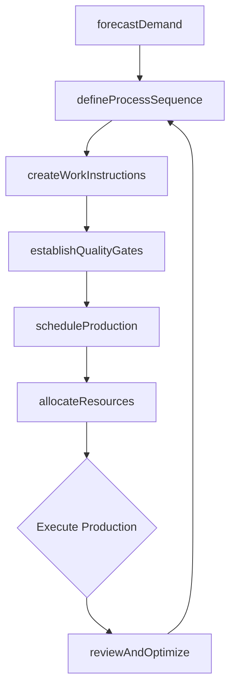
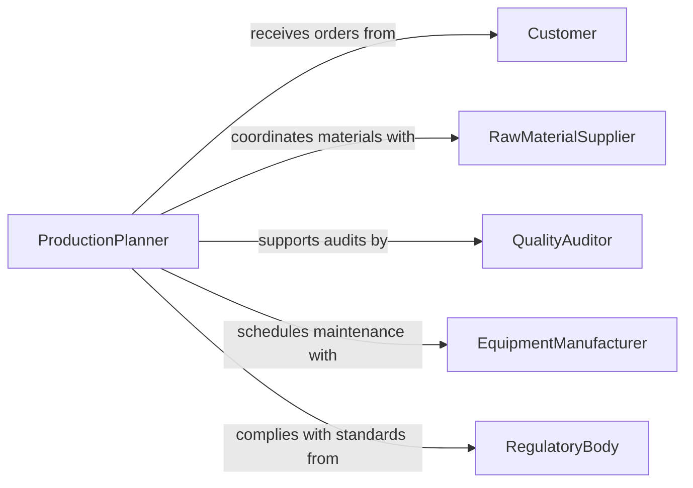

# Plan Production Operational Procedures Sequences

> Business-as-Code definition for planning production or operational procedures and sequences. Models the lifecycle from demand forecasting through process design, resource scheduling, quality checkpoints, and continuous improvement.

## Overview

Planning production and operational procedures involves defining the sequence of manufacturing or processing steps, allocating machinery and labor, establishing quality control checkpoints, and scheduling work to meet delivery commitments. This activity supports factories, food processing plants, pharmaceutical manufacturers, assembly operations, and any organization that transforms raw inputs into finished goods through repeatable processes. Effective production planning minimizes waste, reduces lead times, and ensures consistent product quality.

## Actors

| Actor | Description |
|-------|-------------|
| Customer | Places orders that drive production demand and delivery schedules |
| RawMaterialSupplier | Provides feedstock, components, and consumables for production |
| QualityAuditor | Conducts independent assessments of production processes and outputs |
| EquipmentManufacturer | Supplies and services production machinery and tooling |
| RegulatoryBody | Sets manufacturing standards, safety requirements, and compliance mandates |

## Roles

| Role | Description |
|------|-------------|
| ProductionPlanner | Develops production schedules, sequences, and resource allocations |
| ProcessEngineer | Designs and optimizes manufacturing procedures and work instructions |
| QualityController | Defines inspection checkpoints and acceptance criteria within the process |
| ShiftSupervisor | Executes the production plan on the factory floor and manages personnel |

## Entities

| Entity | Description |
|--------|-------------|
| ProductionOrder | A work directive specifying what to produce, in what quantity, and by when |
| ProcessSequence | The ordered series of operations required to transform inputs into outputs |
| WorkInstruction | A detailed step-by-step procedure for performing a specific operation |
| QualityCheckpoint | An inspection or test point embedded within the production sequence |
| BillOfMaterials | The structured list of raw materials and components for a finished product |
| CapacityPlan | An assessment of available machine hours, labor, and throughput capability |

## Actions

| Action | Description |
|--------|-------------|
| forecastDemand | Analyze orders and market signals to project production requirements |
| defineProcessSequence | Specify the ordered operations, work centers, and cycle times |
| createWorkInstructions | Document step-by-step procedures for each production operation |
| scheduleProduction | Assign production orders to time slots, machines, and shifts |
| allocateResources | Reserve materials, equipment, and personnel for scheduled production |
| establishQualityGates | Define inspection criteria and sampling plans at key process steps |
| reviewAndOptimize | Analyze cycle time, yield, and waste data to improve procedures |

## Events

| Event | Description |
|-------|-------------|
| demandForecasted | Production requirements have been projected from order and market data |
| processSequenceDefined | Manufacturing operations and their order have been established |
| workInstructionsCreated | Step-by-step procedures have been documented and approved |
| productionScheduled | Orders have been assigned to machines, shifts, and time slots |
| resourcesAllocated | Materials, equipment, and labor have been reserved for production |
| qualityGatesEstablished | Inspection criteria and sampling plans have been set |
| processOptimized | Procedures have been revised based on performance analysis |

## Searches

| Search | Description |
|--------|-------------|
| findProductionOrders | List production orders by product, date, status, or priority |
| getProcessSequence | Retrieve the operation steps and cycle times for a specific product |
| getCapacity | Check available machine hours and labor by work center and time period |
| getQualityMetrics | Access yield, defect rate, and inspection results by production line |

## Workflow



## Actor Relationships



## Usage

### Calling Actions

```typescript
import { planProductionOperationalProceduresSequences } from '@headlessly/plan-production-operational-procedures-sequences'

const production = planProductionOperationalProceduresSequences()

// Forecast demand for next quarter
const forecast = await production.forecastDemand({
  productFamily: 'precision-bearings',
  period: 'Q2-2026',
  sources: ['open-orders', 'sales-pipeline', 'seasonal-trends']
})

// Define the process sequence
const sequence = await production.defineProcessSequence({
  product: 'bearing-6205-2RS',
  operations: [
    { step: 1, name: 'forging', workCenter: 'forge-line-A', cycleTime: 45 },
    { step: 2, name: 'turning', workCenter: 'cnc-lathe-12', cycleTime: 120 },
    { step: 3, name: 'heat-treatment', workCenter: 'furnace-2', cycleTime: 480 },
    { step: 4, name: 'grinding', workCenter: 'grinder-7', cycleTime: 90 },
    { step: 5, name: 'assembly', workCenter: 'assembly-cell-B', cycleTime: 60 }
  ]
})

// Schedule production
await production.scheduleProduction({
  productionOrderId: 'PO-2026-1847',
  sequenceId: sequence.id,
  startDate: '2026-04-07',
  shift: 'day',
  quantity: 5000
})
```

### Event-Driven Automation

```typescript
// Trigger material procurement when production is scheduled
production.productionScheduled(async ({ productionOrderId, billOfMaterials }) => {
  for (const material of billOfMaterials) {
    const stock = await checkInventory(material.partNumber)
    if (stock.available < material.requiredQuantity) {
      await createPurchaseRequisition({
        partNumber: material.partNumber,
        quantity: material.requiredQuantity - stock.available,
        neededBy: material.neededDate
      })
    }
  }
})

// Alert on quality gate failures
production.qualityGatesEstablished(async ({ productionOrderId }) => {
  await enableInspectionHook({
    orderId: productionOrderId,
    onFailure: async ({ step, defectType, quantity }) => {
      await escalate({
        to: 'quality-controller',
        message: `Quality gate failure at step ${step}: ${quantity} units with ${defectType}`
      })
    }
  })
})
```
