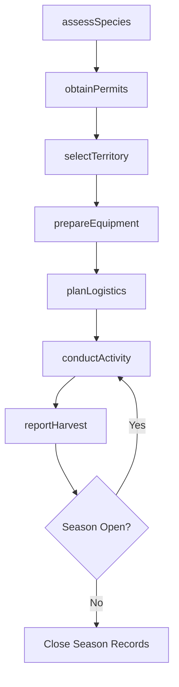
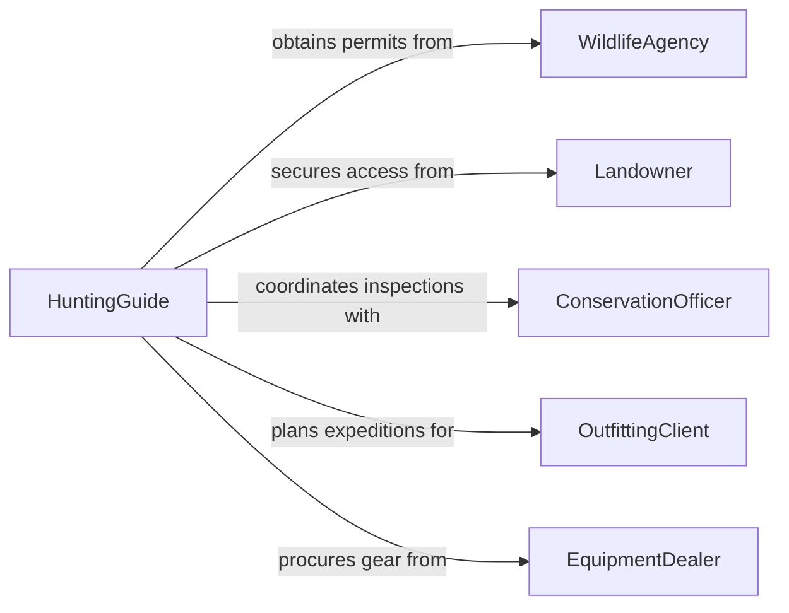

# Plan Trapping Hunting Activities

> Business-as-Code definition for planning trapping or hunting activities. Models the lifecycle from species assessment and permit acquisition through territory selection, equipment preparation, and harvest reporting.

## Overview

Planning trapping and hunting activities involves identifying target species, obtaining required permits and licenses, selecting harvest territories based on population surveys and habitat conditions, preparing equipment, and establishing compliance with wildlife regulations. This activity supports wildlife management agencies, commercial trappers, outfitting guides, and conservation organizations conducting population control, fur harvesting, or subsistence hunting programs.

## Actors

| Actor | Description |
|-------|-------------|
| WildlifeAgency | Issues permits, sets harvest quotas, and manages species populations |
| Landowner | Grants or denies access to private land for hunting and trapping activities |
| ConservationOfficer | Enforces wildlife regulations and inspects harvests in the field |
| OutfittingClient | Hires guide services for planned hunting or trapping expeditions |
| EquipmentDealer | Supplies traps, firearms, ammunition, and field gear |

## Roles

| Role | Description |
|------|-------------|
| HuntingGuide | Plans and leads hunting or trapping expeditions in the field |
| WildlifeBiologist | Conducts population surveys and recommends harvest levels |
| PermitCoordinator | Manages license applications, tag allocations, and regulatory documentation |
| FieldLogistician | Organizes transportation, camps, equipment, and supply provisioning |

## Entities

| Entity | Description |
|--------|-------------|
| HarvestPlan | A documented plan specifying species, location, methods, and season dates |
| Permit | A government-issued license authorizing the taking of specific species |
| Territory | A geographic area selected for hunting or trapping based on habitat quality |
| SpeciesSurvey | Population data and trend analysis for target wildlife species |
| EquipmentManifest | An inventory of traps, firearms, and gear required for the activity |
| HarvestReport | A post-activity record of species taken, locations, and methods used |

## Actions

| Action | Description |
|--------|-------------|
| assessSpecies | Review population surveys and habitat data for target species |
| obtainPermits | Apply for and secure hunting or trapping licenses and tags |
| selectTerritory | Choose harvest areas based on species density, access, and regulations |
| prepareEquipment | Assemble, inspect, and maintain traps, firearms, and field supplies |
| planLogistics | Organize transportation, camp setup, and provisioning for the expedition |
| conductActivity | Execute the trapping or hunting plan in the field |
| reportHarvest | Document species taken, quantities, and locations for regulatory compliance |

## Events

| Event | Description |
|-------|-------------|
| speciesAssessed | Population and habitat data have been reviewed for target species |
| permitsObtained | All required licenses and tags have been secured |
| territorySelected | Harvest areas have been identified and access confirmed |
| equipmentPrepared | All traps, firearms, and gear have been inspected and readied |
| logisticsPlanned | Transportation, camp, and supply arrangements have been finalized |
| activityCompleted | The trapping or hunting expedition has concluded |
| harvestReported | Regulatory harvest reports have been filed |

## Searches

| Search | Description |
|--------|-------------|
| findHarvestPlans | List plans by species, territory, season, or status |
| getPermitStatus | Check application and issuance status for hunting or trapping licenses |
| getSpeciesData | Retrieve population surveys and trend data for a specific species and region |
| getHarvestHistory | Access historical harvest records by territory, season, or species |

## Workflow



## Actor Relationships



## Usage

### Calling Actions

```typescript
import { planTrappingHuntingActivities } from '@headlessly/plan-trapping-hunting-activities'

const hunting = planTrappingHuntingActivities()

// Assess target species population
const survey = await hunting.assessSpecies({
  species: 'white-tailed-deer',
  region: 'unit-7a-colorado',
  season: 'fall-2026',
  dataSource: 'state-wildlife-survey'
})

// Obtain permits
const permit = await hunting.obtainPermits({
  applicant: 'guide-johnson',
  species: 'white-tailed-deer',
  tags: 2,
  unit: '7a',
  season: { start: '2026-10-15', end: '2026-11-30' }
})

// Plan expedition logistics
await hunting.planLogistics({
  harvestPlanId: 'hp-2026-fall-7a',
  transportation: 'four-wheel-drive',
  campLocation: 'elk-creek-trailhead',
  duration: 5,
  provisions: ['food', 'water', 'first-aid', 'field-dressing-kit']
})
```

### Event-Driven Automation

```typescript
// Notify guide when permits are approved
hunting.permitsObtained(async ({ harvestPlanId, permitIds }) => {
  await notify({
    to: 'guide-team',
    message: `Permits approved for plan ${harvestPlanId}. Begin territory scouting.`
  })
})

// Auto-submit harvest reports to wildlife agency
hunting.activityCompleted(async ({ harvestPlanId, speciesTaken }) => {
  await hunting.reportHarvest({
    harvestPlanId,
    entries: speciesTaken.map(s => ({
      species: s.species,
      quantity: s.count,
      location: s.gpsCoordinates,
      method: s.method,
      date: s.date
    }))
  })
})
```
