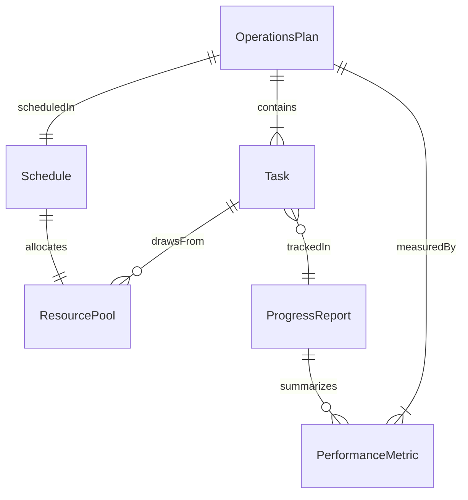
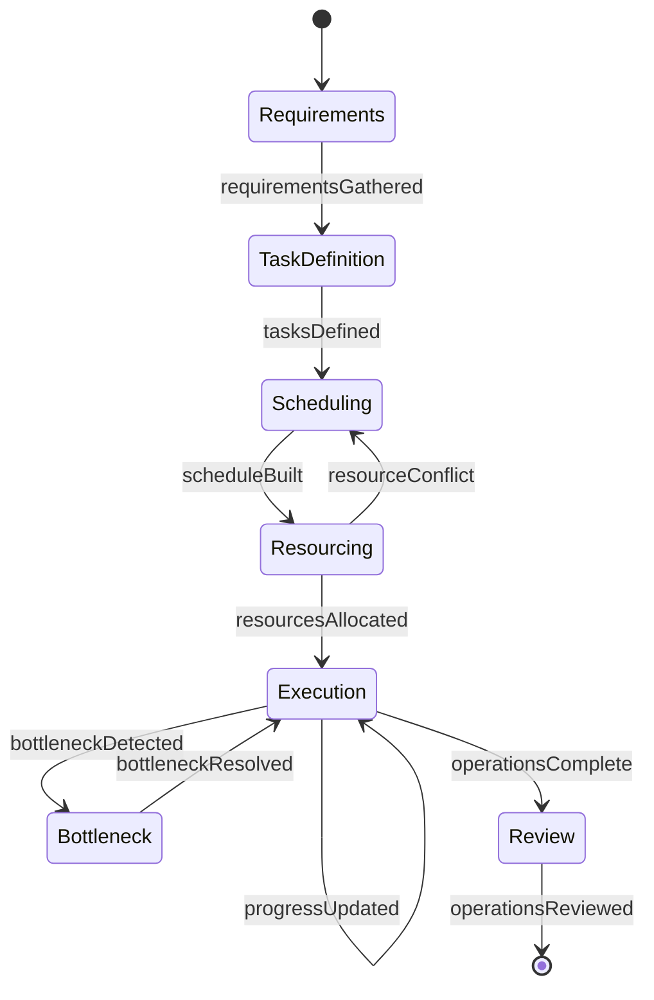
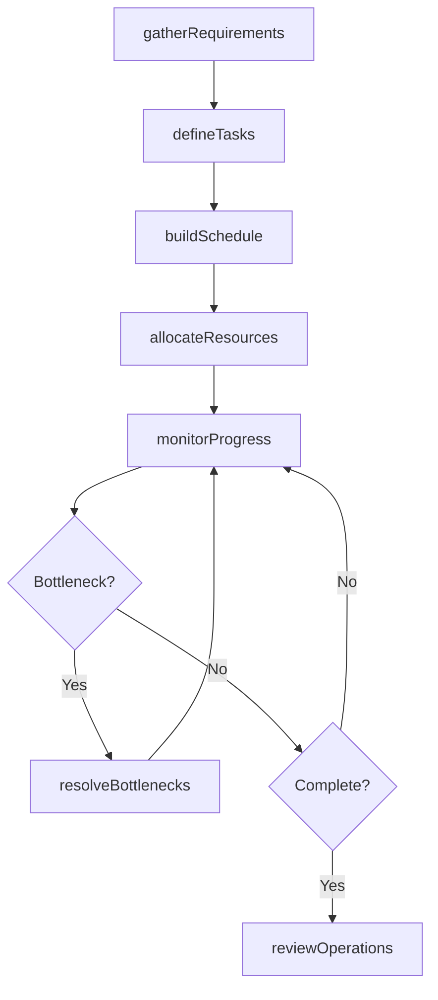
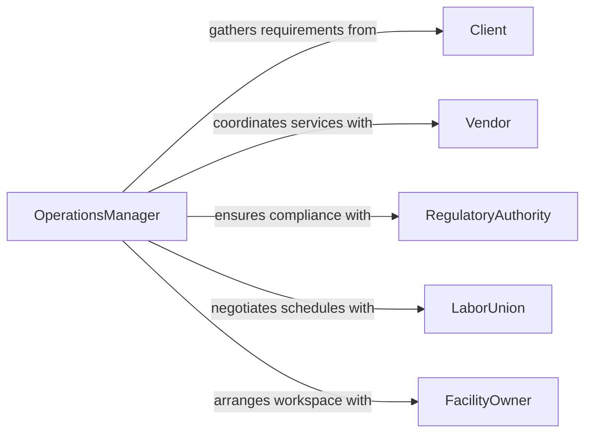

# Plan Work Operations

> Business-as-Code definition for planning work operations. Models the lifecycle from requirements gathering and task definition through resource scheduling, execution monitoring, and operational review.

## Overview

Planning work operations involves defining tasks and deliverables, assigning personnel and equipment, establishing timelines, and monitoring execution to ensure operational goals are met on schedule and within budget. This activity applies broadly across industries including facilities management, field operations, manufacturing, logistics, and professional services. Effective operations planning balances workload distribution, minimizes downtime, and provides visibility into progress and bottlenecks.

## Actors

| Actor | Description |
|-------|-------------|
| Client | The internal or external party requesting operational work to be performed |
| Vendor | External service providers or suppliers supporting the operation |
| RegulatoryAuthority | Government or industry bodies imposing standards on work execution |
| LaborUnion | Represents workforce interests including scheduling, safety, and work rules |
| FacilityOwner | Provides and maintains the physical workspace where operations occur |

## Roles

| Role | Description |
|------|-------------|
| OperationsManager | Develops and oversees the overall work plan and resource allocation |
| TeamLead | Directs daily task execution and resolves on-the-ground issues |
| Scheduler | Builds and maintains work schedules balancing capacity and demand |
| PerformanceAnalyst | Tracks operational metrics and identifies improvement opportunities |

## Entities

| Entity | Description |
|--------|-------------|
| OperationsPlan | A comprehensive document defining scope, tasks, timeline, and resources |
| Task | A discrete unit of work with defined inputs, outputs, and duration |
| Schedule | A time-based allocation of tasks to personnel and equipment |
| ResourcePool | The available workforce, machinery, and materials for assignment |
| ProgressReport | A periodic update on task completion, delays, and issues |
| PerformanceMetric | A measurable indicator of operational efficiency or quality |

## Actions

| Action | Description |
|--------|-------------|
| gatherRequirements | Collect operational objectives, constraints, and deliverables from stakeholders |
| defineTasks | Break down the operation into discrete, assignable work units |
| buildSchedule | Create a timeline assigning tasks to specific dates, shifts, and personnel |
| allocateResources | Reserve personnel, equipment, and materials for scheduled tasks |
| monitorProgress | Track task completion, flag delays, and update stakeholders |
| resolveBottlenecks | Identify and address resource conflicts, delays, or quality issues |
| reviewOperations | Conduct post-completion analysis of schedule adherence and performance |

## Events

| Event | Description |
|-------|-------------|
| requirementsGathered | Operational objectives and constraints have been documented |
| tasksDefined | Work has been decomposed into discrete assignable units |
| scheduleBuilt | Tasks have been assigned to dates, shifts, and personnel |
| resourcesAllocated | Personnel, equipment, and materials have been reserved |
| progressUpdated | Task completion status has been reported and recorded |
| bottleneckResolved | A resource conflict or delay has been addressed |
| operationsReviewed | Post-completion performance analysis has been finalized |

## Searches

| Search | Description |
|--------|-------------|
| findOperationsPlans | List plans by department, status, date range, or manager |
| getTasks | Retrieve tasks by plan, assignee, status, or priority |
| getScheduleConflicts | Identify overlapping assignments or resource over-allocations |
| getPerformanceMetrics | Access cycle time, utilization, and on-time completion rates |

## Entity Relationships



## State Diagram



## Workflow



## Actor Relationships



## Usage

### Calling Actions

```typescript
import { planWorkOperations } from '@headlessly/plan-work-operations'

const operations = planWorkOperations()

// Gather requirements for a facility maintenance operation
const requirements = await operations.gatherRequirements({
  operationType: 'quarterly-facility-maintenance',
  facility: 'building-c-campus-north',
  objectives: ['hvac-inspection', 'fire-system-testing', 'elevator-servicing'],
  deadline: '2026-03-31'
})

// Define tasks from requirements
const tasks = await operations.defineTasks({
  requirementsId: requirements.id,
  tasks: [
    { name: 'HVAC filter replacement', duration: 4, unit: 'hours', skill: 'hvac-tech' },
    { name: 'Fire alarm panel testing', duration: 2, unit: 'hours', skill: 'fire-safety' },
    { name: 'Elevator annual inspection', duration: 6, unit: 'hours', skill: 'elevator-tech' }
  ]
})

// Build the schedule
await operations.buildSchedule({
  planId: requirements.id,
  tasks: tasks.map(t => t.id),
  startDate: '2026-03-17',
  shiftHours: { start: '07:00', end: '15:30' }
})
```

### Event-Driven Automation

```typescript
// Alert manager when a bottleneck is detected
operations.progressUpdated(async ({ planId, delayedTasks }) => {
  if (delayedTasks.length > 0) {
    await notify({
      to: 'operations-manager',
      message: `${delayedTasks.length} tasks delayed on plan ${planId}. Review schedule conflicts.`
    })
  }
})

// Auto-generate performance report after operations complete
operations.operationsReviewed(async ({ planId, metrics }) => {
  await generateReport({
    planId,
    onTimeRate: metrics.onTimeCompletion,
    utilization: metrics.resourceUtilization,
    issues: metrics.bottlenecksResolved
  })
})
```
