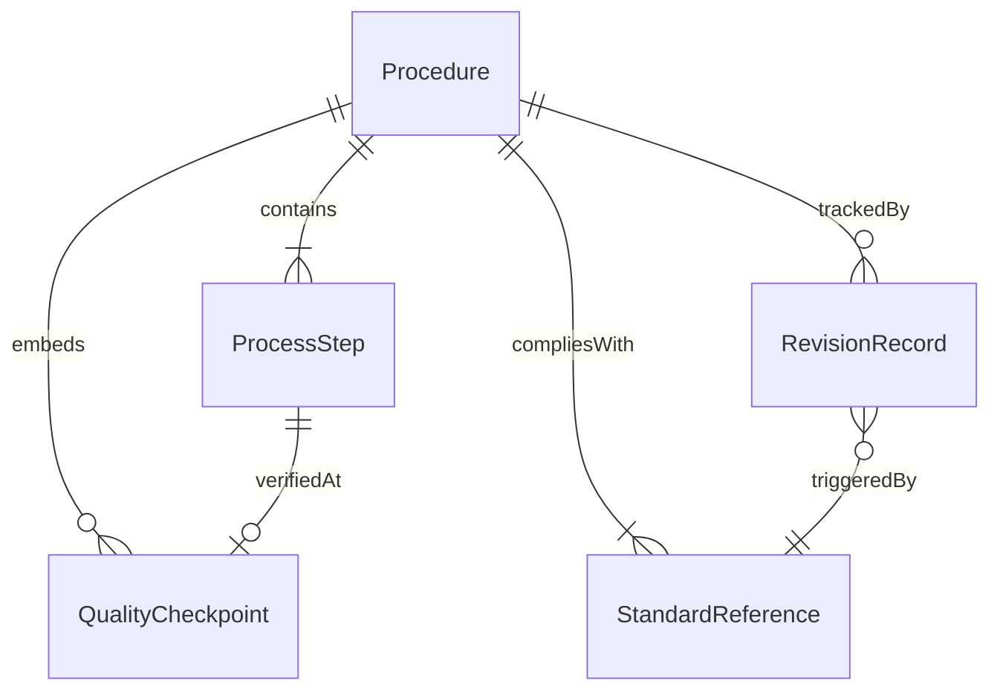
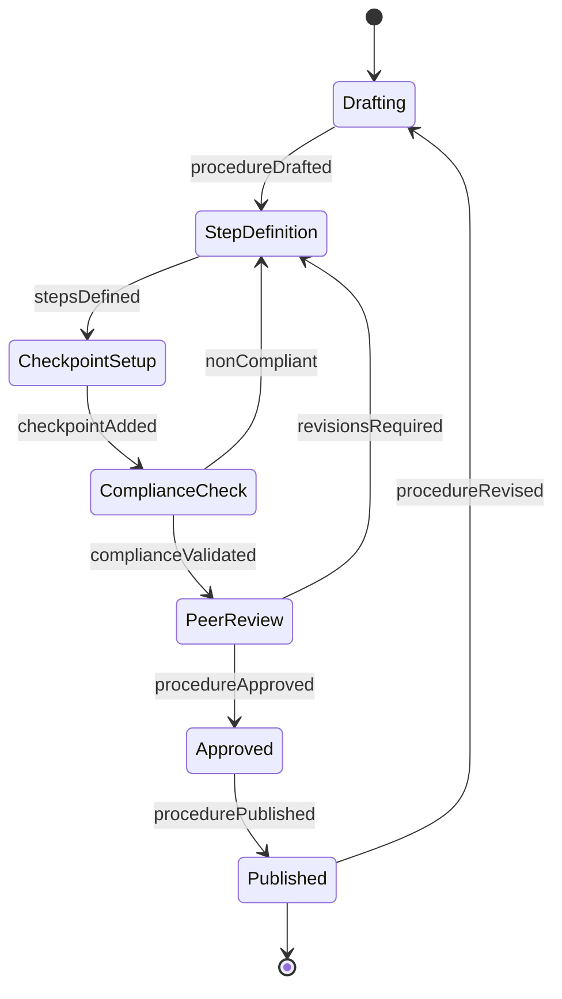
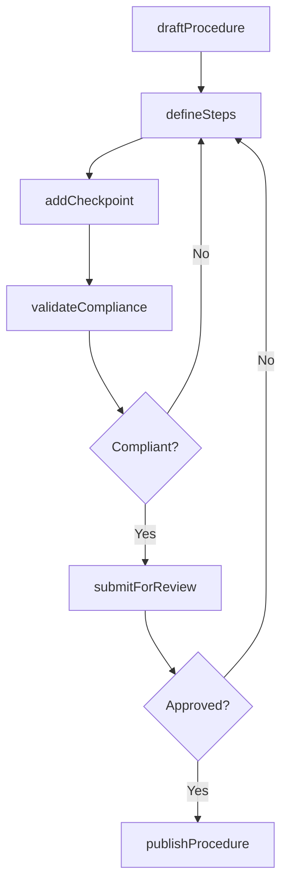
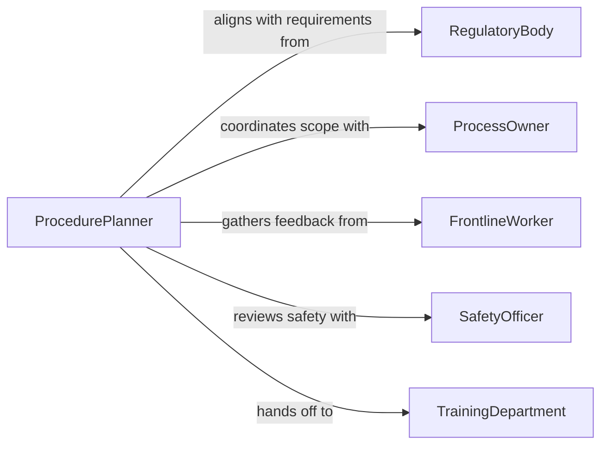

# Plan Work Procedures

> Business-as-Code definition for planning work procedures. Models the design, documentation, and validation of standardized procedures that govern how work is performed across an organization.

## Overview

Planning work procedures involves defining the step-by-step methods, sequences, and standards that workers follow to complete operational tasks consistently and safely. This includes identifying process inputs and outputs, establishing quality checkpoints, and documenting procedures in a format that supports training and compliance. The definition provides actions for procedure creation and lifecycle management, events for tracking procedural changes, and searches for accessing procedure libraries.

## Actors

| Actor | Description |
|-------|-------------|
| RegulatoryBody | Sets compliance requirements that procedures must satisfy |
| ProcessOwner | Accountable for the business process the procedure supports |
| FrontlineWorker | Executes the procedure and provides practical feedback |
| SafetyOfficer | Reviews procedures for occupational health and safety compliance |
| TrainingDepartment | Develops training materials based on finalized procedures |

## Roles

| Role | Description |
|------|-------------|
| ProcedurePlanner | Designs and documents work procedures |
| ProcessAnalyst | Analyzes workflow efficiency and identifies improvement opportunities |
| ComplianceReviewer | Validates procedures against regulatory and policy requirements |
| ApprovalAuthority | Grants final approval for procedure implementation |

## Entities

| Entity | Description |
|--------|-------------|
| Procedure | A documented sequence of steps for completing a specific work task |
| ProcessStep | An individual action within a procedure with defined inputs and outputs |
| QualityCheckpoint | A verification point ensuring work meets required standards |
| StandardReference | A regulatory or organizational standard the procedure must comply with |
| RevisionRecord | A tracked change to a procedure including rationale and effective date |

## Actions

| Action | Description |
|--------|-------------|
| draftProcedure | Create an initial procedure document with scope and objectives |
| defineSteps | Specify the sequential steps, tools, and materials for the procedure |
| addCheckpoint | Insert a quality or safety verification point within the procedure |
| validateCompliance | Check the procedure against applicable standards and regulations |
| submitForReview | Route the procedure to reviewers for feedback and approval |
| publishProcedure | Release the approved procedure for operational use |
| reviseProcedure | Update an existing procedure based on feedback or changing requirements |

## Events

| Event | Description |
|-------|-------------|
| procedureDrafted | A new procedure draft has been created |
| stepsDefined | Process steps have been documented for a procedure |
| checkpointAdded | A quality or safety checkpoint has been inserted |
| complianceValidated | The procedure has passed compliance review |
| procedureApproved | The procedure has received final approval |
| procedurePublished | The procedure is now available for operational use |
| procedureRevised | An existing procedure has been updated with a new revision |

## Searches

| Search | Description |
|--------|-------------|
| findProcedures | List procedures by department, process area, or status |
| getRevisionHistory | Retrieve the change history for a specific procedure |
| getPendingReviews | Find procedures awaiting review or approval |
| searchByStandard | Locate procedures linked to a specific regulatory standard |

## Entity Relationships



## State Diagram



## Workflow



## Actor Relationships



## Usage

### Calling Actions

```typescript
import { planWorkProcedures } from '@headlessly/plan-work-procedures'

const procedures = planWorkProcedures()

// Draft a new procedure
const proc = await procedures.draftProcedure({
  title: 'Equipment Changeover Procedure',
  department: 'Manufacturing',
  scope: 'CNC machine tool changeover for product line switching'
})

// Define the procedure steps
await procedures.defineSteps({
  procedureId: proc.id,
  steps: [
    { order: 1, description: 'Power down machine and lock out energy sources', tools: ['lockout-tagout-kit'] },
    { order: 2, description: 'Remove current tooling and fixtures', tools: ['wrench-set'] },
    { order: 3, description: 'Install new tooling per job specification', tools: ['torque-wrench'] },
    { order: 4, description: 'Run test cycle and verify dimensions', tools: ['caliper', 'micrometer'] }
  ]
})

// Publish after approval
await procedures.publishProcedure({ procedureId: proc.id })
```

### Event-Driven Automation

```typescript
// Notify training department when a procedure is published
procedures.procedurePublished(async ({ procedureId, title, department }) => {
  await notify({
    to: 'training-department',
    message: `New procedure "${title}" published for ${department} - training materials needed`
  })
})

// Track compliance validation failures
procedures.complianceValidated(async ({ procedureId, result, issues }) => {
  if (!result.passed) {
    await createTask({
      assignee: 'procedure-planner',
      title: `Resolve compliance issues for procedure ${procedureId}`,
      details: issues
    })
  }
})
```
