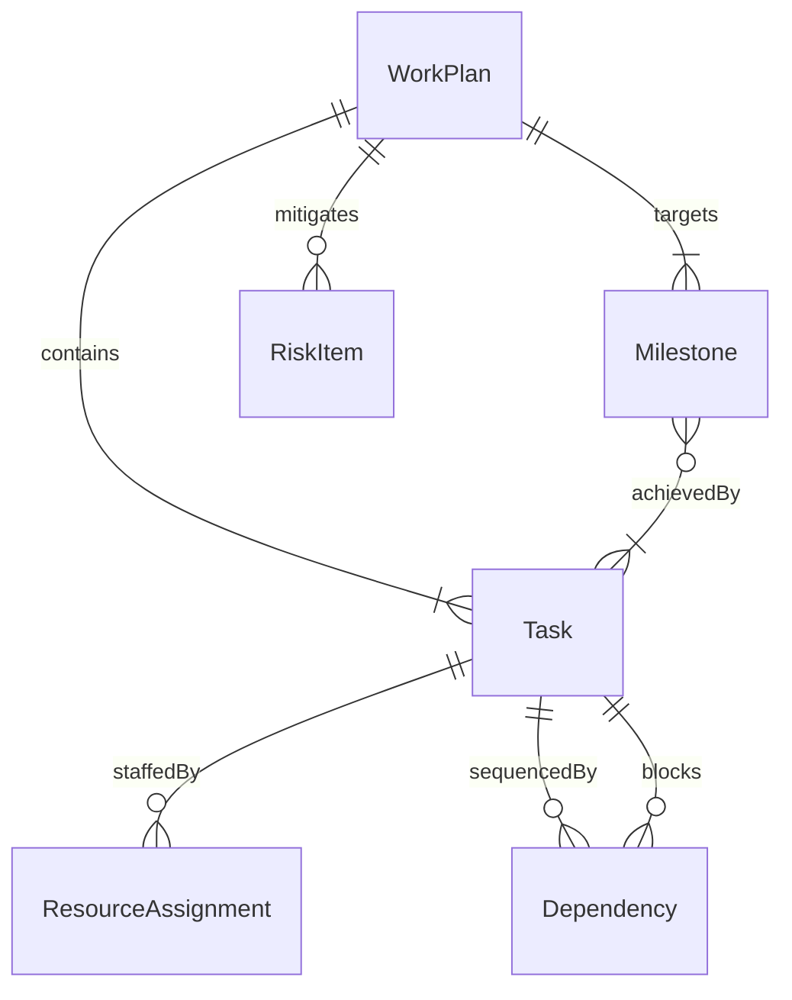
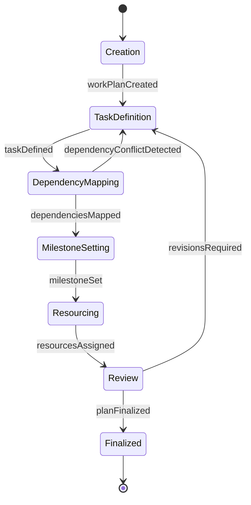
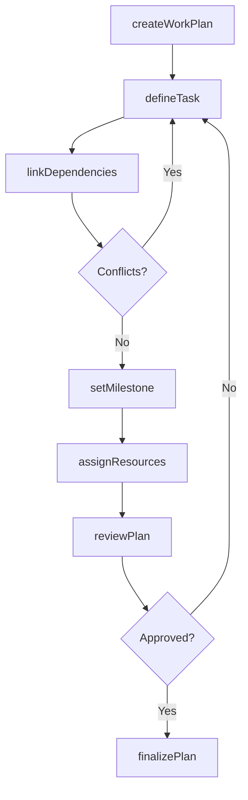
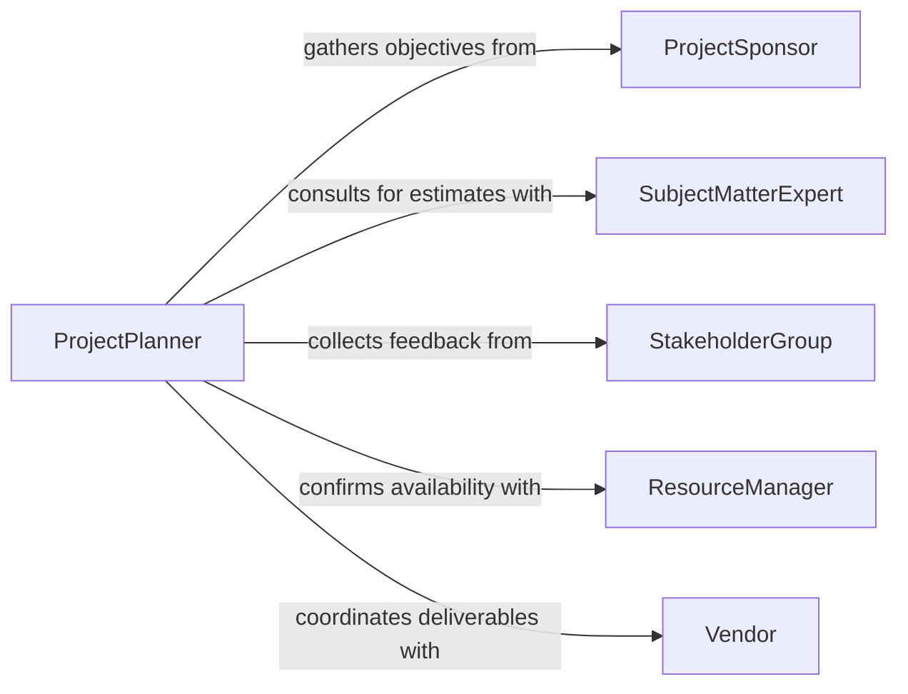

# Prepare Detailed Work Plans

> Business-as-Code definition for preparing detailed work plans. Models the complete lifecycle of creating, structuring, and finalizing work plans that define tasks, timelines, resources, and deliverables.

## Overview

Preparing detailed work plans involves breaking down project objectives into specific tasks, sequencing activities, assigning resources, and establishing milestones with target dates. This process ensures that all team members understand their responsibilities and that project execution follows a structured, measurable path. The definition exposes actions for plan creation and refinement, events for tracking plan status changes, and searches for retrieving plan data across projects.

## Actors

| Actor | Description |
|-------|-------------|
| ProjectSponsor | Provides project objectives, constraints, and funding authority |
| SubjectMatterExpert | Contributes domain knowledge for accurate task estimation |
| StakeholderGroup | Reviews and provides input on plan scope and priorities |
| ResourceManager | Confirms availability of personnel and equipment |
| Vendor | Supplies external services or materials referenced in the plan |

## Roles

| Role | Description |
|------|-------------|
| ProjectPlanner | Authors and maintains the detailed work plan |
| ScheduleAnalyst | Validates task dependencies and timeline feasibility |
| TeamLead | Reviews task assignments and confirms team capacity |
| QualityReviewer | Ensures the plan meets organizational standards and completeness criteria |

## Entities

| Entity | Description |
|--------|-------------|
| WorkPlan | A structured document defining tasks, timelines, and resources for a project |
| Task | An individual unit of work with defined inputs, outputs, and duration |
| Milestone | A significant checkpoint marking completion of a phase or deliverable |
| ResourceAssignment | A mapping of personnel or equipment to specific tasks |
| Dependency | A relationship between tasks that determines sequencing |
| RiskItem | A potential issue identified during planning that could affect the schedule |

## Actions

| Action | Description |
|--------|-------------|
| createWorkPlan | Initialize a new detailed work plan from project objectives |
| defineTask | Add a task with description, duration, and resource requirements |
| setMilestone | Establish a milestone with target date and acceptance criteria |
| assignResources | Map available personnel and equipment to plan tasks |
| linkDependencies | Define sequencing relationships between tasks |
| reviewPlan | Submit the work plan for stakeholder review and feedback |
| finalizePlan | Lock the plan as the approved baseline for execution |

## Events

| Event | Description |
|-------|-------------|
| workPlanCreated | A new work plan has been initialized |
| taskDefined | A task has been added to the work plan |
| milestoneSet | A milestone has been established with a target date |
| resourcesAssigned | Personnel or equipment have been mapped to tasks |
| planReviewed | Stakeholder review of the work plan is complete |
| planFinalized | The work plan has been approved and baselined |
| dependencyConflictDetected | A circular or infeasible dependency has been identified |

## Searches

| Search | Description |
|--------|-------------|
| findWorkPlans | List work plans by project, status, or date range |
| getTasksByMilestone | Retrieve all tasks associated with a specific milestone |
| getResourceUtilization | Query resource allocation across tasks and plans |
| getCriticalPath | Identify the longest dependency chain determining project duration |

## Entity Relationships



## State Diagram



## Workflow



## Actor Relationships



## Usage

### Calling Actions

```typescript
import { prepareDetailedWorkPlans } from '@headlessly/prepare-detailed-work-plans'

const plans = prepareDetailedWorkPlans()

// Initialize a new work plan
const plan = await plans.createWorkPlan({
  name: 'Q3 Product Launch Plan',
  projectId: 'proj-2026-q3',
  startDate: '2026-07-01',
  endDate: '2026-09-30'
})

// Define tasks and set milestones
await plans.defineTask({
  planId: plan.id,
  name: 'Complete UX Design',
  duration: { days: 15 },
  resources: ['design-team']
})

await plans.setMilestone({
  planId: plan.id,
  name: 'Design Review Complete',
  targetDate: '2026-07-20',
  criteria: 'All wireframes approved by stakeholders'
})

// Finalize after review
await plans.finalizePlan({ planId: plan.id })
```

### Event-Driven Automation

```typescript
// Notify team when plan is finalized
plans.planFinalized(async ({ planId, name }) => {
  await notify({
    to: 'project-team',
    message: `Work plan "${name}" has been baselined and is ready for execution`
  })
})

// Alert on dependency conflicts
plans.dependencyConflictDetected(async ({ planId, taskIds }) => {
  await notify({
    to: 'schedule-analyst',
    message: `Dependency conflict detected between tasks ${taskIds.join(', ')}`
  })
})
```
