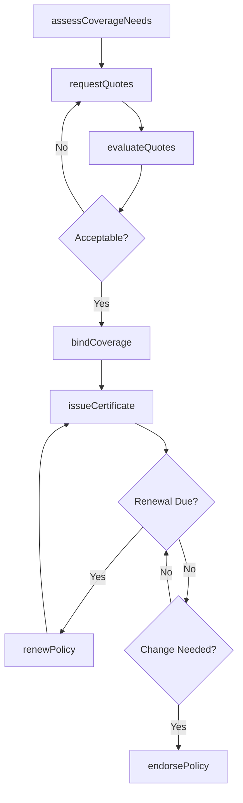
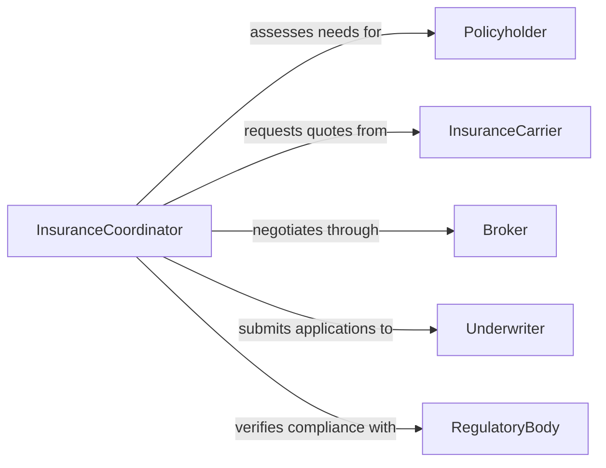

# Arrange Insurance Coverage

> Business-as-Code definition for arranging insurance coverage. Models the complete insurance procurement lifecycle from risk assessment through policy binding and renewal management.

## Overview

Arranging insurance coverage involves assessing coverage needs, obtaining quotes from carriers, evaluating policy options, and binding selected coverage. This definition exposes actions for each stage of the insurance arrangement process, events for tracking policy lifecycle changes, and searches for retrieving coverage and claims data.

## Actors

| Actor | Description |
|-------|-------------|
| InsuranceCarrier | Underwriting company that issues and backs insurance policies |
| Policyholder | Individual or organization seeking insurance coverage |
| Broker | Licensed intermediary who shops coverage across multiple carriers |
| Underwriter | Evaluates risk and determines coverage terms and pricing |
| RegulatoryBody | Government agency overseeing insurance compliance and licensing |

## Roles

| Role | Description |
|------|-------------|
| InsuranceCoordinator | Manages the end-to-end coverage arrangement process |
| RiskAnalyst | Assesses organizational risk exposure and coverage gaps |
| PolicyAdministrator | Maintains policy records and handles renewals |
| ComplianceOfficer | Ensures coverage meets regulatory and contractual requirements |

## Entities

| Entity | Description |
|--------|-------------|
| Policy | An insurance contract specifying coverage terms and premiums |
| CoverageRequest | A formal request outlining coverage needs and risk profile |
| Quote | A carrier proposal with pricing and terms for requested coverage |
| Certificate | A document proving active insurance coverage to third parties |
| Endorsement | A modification to an existing policy adding or changing terms |
| Claim | A request for payment under the terms of a policy |

## Actions

| Action | Description |
|--------|-------------|
| assessCoverageNeeds | Evaluate risk exposure and determine required coverage types |
| requestQuotes | Solicit coverage proposals from one or more carriers |
| evaluateQuotes | Compare carrier proposals on terms, pricing, and coverage limits |
| bindCoverage | Accept a quote and activate the insurance policy |
| issueCertificate | Generate a certificate of insurance for third-party verification |
| renewPolicy | Extend an existing policy for a subsequent term |
| endorsePolicy | Modify coverage terms on an active policy |

## Events

| Event | Description |
|-------|-------------|
| coverageNeedsAssessed | Risk exposure has been evaluated and coverage gaps identified |
| quotesRequested | Coverage proposals have been solicited from carriers |
| quotesEvaluated | Carrier proposals have been compared and a selection made |
| coverageBound | An insurance policy has been activated |
| certificateIssued | A certificate of insurance has been generated |
| policyRenewed | An existing policy has been extended for a new term |
| policyEndorsed | Coverage terms have been modified on an active policy |

## Searches

| Search | Description |
|--------|-------------|
| findPolicies | List active policies by type, carrier, expiration, or status |
| getQuoteComparison | Retrieve and compare outstanding quotes for a coverage request |
| findExpiringPolicies | Locate policies approaching their renewal date |
| getCoverageGaps | Identify areas where current coverage does not meet requirements |

## Workflow



## Actor Relationships



## Usage

### Calling Actions

```typescript
import { arrangeInsuranceCoverage } from '@headlessly/arrange-insurance-coverage'

const insurance = arrangeInsuranceCoverage()

// Assess coverage needs
const assessment = await insurance.assessCoverageNeeds({
  entityId: 'org-3291',
  coverageTypes: ['general-liability', 'property', 'workers-compensation'],
  assetValue: 5000000
})

// Request and evaluate quotes
await insurance.requestQuotes({
  requestId: assessment.requestId,
  carriers: ['carrier-a', 'carrier-b', 'carrier-c']
})

const comparison = await insurance.evaluateQuotes({ requestId: assessment.requestId })

// Bind selected coverage
const policy = await insurance.bindCoverage({
  quoteId: comparison.recommended.quoteId,
  effectiveDate: '2026-03-01'
})

await insurance.issueCertificate({ policyId: policy.id })
```

### Event-Driven Automation

```typescript
// Auto-initiate renewal process before expiration
insurance.coverageBound(async ({ policyId, expirationDate }) => {
  const renewalDate = subtractDays(expirationDate, 60)
  await scheduleAt(renewalDate, async () => {
    await insurance.requestQuotes({ policyId, renewal: true })
  })
})

// Notify compliance when coverage terms change
insurance.policyEndorsed(async ({ policyId, endorsementId, changes }) => {
  await notify({
    to: 'compliance-team',
    message: `Policy ${policyId} endorsed: ${changes.summary}`
  })
})
```
