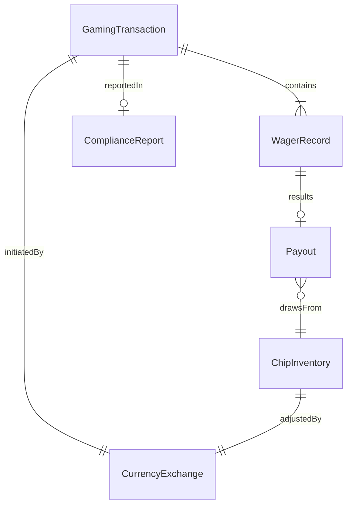
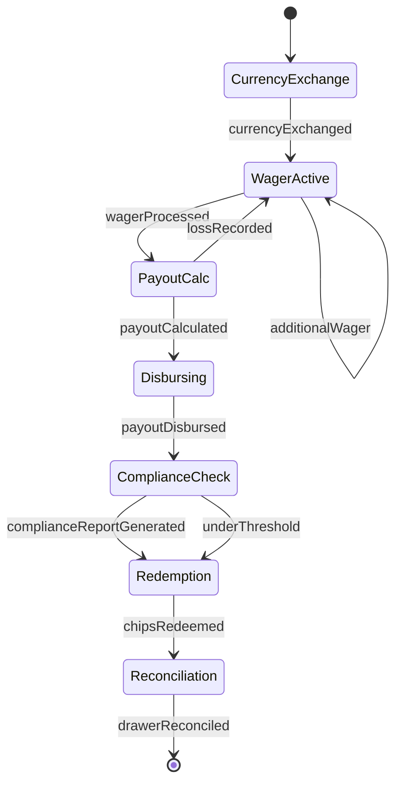
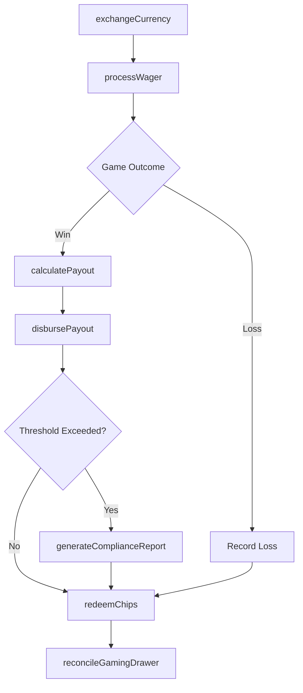
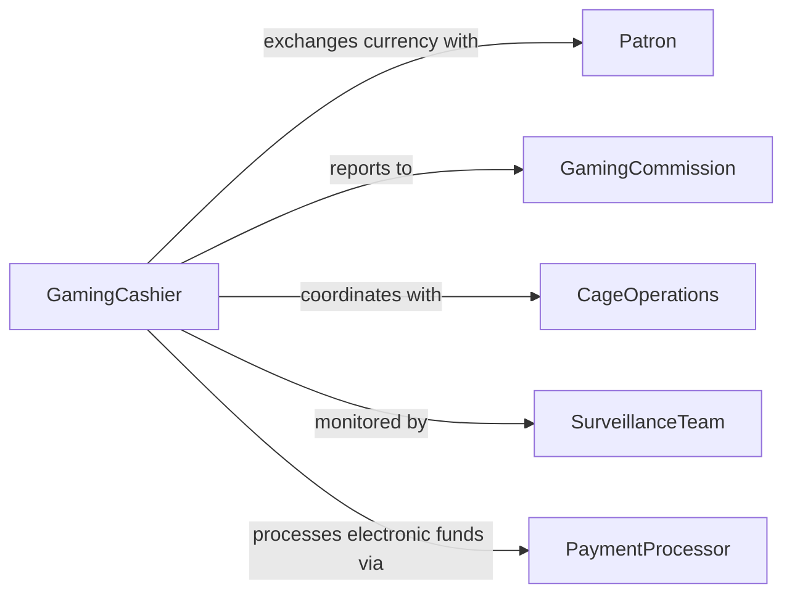

# Conduct Gaming Transactions

> Business-as-Code definition for conducting gaming transactions. Models the exchange of currency, chips, credits, and payouts within casino, lottery, and wagering operations.

## Overview

Conducting gaming transactions involves processing wagers, exchanging currency for chips or credits, handling payouts, and maintaining accurate financial records within regulated gaming environments. This definition exposes actions for each transaction type in gaming operations, events for tracking monetary movement, and searches for auditing and compliance reporting.

## Actors

| Actor | Description |
|-------|-------------|
| Patron | Individual placing wagers or purchasing gaming credits |
| GamingCommission | Regulatory body overseeing gaming operations and compliance |
| CageOperations | Facility cashier area handling currency and chip exchanges |
| SurveillanceTeam | Monitors gaming floor activity for fraud and irregularities |
| PaymentProcessor | Handles electronic fund transfers for gaming accounts |

## Roles

| Role | Description |
|------|-------------|
| GamingCashier | Processes currency exchanges, chip transactions, and payouts |
| PitSupervisor | Oversees table game transactions and verifies large payouts |
| ComplianceAnalyst | Ensures transactions meet regulatory reporting thresholds |
| AuditSpecialist | Reviews transaction logs for accuracy and regulatory adherence |

## Entities

| Entity | Description |
|--------|-------------|
| GamingTransaction | A monetary exchange within a gaming environment |
| ChipInventory | Current stock of gaming chips by denomination |
| Payout | Funds disbursed to a patron for winnings |
| WagerRecord | Documentation of a specific bet or wager placed |
| CurrencyExchange | A conversion between cash and gaming chips or credits |
| ComplianceReport | A regulatory filing for transactions exceeding thresholds |

## Actions

| Action | Description |
|--------|-------------|
| exchangeCurrency | Convert cash to gaming chips or credits |
| processWager | Record and validate a patron wager |
| calculatePayout | Determine winnings based on game outcome and odds |
| disbursePayout | Issue winnings to the patron in chips or currency |
| redeemChips | Convert gaming chips back to cash |
| generateComplianceReport | Create regulatory filings for reportable transactions |
| reconcileGamingDrawer | Balance the cashier drawer against transaction records |

## Events

| Event | Description |
|-------|-------------|
| currencyExchanged | Cash has been converted to gaming chips or credits |
| wagerProcessed | A patron wager has been recorded and validated |
| payoutCalculated | Winnings have been determined for a game outcome |
| payoutDisbursed | Winnings have been issued to the patron |
| chipsRedeemed | Gaming chips have been converted back to cash |
| complianceReportGenerated | A regulatory filing has been created |
| drawerReconciled | The cashier drawer has been balanced |

## Searches

| Search | Description |
|--------|-------------|
| findTransactions | Locate gaming transactions by patron, date, or amount |
| getPayoutHistory | Retrieve payout records for a specific patron or period |
| getReportableTransactions | Identify transactions meeting regulatory reporting thresholds |
| getChipInventory | Check current chip stock levels by denomination |

## Entity Relationships



## State Diagram



## Workflow



## Actor Relationships



## Usage

### Calling Actions

```typescript
import { conductGamingTransactions } from '@headlessly/conduct-gaming-transactions'

const gaming = conductGamingTransactions()

// Exchange currency for chips
const exchange = await gaming.exchangeCurrency({
  patronId: 'patron-5541',
  cashAmount: 500.00,
  denomination: 'mixed',
  currency: 'USD'
})

// Process a wager and handle payout
await gaming.processWager({
  patronId: 'patron-5541',
  tableId: 'blackjack-12',
  amount: 100.00,
  gameType: 'blackjack'
})

const payout = await gaming.calculatePayout({
  patronId: 'patron-5541',
  tableId: 'blackjack-12',
  outcome: 'win',
  multiplier: 1.5
})

await gaming.disbursePayout({ payoutId: payout.id })
```

### Event-Driven Automation

```typescript
// Auto-generate compliance reports for large transactions
gaming.payoutDisbursed(async ({ patronId, amount }) => {
  if (amount >= 10000) {
    await gaming.generateComplianceReport({
      patronId,
      amount,
      reportType: 'CTR',
      reason: 'payout-exceeds-threshold'
    })
  }
})

// Reconcile drawer at end of shift
gaming.chipsRedeemed(async ({ cashierId, shiftEnd }) => {
  if (shiftEnd) {
    await gaming.reconcileGamingDrawer({ cashierId })
  }
})
```
