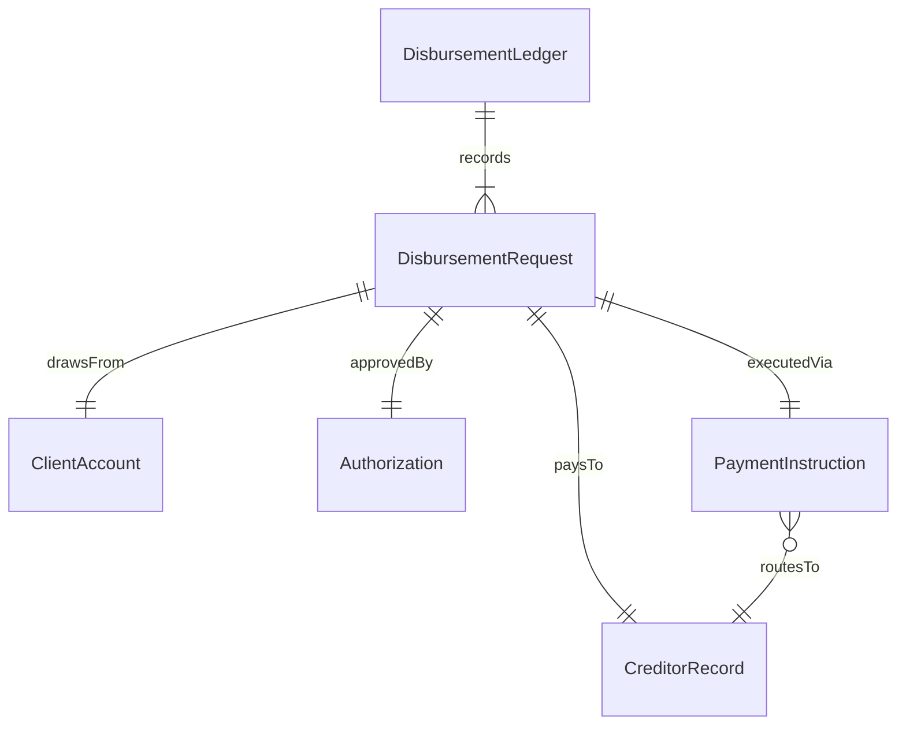
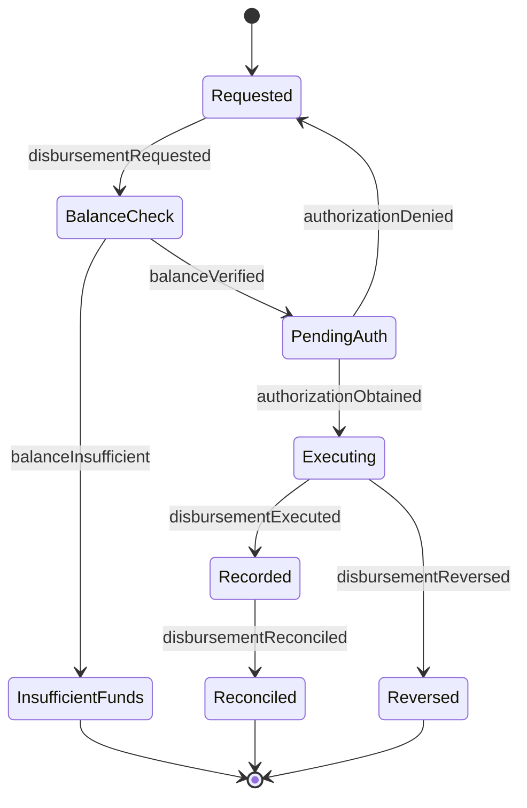
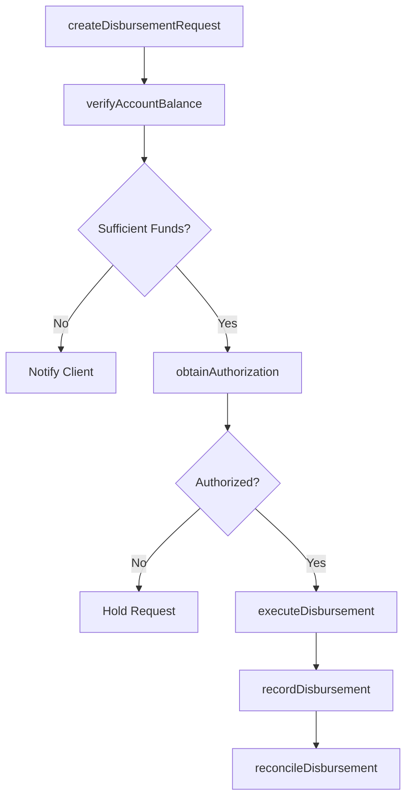
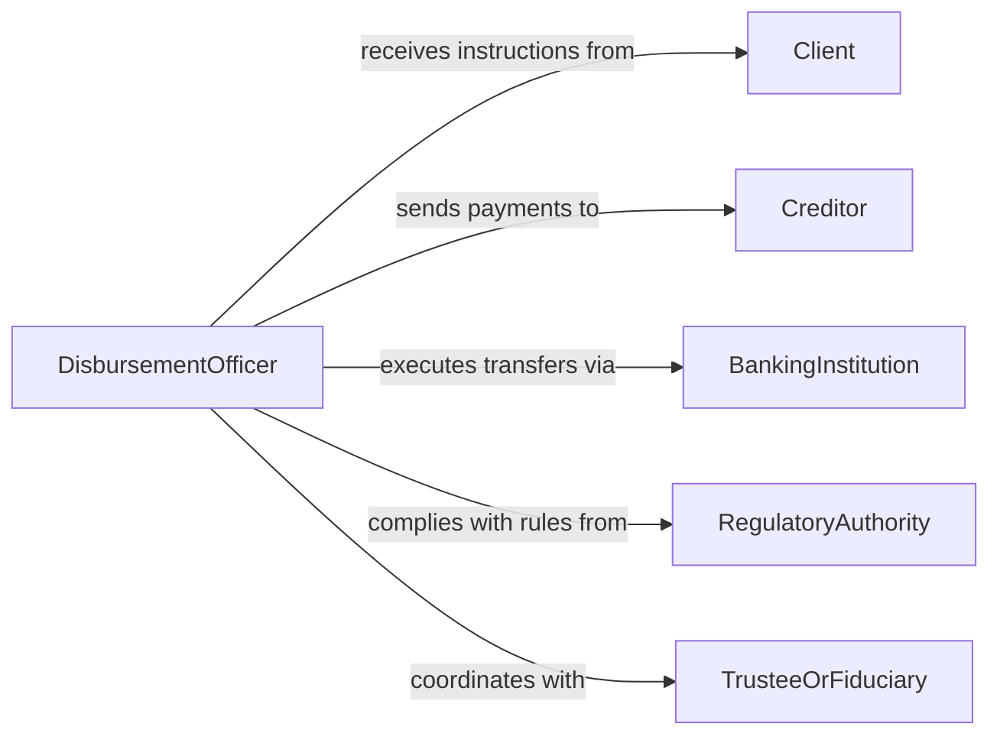

# Disburse Funds Clients Accounts Creditors

> Business-as-Code definition for disbursing funds from client accounts to creditors. Models the authorization, execution, and reconciliation of outbound payments on behalf of clients.

## Overview

Disbursing funds from client accounts to creditors involves verifying payment obligations, obtaining authorization, executing transfers, and maintaining accurate records of all outbound disbursements. This definition exposes actions for the full disbursement lifecycle, events for tracking payment processing stages, and searches for monitoring account balances and payment histories.

## Actors

| Actor | Description |
|-------|-------------|
| Client | Account holder authorizing disbursement of their funds |
| Creditor | Entity receiving payment for goods, services, or obligations |
| BankingInstitution | Financial institution executing the fund transfer |
| RegulatoryAuthority | Government body setting rules for fund disbursement practices |
| TrusteeOrFiduciary | Party with legal authority to manage funds on behalf of others |

## Roles

| Role | Description |
|------|-------------|
| DisbursementOfficer | Manages the preparation and execution of fund disbursements |
| AuthorizationReviewer | Validates disbursement requests against client instructions |
| ReconciliationAnalyst | Matches disbursements to invoices and account records |
| ComplianceSpecialist | Ensures disbursements meet legal and regulatory requirements |

## Entities

| Entity | Description |
|--------|-------------|
| DisbursementRequest | A formal instruction to transfer funds from a client account |
| ClientAccount | The account from which funds are drawn |
| CreditorRecord | Profile and payment details for the receiving party |
| PaymentInstruction | Specific routing, amount, and timing details for the transfer |
| DisbursementLedger | A log of all disbursements processed for a client |
| Authorization | Documented client approval for the fund transfer |

## Actions

| Action | Description |
|--------|-------------|
| createDisbursementRequest | Initiate a new request to transfer funds to a creditor |
| verifyAccountBalance | Confirm sufficient funds in the client account |
| obtainAuthorization | Secure client or fiduciary approval for the disbursement |
| executeDisbursement | Process the fund transfer to the creditor |
| recordDisbursement | Post the transaction to the disbursement ledger |
| reconcileDisbursement | Match the disbursement to the corresponding invoice or obligation |
| reverseDisbursement | Cancel or recall an erroneous disbursement |

## Events

| Event | Description |
|-------|-------------|
| disbursementRequested | A new disbursement request has been created |
| balanceVerified | The client account balance has been confirmed as sufficient |
| authorizationObtained | Client or fiduciary approval has been secured |
| disbursementExecuted | Funds have been transferred to the creditor |
| disbursementRecorded | The transaction has been posted to the ledger |
| disbursementReconciled | The payment has been matched to its obligation |
| disbursementReversed | A disbursement has been cancelled or recalled |

## Searches

| Search | Description |
|--------|-------------|
| findDisbursements | Locate disbursements by client, creditor, date, or status |
| getAccountBalance | Retrieve the current available balance for a client account |
| getPendingDisbursements | List disbursement requests awaiting authorization or execution |
| getDisbursementHistory | Retrieve the complete payment history for a client or creditor |

## Entity Relationships



## State Diagram



## Workflow



## Actor Relationships



## Usage

### Calling Actions

```typescript
import { disburseFundsClientsAccountsCreditors } from '@headlessly/disburse-funds-clients-accounts-creditors'

const disbursements = disburseFundsClientsAccountsCreditors()

// Create a disbursement request
const request = await disbursements.createDisbursementRequest({
  clientId: 'client-7742',
  creditorId: 'creditor-1190',
  amount: 15000.00,
  currency: 'USD',
  paymentMethod: 'wire-transfer',
  reference: 'INV-2026-0088'
})

// Verify and authorize
await disbursements.verifyAccountBalance({ clientId: 'client-7742' })
await disbursements.obtainAuthorization({ requestId: request.id })

// Execute the transfer
await disbursements.executeDisbursement({ requestId: request.id })
```

### Event-Driven Automation

```typescript
// Auto-record and reconcile upon execution
disbursements.disbursementExecuted(async ({ requestId, amount, creditorId }) => {
  await disbursements.recordDisbursement({ requestId })
  await disbursements.reconcileDisbursement({
    requestId,
    matchTo: 'invoice'
  })
})

// Alert on insufficient funds
disbursements.balanceVerified(async ({ clientId, available, required }) => {
  if (available < required) {
    await notify({
      to: clientId,
      message: `Insufficient funds: $${available} available, $${required} required for pending disbursement.`
    })
  }
})
```
