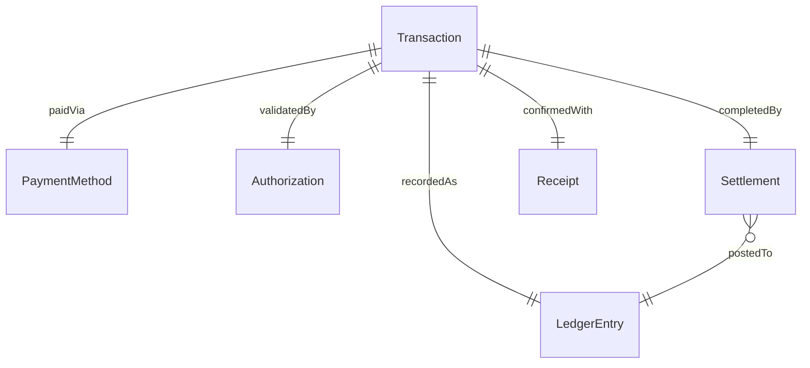
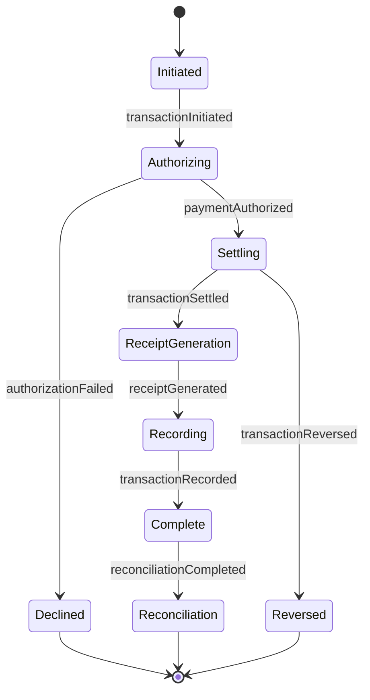
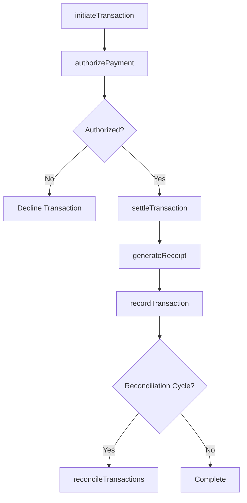
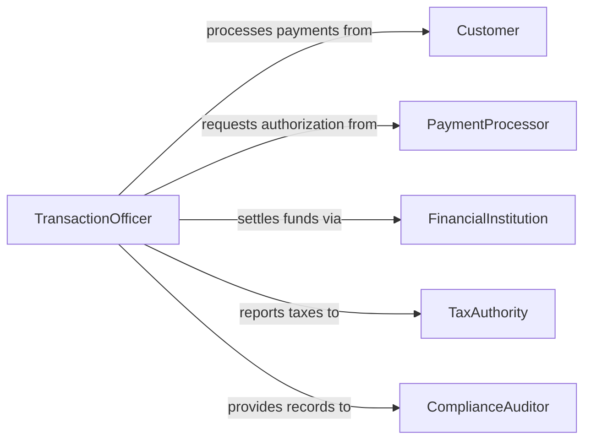

# Execute Sales Financial Transactions

> Business-as-Code definition for executing sales and financial transactions. Models the end-to-end process of initiating, authorizing, settling, and recording sales and other monetary exchanges.

## Overview

Executing sales and financial transactions involves processing monetary exchanges between parties, including point-of-sale transactions, wire transfers, securities trades, and contractual payments. This definition exposes actions for transaction initiation and settlement, events for tracking each transaction stage, and searches for retrieving transaction records and reconciliation data.

## Actors

| Actor | Description |
|-------|-------------|
| Customer | The buyer or payer initiating a purchase or payment |
| PaymentProcessor | Third-party service that authorizes and settles payments |
| FinancialInstitution | Bank or credit union holding accounts involved in transfers |
| TaxAuthority | Government body requiring transaction tax reporting |
| ComplianceAuditor | Reviews transactions for regulatory adherence |

## Roles

| Role | Description |
|------|-------------|
| TransactionOfficer | Initiates and manages the execution of financial transactions |
| SettlementAnalyst | Ensures transactions are properly settled and reconciled |
| ComplianceReviewer | Validates transactions against regulatory requirements |
| AccountingClerk | Records completed transactions in the general ledger |

## Entities

| Entity | Description |
|--------|-------------|
| Transaction | A financial exchange between two or more parties |
| PaymentMethod | The instrument used for payment such as card, wire, or check |
| Authorization | Approval from the payment processor to proceed |
| Settlement | The final transfer of funds completing a transaction |
| Receipt | A formal record confirming the transaction details |
| LedgerEntry | An accounting record of the transaction in the books |

## Actions

| Action | Description |
|--------|-------------|
| initiateTransaction | Start a new sales or financial transaction |
| authorizePayment | Request authorization from the payment processor |
| settleTransaction | Complete the fund transfer between parties |
| recordTransaction | Post the transaction to the accounting ledger |
| reverseTransaction | Cancel or refund a previously completed transaction |
| reconcileTransactions | Match transaction records against bank statements |
| generateReceipt | Produce a formal receipt for the completed transaction |

## Events

| Event | Description |
|-------|-------------|
| transactionInitiated | A new transaction has been started |
| paymentAuthorized | Payment authorization has been granted |
| transactionSettled | Funds have been successfully transferred |
| transactionRecorded | The transaction has been posted to the ledger |
| transactionReversed | A transaction has been cancelled or refunded |
| reconciliationCompleted | Transaction matching against statements is done |
| receiptGenerated | A formal receipt has been produced |

## Searches

| Search | Description |
|--------|-------------|
| findTransactions | Locate transactions by date, amount, party, or status |
| getSettlementStatus | Check the settlement state of pending transactions |
| getReconciliationGaps | Identify unmatched transactions during reconciliation |
| getTransactionReceipts | Retrieve receipts for completed transactions |

## Entity Relationships



## State Diagram



## Workflow



## Actor Relationships



## Usage

### Calling Actions

```typescript
import { executeSalesFinancialTransactions } from '@headlessly/execute-sales-financial-transactions'

const transactions = executeSalesFinancialTransactions()

// Initiate a sale transaction
const txn = await transactions.initiateTransaction({
  type: 'sale',
  amount: 2450.00,
  currency: 'USD',
  customerId: 'cust-8821',
  paymentMethod: 'credit-card'
})

// Authorize and settle
const auth = await transactions.authorizePayment({
  transactionId: txn.id,
  cardToken: 'tok_visa_4242'
})

await transactions.settleTransaction({ transactionId: txn.id })
await transactions.generateReceipt({ transactionId: txn.id })
```

### Event-Driven Automation

```typescript
// Auto-record to ledger upon settlement
transactions.transactionSettled(async ({ transactionId, amount, currency }) => {
  await transactions.recordTransaction({
    transactionId,
    account: 'revenue',
    amount,
    currency
  })
})

// Flag large transactions for compliance review
transactions.paymentAuthorized(async ({ transactionId, amount }) => {
  if (amount > 10000) {
    await notify({
      to: 'compliance-team',
      message: `Transaction ${transactionId} of $${amount} requires review`
    })
  }
})
```
