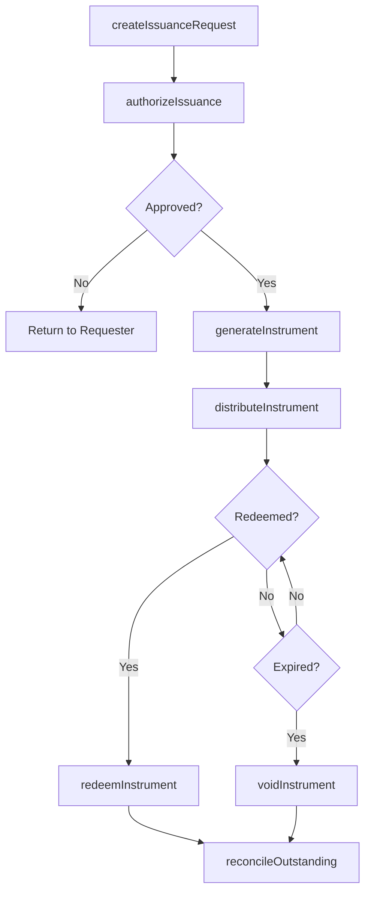
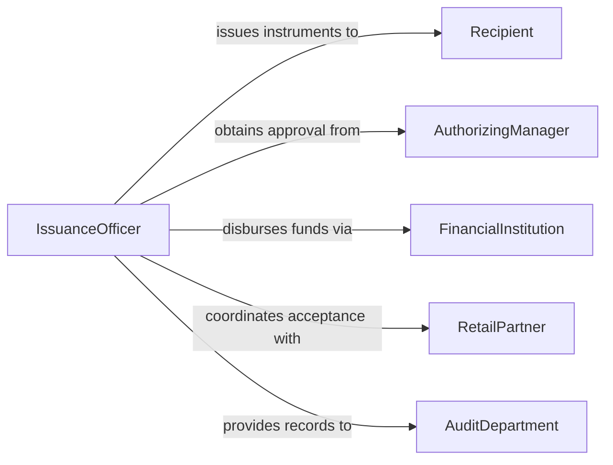

# Issue Money Credit Vouchers

> Business-as-Code definition for issuing money, credit, or vouchers. Models the creation, authorization, distribution, and tracking of monetary disbursements, store credits, refund vouchers, and gift certificates.

## Overview

Issuing money, credit, or vouchers involves determining the appropriate instrument, validating the authorization for issuance, generating the instrument, distributing it to the recipient, and tracking its redemption or expiration. This definition exposes actions for the full issuance lifecycle, events for monitoring instrument status, and searches for managing outstanding credits and vouchers.

## Actors

| Actor | Description |
|-------|-------------|
| Recipient | Individual or organization receiving the money, credit, or voucher |
| AuthorizingManager | Person who approves the issuance of funds or credits |
| FinancialInstitution | Bank or payment provider facilitating monetary disbursements |
| RetailPartner | Merchant that accepts issued vouchers or gift certificates |
| AuditDepartment | Reviews issuance records for compliance and fraud prevention |

## Roles

| Role | Description |
|------|-------------|
| IssuanceOfficer | Prepares and executes the issuance of money, credits, or vouchers |
| Approver | Reviews and authorizes issuance requests |
| RedemptionClerk | Processes the redemption of vouchers and credits |
| ReconciliationAnalyst | Tracks outstanding instruments and reconciles balances |

## Entities

| Entity | Description |
|--------|-------------|
| IssuanceRequest | A formal request to issue money, credit, or a voucher |
| CreditNote | A store credit issued to a customer account |
| Voucher | A certificate redeemable for goods, services, or cash |
| Disbursement | A direct monetary payment issued to a recipient |
| RedemptionRecord | Documentation of when and how an instrument was redeemed |
| ExpirationPolicy | Rules governing when unredeemed instruments expire |

## Actions

| Action | Description |
|--------|-------------|
| createIssuanceRequest | Initiate a request to issue money, credit, or a voucher |
| authorizeIssuance | Approve the issuance request |
| generateInstrument | Create the credit note, voucher, or disbursement record |
| distributeInstrument | Deliver the instrument to the recipient |
| redeemInstrument | Process the use of a voucher or credit |
| voidInstrument | Cancel an issued instrument before redemption |
| reconcileOutstanding | Match issued instruments against redemptions and expirations |

## Events

| Event | Description |
|-------|-------------|
| issuanceRequested | A new issuance request has been created |
| issuanceAuthorized | The issuance has been approved |
| instrumentGenerated | A credit, voucher, or disbursement has been created |
| instrumentDistributed | The instrument has been delivered to the recipient |
| instrumentRedeemed | A voucher or credit has been used |
| instrumentVoided | An instrument has been cancelled |
| outstandingReconciled | Outstanding instruments have been matched against records |

## Searches

| Search | Description |
|--------|-------------|
| findInstruments | Locate issued instruments by type, recipient, or status |
| getOutstandingCredits | List unredeemed credits and vouchers |
| getRedemptionHistory | Retrieve redemption records for a recipient or instrument |
| getExpiringInstruments | Identify instruments approaching their expiration date |

## Workflow



## Actor Relationships



## Usage

### Calling Actions

```typescript
import { issueMoneyCreditVouchers } from '@headlessly/issue-money-credit-vouchers'

const issuance = issueMoneyCreditVouchers()

// Create and authorize a store credit
const request = await issuance.createIssuanceRequest({
  type: 'credit-note',
  recipientId: 'cust-6630',
  amount: 75.00,
  reason: 'product-return',
  referenceOrderId: 'ORD-2026-1142'
})

await issuance.authorizeIssuance({ requestId: request.id })

const credit = await issuance.generateInstrument({
  requestId: request.id,
  expirationDate: '2027-03-01'
})

await issuance.distributeInstrument({
  instrumentId: credit.id,
  channel: 'email'
})
```

### Event-Driven Automation

```typescript
// Notify recipient when instrument is ready
issuance.instrumentDistributed(async ({ instrumentId, recipientId, type, amount }) => {
  await notify({
    to: recipientId,
    message: `A ${type} of $${amount} has been issued to your account.`
  })
})

// Auto-void expired instruments
issuance.getExpiringInstruments(async ({ instruments }) => {
  for (const inst of instruments) {
    if (isPastDate(inst.expirationDate)) {
      await issuance.voidInstrument({ instrumentId: inst.id })
    }
  }
})
```
