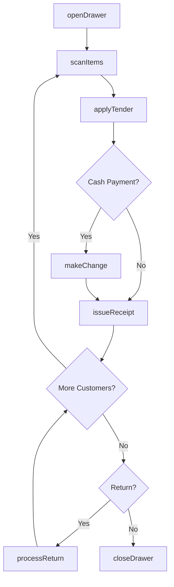
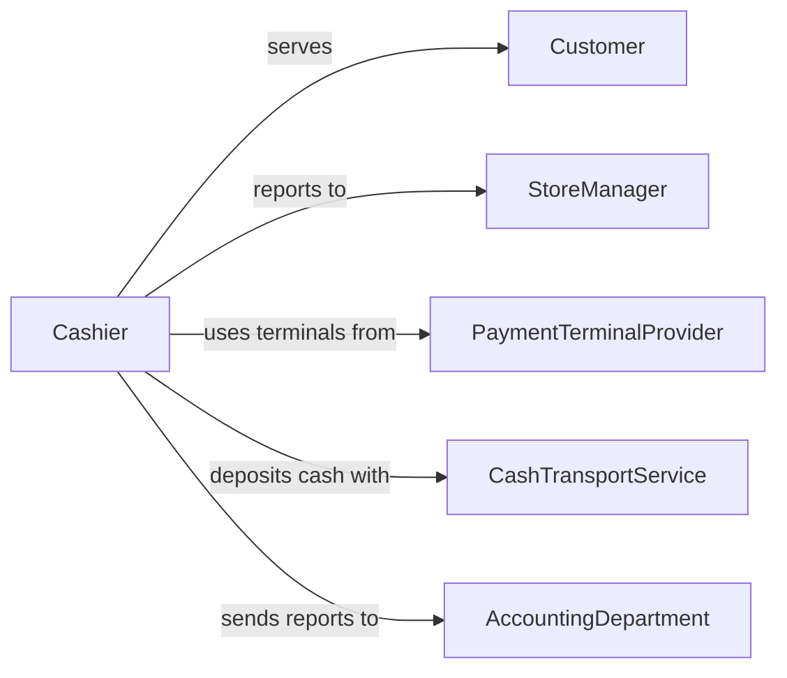

# Operate Cash Registers

> Business-as-Code definition for operating cash registers. Models the opening, transaction processing, payment handling, and closing procedures for point-of-sale register operations.

## Overview

Operating cash registers encompasses the daily procedures of opening a register drawer, scanning or entering items, processing various payment types, issuing change and receipts, and balancing the drawer at close. This definition exposes actions for each register operation, events for tracking transaction flow and drawer status, and searches for retrieving register activity data.

## Actors

| Actor | Description |
|-------|-------------|
| Customer | Individual making a purchase at the point of sale |
| StoreManager | Oversees register operations and handles overrides |
| PaymentTerminalProvider | Supplies and maintains electronic payment hardware |
| CashTransportService | Provides secure cash pickup and delivery |
| AccountingDepartment | Receives daily register reports for financial reconciliation |

## Roles

| Role | Description |
|------|-------------|
| Cashier | Operates the register and processes customer transactions |
| ShiftSupervisor | Opens and closes registers and resolves transaction issues |
| RegisterTechnician | Maintains and troubleshoots register hardware and software |
| CashOfficeClerk | Counts and verifies register deposits at end of day |

## Entities

| Entity | Description |
|--------|-------------|
| Register | A point-of-sale terminal used to process transactions |
| Drawer | The cash compartment within the register holding currency |
| Transaction | A single purchase or return processed at the register |
| TenderType | The method of payment such as cash, card, or mobile |
| Receipt | A printed or digital confirmation of the transaction |
| DrawerReport | A summary of all transactions and cash counts for a shift |

## Actions

| Action | Description |
|--------|-------------|
| openDrawer | Initialize the register drawer with a starting cash float |
| scanItems | Enter products into the transaction by scanning or manual entry |
| applyTender | Accept payment via cash, card, check, or mobile wallet |
| makeChange | Calculate and dispense the correct change for cash payments |
| issueReceipt | Print or email the transaction receipt to the customer |
| processReturn | Handle a merchandise return and issue a refund |
| closeDrawer | Balance the register drawer and generate the shift report |

## Events

| Event | Description |
|-------|-------------|
| drawerOpened | The register drawer has been initialized with a cash float |
| itemsScanned | Products have been entered into the current transaction |
| tenderApplied | Payment has been accepted for the transaction |
| changeMade | Change has been dispensed to the customer |
| receiptIssued | A transaction receipt has been produced |
| returnProcessed | A merchandise return and refund have been completed |
| drawerClosed | The register drawer has been balanced and the shift report generated |

## Searches

| Search | Description |
|--------|-------------|
| getRegisterTransactions | List all transactions for a register within a date range |
| getDrawerBalance | Retrieve the current cash balance in the register drawer |
| getShiftReport | Retrieve the drawer report for a specific shift |
| getVoidedTransactions | Find transactions that were voided or cancelled |

## Workflow



## Actor Relationships



## Usage

### Calling Actions

```typescript
import { operateCashRegisters } from '@headlessly/operate-cash-registers'

const register = operateCashRegisters()

// Open the register for a new shift
await register.openDrawer({
  registerId: 'POS-03',
  cashierId: 'emp-1120',
  startingFloat: 200.00
})

// Process a customer transaction
await register.scanItems({
  registerId: 'POS-03',
  items: [
    { sku: 'PRD-4410', quantity: 1, price: 12.99 },
    { sku: 'PRD-8821', quantity: 2, price: 5.49 }
  ]
})

await register.applyTender({
  registerId: 'POS-03',
  tenderType: 'cash',
  amountTendered: 30.00
})

await register.makeChange({ registerId: 'POS-03' })
await register.issueReceipt({ registerId: 'POS-03', format: 'printed' })
```

### Event-Driven Automation

```typescript
// Auto-alert manager on large cash transactions
register.tenderApplied(async ({ registerId, tenderType, amount }) => {
  if (tenderType === 'cash' && amount > 500) {
    await notify({
      to: 'shift-supervisor',
      message: `Large cash transaction of $${amount} at ${registerId}`
    })
  }
})

// Send drawer report to accounting at close
register.drawerClosed(async ({ registerId, cashierId, report }) => {
  await sendReport({
    to: 'accounting-department',
    subject: `Shift Report - ${registerId}`,
    data: report
  })
})
```
