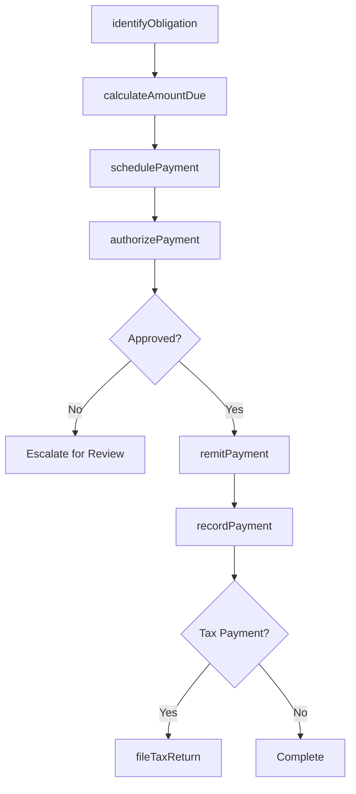
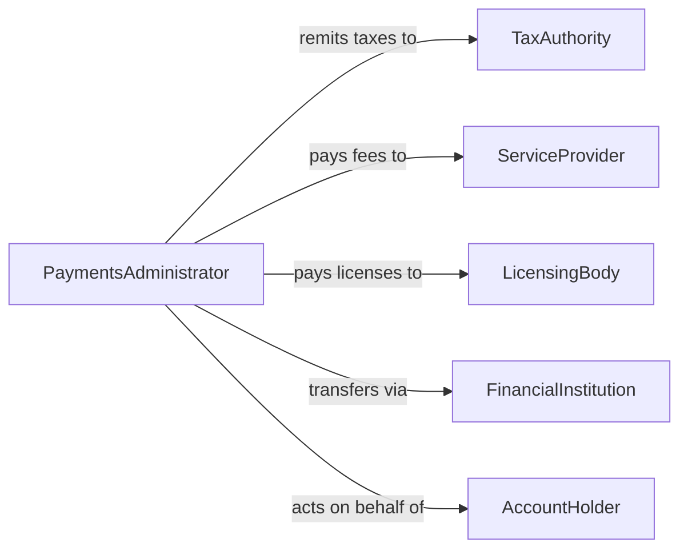

# Pay Charges Fees Taxes

> Business-as-Code definition for paying charges, fees, and taxes. Models the calculation, scheduling, authorization, and remittance of mandatory financial obligations to authorities, vendors, and service providers.

## Overview

Paying charges, fees, and taxes involves identifying financial obligations, calculating amounts due, obtaining approval for payment, and remitting funds to the appropriate recipients by their deadlines. This definition exposes actions for obligation management and payment execution, events for tracking payment lifecycle stages, and searches for monitoring upcoming and completed obligations.

## Actors

| Actor | Description |
|-------|-------------|
| TaxAuthority | Government agency that assesses and collects taxes |
| ServiceProvider | Entity charging fees for professional or utility services |
| LicensingBody | Organization that collects fees for permits and licenses |
| FinancialInstitution | Bank or payment platform used to remit funds |
| AccountHolder | Individual or organization responsible for the obligation |

## Roles

| Role | Description |
|------|-------------|
| PaymentsAdministrator | Manages the scheduling and execution of obligation payments |
| TaxSpecialist | Calculates tax liabilities and ensures timely filing |
| Approver | Authorizes payment of charges, fees, and taxes |
| AccountsPayableClerk | Processes and records outbound payments |

## Entities

| Entity | Description |
|--------|-------------|
| Obligation | A charge, fee, or tax that must be paid |
| PaymentSchedule | A timeline of upcoming obligations and due dates |
| Invoice | A formal statement of charges from a service provider or authority |
| PaymentRecord | Documentation of a completed payment transaction |
| TaxFiling | A formal declaration accompanying a tax payment |
| Penalty | Additional charges incurred from late or missed payments |

## Actions

| Action | Description |
|--------|-------------|
| identifyObligation | Recognize a charge, fee, or tax that is due |
| calculateAmountDue | Determine the exact amount owed including penalties or credits |
| schedulePayment | Set a payment date aligned with the obligation deadline |
| authorizePayment | Obtain approval to remit the payment |
| remitPayment | Execute the fund transfer to the recipient |
| recordPayment | Log the completed payment in accounts payable |
| fileTaxReturn | Submit a tax declaration along with the payment |

## Events

| Event | Description |
|-------|-------------|
| obligationIdentified | A new charge, fee, or tax has been recognized |
| amountCalculated | The amount due has been determined |
| paymentScheduled | A payment has been set for a specific date |
| paymentAuthorized | Approval has been granted to remit payment |
| paymentRemitted | Funds have been transferred to the recipient |
| paymentRecorded | The transaction has been logged in accounts payable |
| taxReturnFiled | A tax declaration has been submitted |

## Searches

| Search | Description |
|--------|-------------|
| findObligations | Locate obligations by type, due date, or payee |
| getUpcomingPayments | List payments due within a specified period |
| getPaymentHistory | Retrieve completed payment records by payee or date |
| getOverdueObligations | Identify obligations past their due date |

## Workflow



## Actor Relationships



## Usage

### Calling Actions

```typescript
import { payChargesFeesTaxes } from '@headlessly/pay-charges-fees-taxes'

const payments = payChargesFeesTaxes()

// Identify and calculate a quarterly tax obligation
const obligation = await payments.identifyObligation({
  type: 'sales-tax',
  jurisdiction: 'CA',
  period: 'Q1-2026'
})

const amount = await payments.calculateAmountDue({
  obligationId: obligation.id,
  includeCredits: true
})

// Schedule and authorize
await payments.schedulePayment({
  obligationId: obligation.id,
  dueDate: '2026-04-30',
  amount: amount.total
})

await payments.authorizePayment({ obligationId: obligation.id })
await payments.remitPayment({ obligationId: obligation.id })
```

### Event-Driven Automation

```typescript
// Auto-schedule payments when obligations are identified
payments.obligationIdentified(async ({ obligationId, dueDate, amount }) => {
  await payments.schedulePayment({
    obligationId,
    dueDate,
    amount
  })
})

// Alert on overdue obligations
payments.getOverdueObligations(async ({ obligations }) => {
  for (const ob of obligations) {
    await notify({
      to: 'accounts-payable',
      message: `Overdue: ${ob.type} of $${ob.amount} was due ${ob.dueDate}`
    })
  }
})
```
