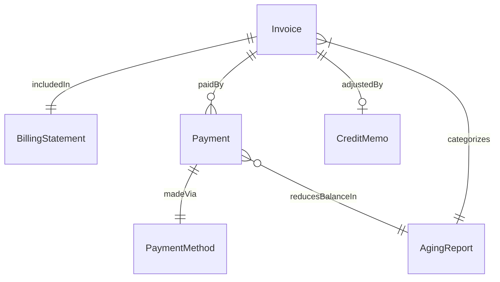
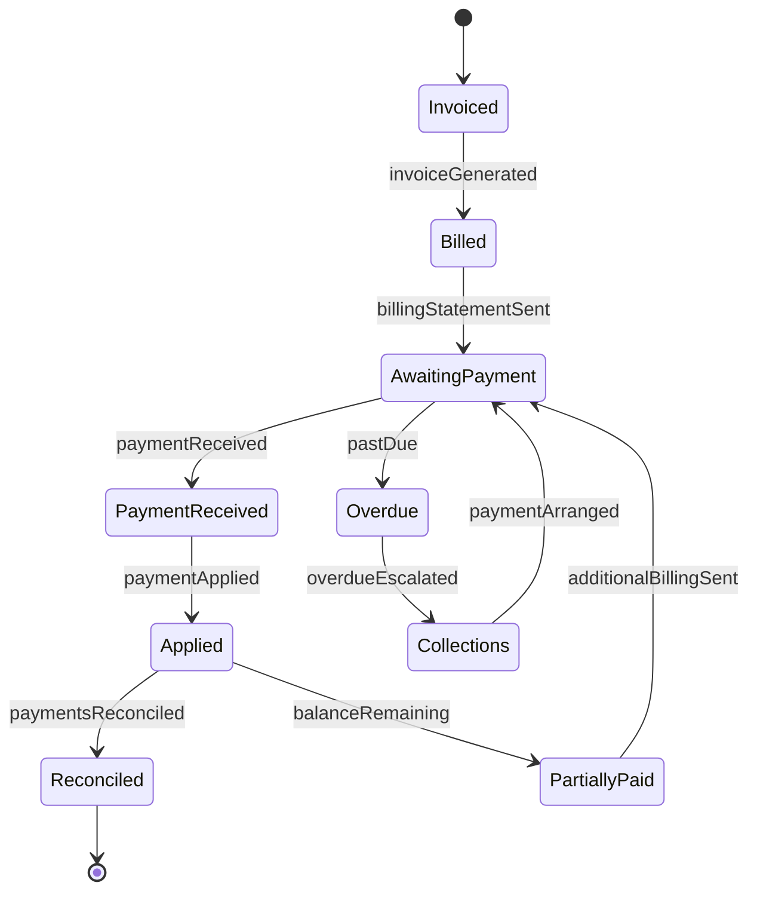
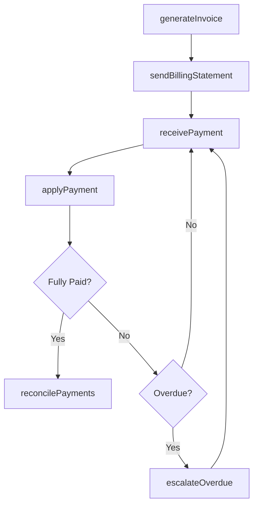
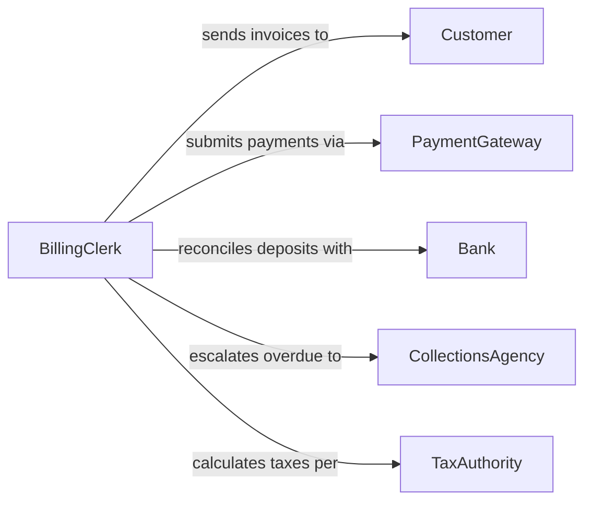

# Process Customer Bills Payments

> Business-as-Code definition for processing customer bills and payments. Models the complete billing and payment lifecycle from invoice generation through payment reconciliation.

## Overview

Processing customer bills and payments involves generating invoices, sending billing statements, receiving payments, and reconciling accounts. This definition exposes actions for each stage of the billing cycle, events for automation triggers, and searches for retrieving billing and payment data across customer accounts.

## Actors

| Actor | Description |
|-------|-------------|
| Customer | Individual or organization receiving bills and submitting payments |
| PaymentGateway | Third-party service that processes electronic payments |
| Bank | Financial institution handling deposits and fund transfers |
| CollectionsAgency | External firm engaged to recover overdue balances |
| TaxAuthority | Government entity requiring tax calculations on invoices |

## Roles

| Role | Description |
|------|-------------|
| BillingClerk | Generates and sends invoices to customers |
| PaymentProcessor | Receives and applies customer payments to accounts |
| AccountsReceivableManager | Oversees the billing pipeline and aging balances |
| FinancialAuditor | Reviews billing accuracy and payment reconciliation |

## Entities

| Entity | Description |
|--------|-------------|
| Invoice | A billing document detailing amounts owed by a customer |
| Payment | A monetary transaction received from a customer |
| BillingStatement | A periodic summary of charges and payments for an account |
| PaymentMethod | The instrument used to make a payment such as card or check |
| CreditMemo | An adjustment reducing the amount owed on an account |
| AgingReport | A summary of outstanding balances grouped by time overdue |

## Actions

| Action | Description |
|--------|-------------|
| generateInvoice | Create a new invoice for products or services delivered |
| sendBillingStatement | Distribute a billing statement to the customer |
| receivePayment | Record an incoming payment from a customer |
| applyPayment | Match a payment to one or more outstanding invoices |
| issueCreditMemo | Create a credit adjustment against a customer account |
| escalateOverdue | Flag overdue accounts for collections follow-up |
| reconcilePayments | Verify that payments match bank deposits and ledger entries |

## Events

| Event | Description |
|-------|-------------|
| invoiceGenerated | A new invoice has been created for a customer |
| billingStatementSent | A billing statement has been delivered to the customer |
| paymentReceived | A payment has been recorded from a customer |
| paymentApplied | A payment has been matched to outstanding invoices |
| creditMemoIssued | A credit adjustment has been applied to an account |
| overdueEscalated | An overdue account has been flagged for collections |
| paymentsReconciled | Payments have been verified against bank records |

## Searches

| Search | Description |
|--------|-------------|
| findInvoices | List invoices by customer, date range, status, or amount |
| getPaymentHistory | Retrieve payment records for a specific customer account |
| getAgingReport | Retrieve outstanding balances grouped by days overdue |
| findOverdueAccounts | Locate accounts with balances past their due date |
| getReconciliationStatus | Check reconciliation state for a billing period |

## Entity Relationships



## State Diagram



## Workflow



## Actor Relationships



## Usage

### Calling Actions

```typescript
import { processCustomerBillsPayments } from '@headlessly/process-customer-bills-payments'

const billing = processCustomerBillsPayments()

// Generate and send an invoice
const invoice = await billing.generateInvoice({
  customerId: 'cust-7832',
  lineItems: [
    { description: 'Consulting Services - January', amount: 15000 },
    { description: 'Software License', amount: 4500 }
  ],
  dueDate: '2026-02-28'
})

await billing.sendBillingStatement({ customerId: 'cust-7832', period: '2026-01' })

// Process incoming payment
const payment = await billing.receivePayment({
  customerId: 'cust-7832',
  amount: 19500,
  method: 'wire-transfer',
  reference: 'WT-20260215-001'
})

await billing.applyPayment({ paymentId: payment.id, invoiceIds: [invoice.id] })
```

### Event-Driven Automation

```typescript
// Escalate when invoice becomes overdue
billing.invoiceGenerated(async ({ invoiceId, dueDate, customerId }) => {
  await scheduleAt(dueDate, async () => {
    const invoice = await billing.findInvoices({ id: invoiceId })
    if (invoice.status === 'unpaid') {
      await billing.escalateOverdue({ customerId, invoiceId })
    }
  })
})

// Auto-reconcile when payment is applied
billing.paymentApplied(async ({ paymentId, invoiceIds }) => {
  await billing.reconcilePayments({ paymentId, invoiceIds })
})
```
