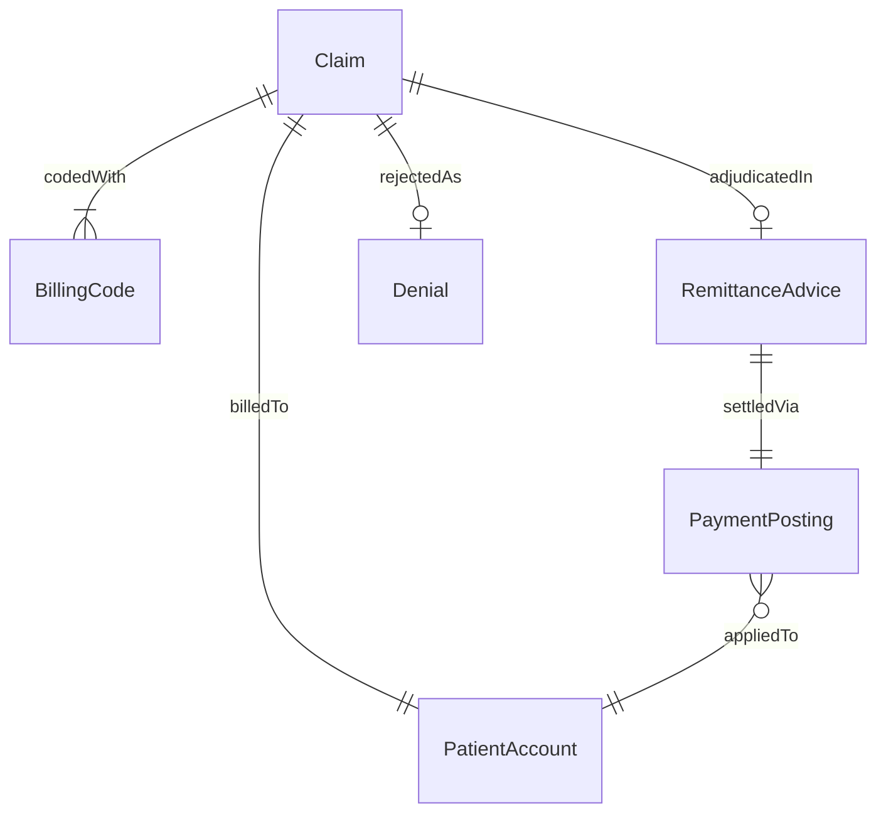
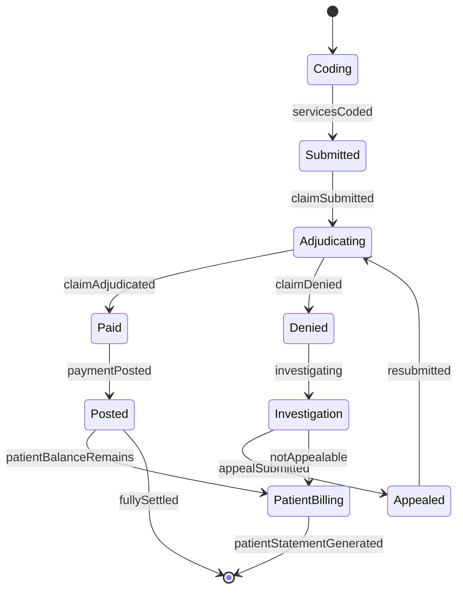
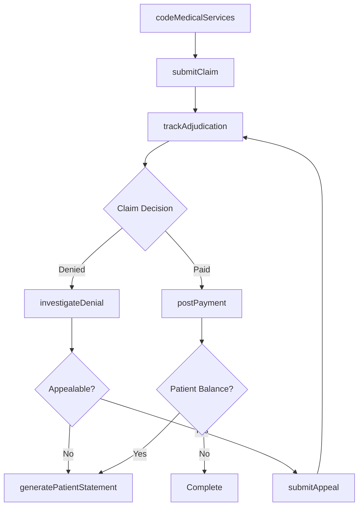
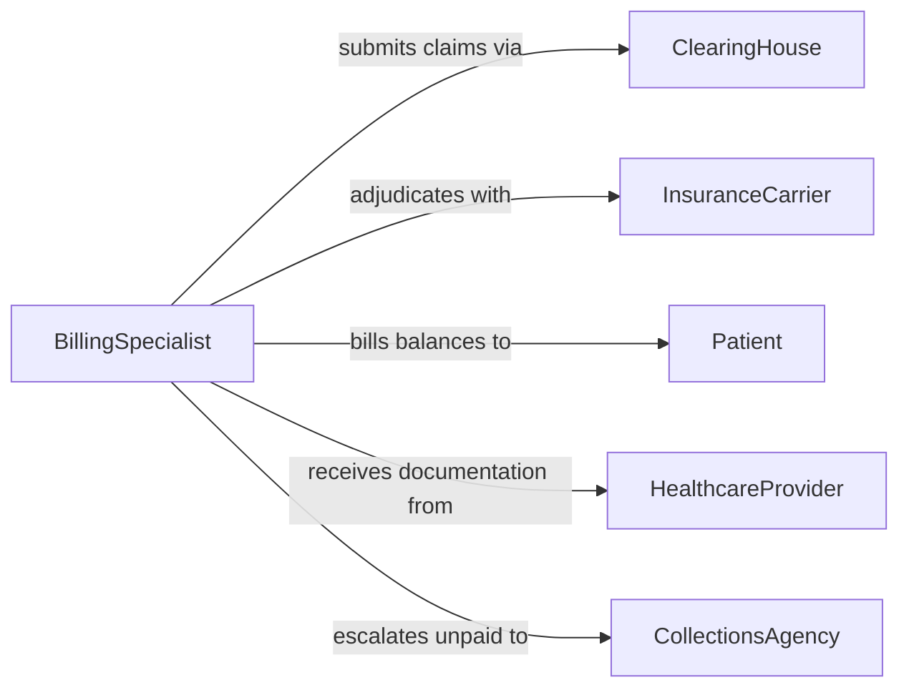

# Process Medical Billing Information

> Business-as-Code definition for processing medical billing information. Models the coding, claim submission, adjudication tracking, and payment posting lifecycle for healthcare services.

## Overview

Processing medical billing information involves translating clinical services into standardized billing codes, submitting claims to insurance carriers, tracking adjudication outcomes, posting payments, and managing denials and appeals. This definition exposes actions for each stage of the medical billing cycle, events for monitoring claim progress, and searches for retrieving billing and payment data.

## Actors

| Actor | Description |
|-------|-------------|
| Patient | Individual who received medical services and may owe a balance |
| InsuranceCarrier | Payer that adjudicates and reimburses claims |
| ClearingHouse | Intermediary that routes electronic claims to the correct payer |
| HealthcareProvider | Physician or facility that rendered the medical services |
| CollectionsAgency | Third party that pursues outstanding patient balances |

## Roles

| Role | Description |
|------|-------------|
| MedicalCoder | Translates clinical documentation into billing codes |
| BillingSpecialist | Prepares and submits claims to payers |
| DenialsAnalyst | Investigates and appeals rejected or denied claims |
| PaymentPoster | Records incoming payments and adjustments to patient accounts |
| BillingManager | Oversees the billing department and revenue cycle performance |

## Entities

| Entity | Description |
|--------|-------------|
| Claim | A formal request for payment submitted to an insurance carrier |
| BillingCode | A standardized code representing a medical service or procedure |
| RemittanceAdvice | Explanation of benefits detailing payer adjudication decisions |
| PatientAccount | The financial record for a specific patient |
| Denial | A rejected claim requiring investigation or appeal |
| PaymentPosting | A record of payment applied to a patient account |

## Actions

| Action | Description |
|--------|-------------|
| codeMedicalServices | Assign billing codes to documented clinical services |
| submitClaim | Send a claim to the insurance carrier for adjudication |
| trackAdjudication | Monitor the status of submitted claims through the payer |
| postPayment | Record payments received against patient accounts |
| investigateDenial | Review denied claims and determine the cause |
| submitAppeal | File an appeal for a denied or underpaid claim |
| generatePatientStatement | Create a billing statement for patient-responsible balances |

## Events

| Event | Description |
|-------|-------------|
| servicesCoded | Medical services have been assigned billing codes |
| claimSubmitted | A claim has been sent to the insurance carrier |
| claimAdjudicated | The payer has rendered a decision on the claim |
| paymentPosted | A payment has been applied to the patient account |
| claimDenied | A claim has been rejected by the payer |
| appealSubmitted | An appeal has been filed for a denied claim |
| patientStatementGenerated | A billing statement has been sent to the patient |

## Searches

| Search | Description |
|--------|-------------|
| findClaims | Locate claims by patient, payer, date, or status |
| getPendingClaims | List claims awaiting adjudication from payers |
| getDeniedClaims | Retrieve claims that have been rejected or denied |
| getPatientBalance | Check the outstanding balance on a patient account |
| getRevenueByPeriod | Aggregate payments received over a specified date range |

## Entity Relationships



## State Diagram



## Workflow



## Actor Relationships



## Usage

### Calling Actions

```typescript
import { processMedicalBillingInformation } from '@headlessly/process-medical-billing-information'

const billing = processMedicalBillingInformation()

// Code services from a patient encounter
await billing.codeMedicalServices({
  encounterId: 'enc-44210',
  codes: [
    { type: 'CPT', code: '99213', description: 'Office visit, established patient' },
    { type: 'ICD-10', code: 'J06.9', description: 'Acute upper respiratory infection' }
  ]
})

// Submit the claim
const claim = await billing.submitClaim({
  patientId: 'pat-11820',
  encounterId: 'enc-44210',
  carrierId: 'aetna',
  totalCharge: 185.00
})

// Track and post payment
const result = await billing.trackAdjudication({ claimId: claim.id })
await billing.postPayment({
  claimId: claim.id,
  paidAmount: result.allowedAmount,
  adjustments: result.adjustments
})
```

### Event-Driven Automation

```typescript
// Auto-generate patient statement when balance remains
billing.paymentPosted(async ({ patientId, claimId, remainingBalance }) => {
  if (remainingBalance > 0) {
    await billing.generatePatientStatement({
      patientId,
      balance: remainingBalance
    })
  }
})

// Auto-investigate denied claims
billing.claimDenied(async ({ claimId, denialReason }) => {
  await billing.investigateDenial({ claimId, reason: denialReason })
})
```
