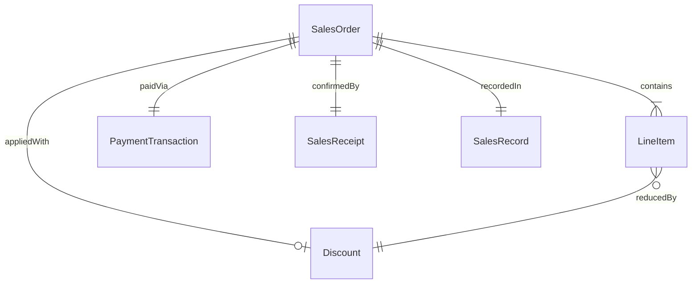
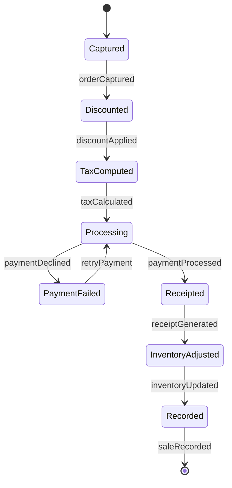
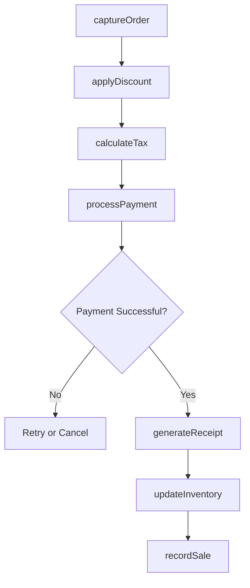
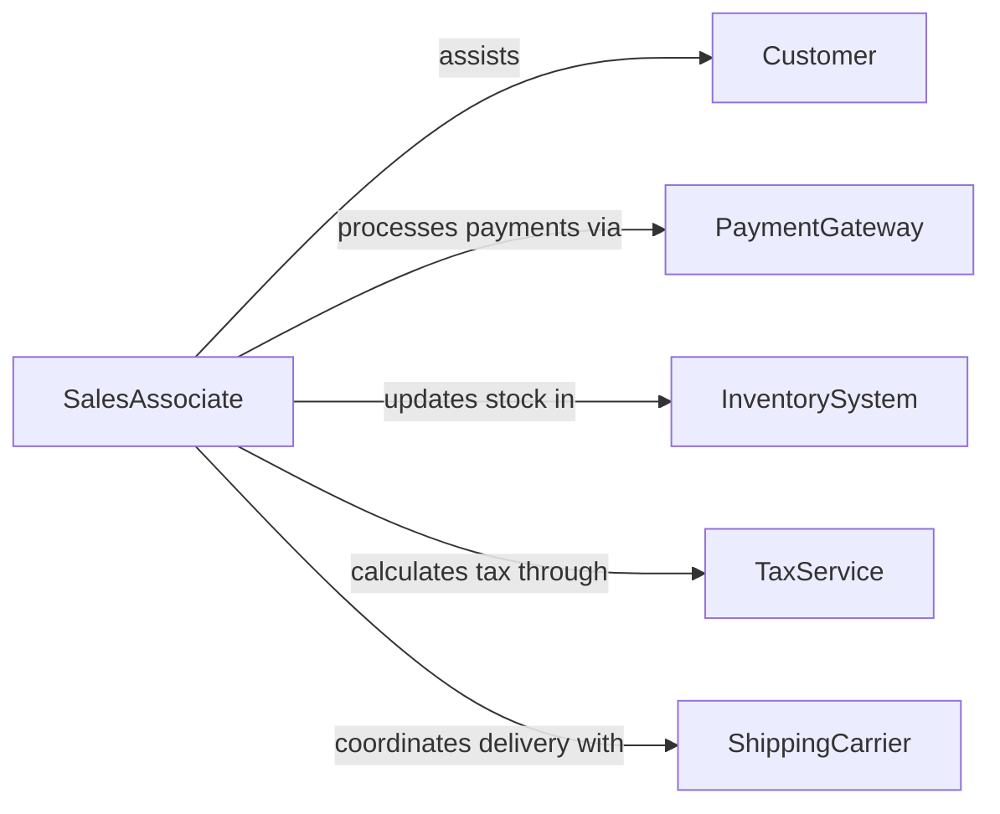

# Process Sales Transactions

> Business-as-Code definition for processing sales and other transactions. Models the capture, validation, fulfillment, and recording of customer purchases across retail, wholesale, and service channels.

## Overview

Processing sales transactions involves capturing purchase details, validating payment, applying discounts or promotions, generating confirmations, and updating inventory and financial records. This definition exposes actions for each stage of the sales processing pipeline, events for real-time transaction tracking, and searches for retrieving sales data and analytics.

## Actors

| Actor | Description |
|-------|-------------|
| Customer | The buyer purchasing goods or services |
| PaymentGateway | Service that authorizes and processes electronic payments |
| InventorySystem | System that tracks product availability and stock levels |
| TaxService | Calculates applicable sales tax based on jurisdiction |
| ShippingCarrier | Handles physical delivery of purchased goods |

## Roles

| Role | Description |
|------|-------------|
| SalesAssociate | Captures order details and assists customers during purchase |
| TransactionProcessor | Validates and completes the financial portion of the sale |
| FulfillmentCoordinator | Manages order preparation and delivery logistics |
| SalesManager | Oversees transaction processing and resolves exceptions |

## Entities

| Entity | Description |
|--------|-------------|
| SalesOrder | A record of items and quantities a customer intends to purchase |
| LineItem | An individual product or service within a sales order |
| PaymentTransaction | The financial exchange associated with the sales order |
| Discount | A price reduction applied to the order or specific line items |
| SalesReceipt | A confirmation document issued to the customer |
| SalesRecord | The finalized transaction entry in the sales ledger |

## Actions

| Action | Description |
|--------|-------------|
| captureOrder | Record the customer purchase details and line items |
| applyDiscount | Apply promotional or loyalty discounts to the order |
| calculateTax | Determine applicable taxes for the transaction |
| processPayment | Authorize and capture payment from the customer |
| generateReceipt | Create a sales receipt for the completed transaction |
| updateInventory | Adjust stock levels to reflect items sold |
| recordSale | Post the transaction to the sales ledger |

## Events

| Event | Description |
|-------|-------------|
| orderCaptured | Customer purchase details have been recorded |
| discountApplied | A promotional or loyalty discount has been applied |
| taxCalculated | Sales tax has been determined for the transaction |
| paymentProcessed | Customer payment has been authorized and captured |
| receiptGenerated | A sales receipt has been produced |
| inventoryUpdated | Stock levels have been adjusted for sold items |
| saleRecorded | The transaction has been posted to the sales ledger |

## Searches

| Search | Description |
|--------|-------------|
| findSalesOrders | Locate orders by customer, date, product, or status |
| getDailySales | Retrieve all transactions for a specific business day |
| getSalesbyProduct | Aggregate sales data by product or category |
| getRefundableTransactions | Identify transactions eligible for return or refund |

## Entity Relationships



## State Diagram



## Workflow



## Actor Relationships



## Usage

### Calling Actions

```typescript
import { processSalesTransactions } from '@headlessly/process-sales-transactions'

const sales = processSalesTransactions()

// Capture a customer order
const order = await sales.captureOrder({
  customerId: 'cust-2204',
  lineItems: [
    { productId: 'SKU-8810', quantity: 2, unitPrice: 49.99 },
    { productId: 'SKU-3320', quantity: 1, unitPrice: 129.00 }
  ]
})

// Apply discount and calculate tax
await sales.applyDiscount({ orderId: order.id, promoCode: 'SAVE10' })
await sales.calculateTax({ orderId: order.id, jurisdiction: 'TX' })

// Process payment and finalize
await sales.processPayment({
  orderId: order.id,
  method: 'credit-card',
  token: 'tok_mastercard_5100'
})

await sales.generateReceipt({ orderId: order.id })
```

### Event-Driven Automation

```typescript
// Auto-update inventory after payment
sales.paymentProcessed(async ({ orderId, lineItems }) => {
  for (const item of lineItems) {
    await sales.updateInventory({
      productId: item.productId,
      quantitySold: item.quantity
    })
  }
})

// Record sale to ledger after receipt generation
sales.receiptGenerated(async ({ orderId, total, taxAmount }) => {
  await sales.recordSale({
    orderId,
    revenue: total,
    taxCollected: taxAmount
  })
})
```
