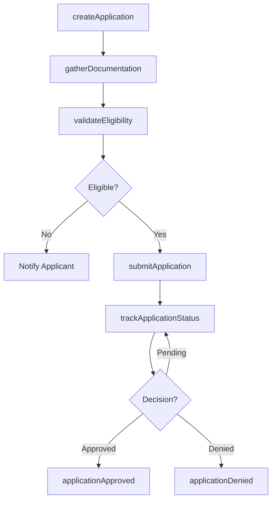
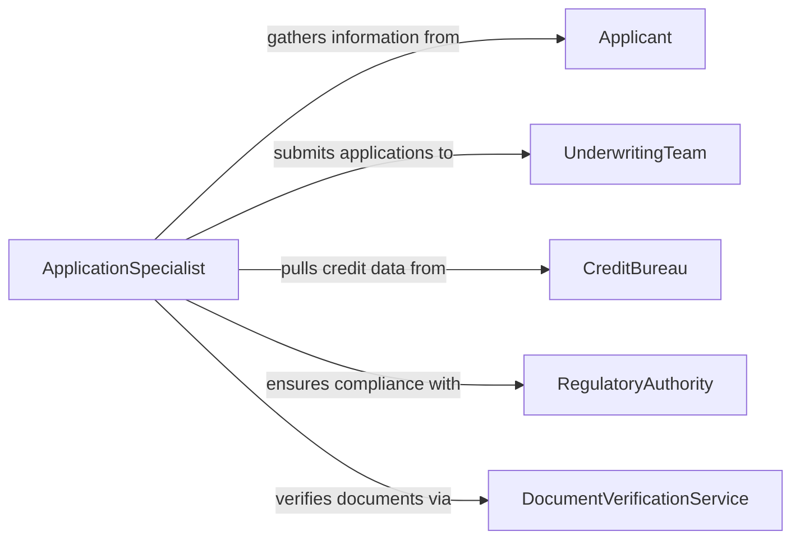

# Submit Financial Applications

> Business-as-Code definition for submitting financial applications. Models the preparation, validation, submission, and tracking of loan, credit, grant, and insurance applications through approval workflows.

## Overview

Submitting financial applications involves gathering applicant information, assembling supporting documentation, validating eligibility criteria, and forwarding completed applications to underwriters or review committees. This definition exposes actions for each stage of the application lifecycle, events for monitoring submission and decision outcomes, and searches for tracking application status.

## Actors

| Actor | Description |
|-------|-------------|
| Applicant | Individual or organization requesting financial products or funding |
| UnderwritingTeam | Evaluates risk and determines approval for the application |
| CreditBureau | Provides credit history and scoring data for applicants |
| RegulatoryAuthority | Sets compliance standards for financial product applications |
| DocumentVerificationService | Validates authenticity of submitted supporting documents |

## Roles

| Role | Description |
|------|-------------|
| ApplicationSpecialist | Prepares and assembles the financial application package |
| ComplianceOfficer | Ensures the application meets regulatory requirements |
| ReviewCoordinator | Routes applications to appropriate underwriting teams |
| ClientAdvisor | Guides applicants through the submission process |

## Entities

| Entity | Description |
|--------|-------------|
| Application | A formal request for a financial product or service |
| ApplicantProfile | Demographic, financial, and credit data for the applicant |
| SupportingDocument | Evidence such as income statements, tax returns, or collateral records |
| EligibilityCriteria | Rules defining minimum qualifications for approval |
| DecisionRecord | The outcome of the underwriting review with rationale |
| ApplicationStatus | Current state of the application in the review pipeline |

## Actions

| Action | Description |
|--------|-------------|
| createApplication | Initialize a new financial application for an applicant |
| gatherDocumentation | Collect and attach required supporting documents |
| validateEligibility | Check the applicant against product eligibility criteria |
| submitApplication | Forward the completed application to the review team |
| trackApplicationStatus | Monitor the current state of a submitted application |
| amendApplication | Update or correct information on a pending application |
| withdrawApplication | Cancel a submitted application before final decision |

## Events

| Event | Description |
|-------|-------------|
| applicationCreated | A new application has been initialized |
| documentationGathered | All required supporting documents have been collected |
| eligibilityValidated | The applicant has been checked against eligibility rules |
| applicationSubmitted | The application has been forwarded for review |
| applicationApproved | The application has been approved by underwriting |
| applicationDenied | The application has been declined with rationale |
| applicationWithdrawn | The applicant has cancelled the pending application |

## Searches

| Search | Description |
|--------|-------------|
| findApplications | Locate applications by applicant, product type, or status |
| getPendingReviews | List applications awaiting underwriting decision |
| getApplicationHistory | Retrieve the full timeline of events for an application |
| getEligibilityResults | Check validation outcomes for a specific applicant |

## Workflow



## Actor Relationships



## Usage

### Calling Actions

```typescript
import { submitFinancialApplications } from '@headlessly/submit-financial-applications'

const applications = submitFinancialApplications()

// Create a new loan application
const app = await applications.createApplication({
  applicantId: 'app-33210',
  productType: 'commercial-loan',
  requestedAmount: 250000,
  term: '60-months'
})

// Gather documents and validate
await applications.gatherDocumentation({
  applicationId: app.id,
  documents: [
    { type: 'tax-return', year: 2025 },
    { type: 'bank-statement', period: 'last-6-months' },
    { type: 'business-plan' }
  ]
})

await applications.validateEligibility({ applicationId: app.id })
await applications.submitApplication({ applicationId: app.id })
```

### Event-Driven Automation

```typescript
// Notify applicant upon decision
applications.applicationApproved(async ({ applicationId, approvedAmount }) => {
  const app = await applications.findApplications({ id: applicationId })
  await notify({
    to: app.applicantId,
    message: `Your application has been approved for $${approvedAmount}.`
  })
})

applications.applicationDenied(async ({ applicationId, reason }) => {
  const app = await applications.findApplications({ id: applicationId })
  await notify({
    to: app.applicantId,
    message: `Your application was not approved. Reason: ${reason}`
  })
})
```
