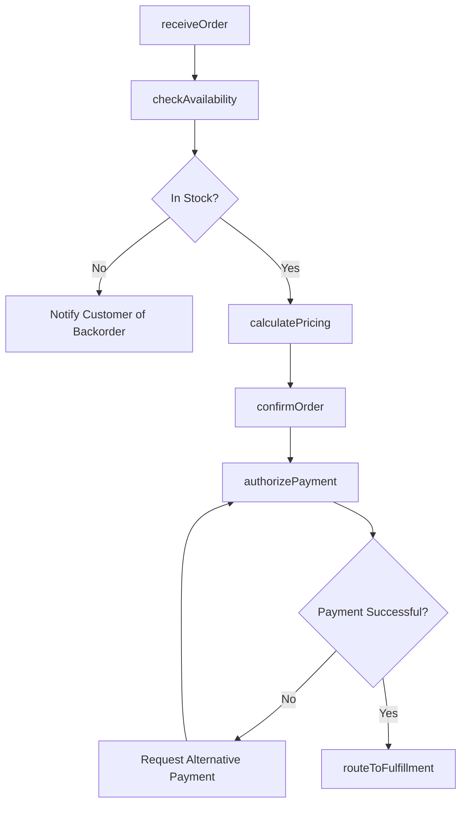
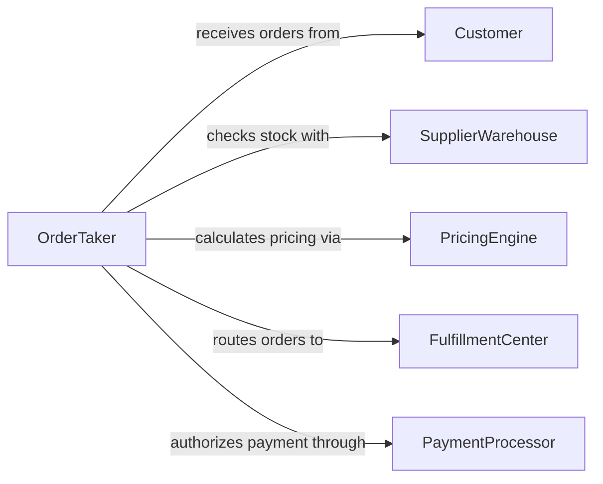

# Take Customer Orders

> Business-as-Code definition for taking customer orders. Models the capture, validation, pricing, confirmation, and routing of customer purchase requests across in-person, phone, and digital channels.

## Overview

Taking customer orders involves receiving purchase requests from customers, verifying product availability, calculating pricing and applicable fees, confirming the order details with the customer, and routing the order for fulfillment. This definition exposes actions for each phase of the order intake process, events for tracking order progression, and searches for retrieving order and availability data.

## Actors

| Actor | Description |
|-------|-------------|
| Customer | Individual or business placing a purchase order |
| SupplierWarehouse | Facility that confirms product availability and ships goods |
| PricingEngine | System that calculates item prices, taxes, and discounts |
| FulfillmentCenter | Operations team responsible for picking, packing, and shipping |
| PaymentProcessor | Service that handles payment authorization for the order |

## Roles

| Role | Description |
|------|-------------|
| OrderTaker | Captures customer order details and confirms specifications |
| OrderValidator | Verifies product availability, pricing, and customer eligibility |
| OrderCoordinator | Routes confirmed orders to fulfillment and tracks progress |
| CustomerServiceRepresentative | Assists with order modifications and customer inquiries |

## Entities

| Entity | Description |
|--------|-------------|
| Order | A customer request to purchase one or more products or services |
| OrderLineItem | An individual product or service within an order |
| ProductCatalog | The available inventory of products and services |
| PriceQuote | A calculated total including items, taxes, and shipping |
| OrderConfirmation | A verified acknowledgment sent to the customer |
| FulfillmentRequest | An instruction to the warehouse to prepare the order |

## Actions

| Action | Description |
|--------|-------------|
| receiveOrder | Capture the initial customer order request |
| checkAvailability | Verify that requested items are in stock or available |
| calculatePricing | Determine the total cost including taxes and shipping |
| confirmOrder | Finalize the order details with the customer |
| authorizePayment | Process payment authorization for the order total |
| routeToFulfillment | Send the confirmed order to the fulfillment center |
| modifyOrder | Update order details before fulfillment begins |

## Events

| Event | Description |
|-------|-------------|
| orderReceived | A new customer order has been captured |
| availabilityChecked | Product availability has been verified |
| pricingCalculated | The order total has been determined |
| orderConfirmed | The customer has confirmed the order details |
| paymentAuthorized | Payment has been authorized for the order |
| orderRoutedToFulfillment | The order has been sent for picking and shipping |
| orderModified | Order details have been updated |

## Searches

| Search | Description |
|--------|-------------|
| findOrders | Locate orders by customer, date, status, or product |
| checkProductAvailability | Query stock levels for specific products |
| getPendingOrders | List orders received but not yet confirmed or fulfilled |
| getOrderHistory | Retrieve past orders for a specific customer |

## Workflow



## Actor Relationships



## Usage

### Calling Actions

```typescript
import { takeCustomerOrders } from '@headlessly/take-customer-orders'

const orders = takeCustomerOrders()

// Receive a new customer order
const order = await orders.receiveOrder({
  customerId: 'cust-4412',
  channel: 'phone',
  items: [
    { productId: 'PROD-880', quantity: 3 },
    { productId: 'PROD-225', quantity: 1 }
  ]
})

// Check availability and calculate pricing
await orders.checkAvailability({ orderId: order.id })
const quote = await orders.calculatePricing({ orderId: order.id })

// Confirm with customer and route
await orders.confirmOrder({
  orderId: order.id,
  total: quote.total,
  estimatedDelivery: '2026-02-12'
})

await orders.authorizePayment({ orderId: order.id, method: 'credit-card' })
await orders.routeToFulfillment({ orderId: order.id })
```

### Event-Driven Automation

```typescript
// Auto-route to fulfillment after payment
orders.paymentAuthorized(async ({ orderId }) => {
  await orders.routeToFulfillment({ orderId })
})

// Send confirmation to customer
orders.orderConfirmed(async ({ orderId, customerId, total, estimatedDelivery }) => {
  await notify({
    to: customerId,
    message: `Order ${orderId} confirmed. Total: $${total}. Expected delivery: ${estimatedDelivery}.`
  })
})
```
