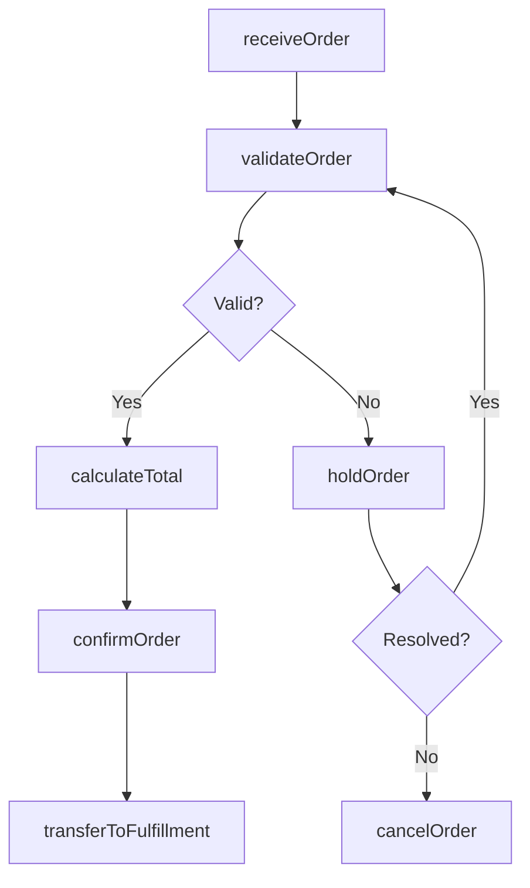
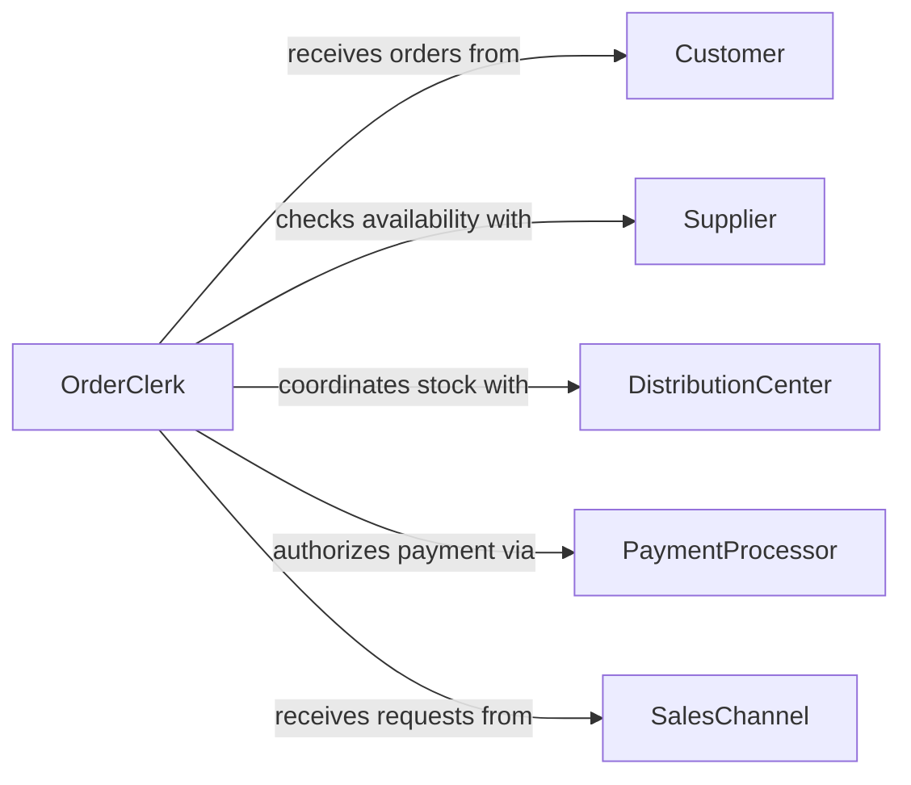

# Take Product Orders Customers

> Business-as-Code definition for capturing and processing product orders from customers. Models the complete order intake lifecycle from initial request through confirmation and fulfillment handoff.

## Overview

Taking product orders from customers involves receiving order requests through various channels, validating product availability and pricing, and confirming the order for downstream fulfillment. This definition exposes actions for each stage of the order intake process, events for workflow automation, and searches for retrieving order data across the pipeline.

## Actors

| Actor | Description |
|-------|-------------|
| Customer | Individual or organization placing a product order |
| Supplier | Provides products or inventory to fulfill orders |
| DistributionCenter | Warehouse facility that stocks and ships products |
| PaymentProcessor | Handles payment authorization and settlement |
| SalesChannel | Storefront, website, or marketplace where orders originate |

## Roles

| Role | Description |
|------|-------------|
| OrderClerk | Receives and enters customer orders into the system |
| SalesRepresentative | Assists customers with product selection and order placement |
| InventorySpecialist | Verifies stock availability for requested items |
| OrderSupervisor | Reviews and approves orders requiring escalation |

## Entities

| Entity | Description |
|--------|-------------|
| Order | A customer request to purchase one or more products |
| OrderLineItem | An individual product entry within an order |
| ProductCatalog | Available products with pricing and specifications |
| CustomerAccount | Customer profile with contact and billing information |
| PriceQuote | Calculated pricing for requested items including discounts |
| OrderConfirmation | Acknowledgment sent to the customer upon order acceptance |

## Actions

| Action | Description |
|--------|-------------|
| receiveOrder | Capture an incoming order request from a customer |
| validateOrder | Check product availability, pricing, and customer eligibility |
| calculateTotal | Compute order totals including taxes, discounts, and shipping |
| confirmOrder | Finalize the order and issue confirmation to the customer |
| holdOrder | Place an order on hold pending resolution of an issue |
| cancelOrder | Cancel an order before fulfillment begins |
| transferToFulfillment | Hand off a confirmed order to the fulfillment pipeline |

## Events

| Event | Description |
|-------|-------------|
| orderReceived | A new order request has been captured from a customer |
| orderValidated | Order has passed availability and pricing checks |
| totalCalculated | Order totals have been computed and are ready for review |
| orderConfirmed | Order has been accepted and confirmation issued |
| orderHeld | Order has been placed on hold pending resolution |
| orderCancelled | Order has been cancelled before fulfillment |
| orderTransferredToFulfillment | Confirmed order has been handed off for fulfillment |

## Searches

| Search | Description |
|--------|-------------|
| findOrders | List orders by customer, date range, status, or channel |
| getOrderDetails | Retrieve full order details including line items and pricing |
| findPendingOrders | Locate orders awaiting validation or confirmation |
| getCustomerOrderHistory | Retrieve past orders for a specific customer account |

## Workflow



## Actor Relationships



## Usage

### Calling Actions

```typescript
import { takeProductOrdersCustomers } from '@headlessly/take-product-orders-customers'

const orders = takeProductOrdersCustomers()

// Receive a new customer order
const order = await orders.receiveOrder({
  customerId: 'cust-4821',
  channel: 'web-storefront',
  items: [
    { productId: 'SKU-1001', quantity: 3 },
    { productId: 'SKU-2045', quantity: 1 }
  ]
})

// Validate and calculate totals
await orders.validateOrder({ orderId: order.id })
const totals = await orders.calculateTotal({ orderId: order.id })

// Confirm and hand off to fulfillment
await orders.confirmOrder({ orderId: order.id })
await orders.transferToFulfillment({ orderId: order.id })
```

### Event-Driven Automation

```typescript
// Notify sales rep when high-value order is received
orders.orderReceived(async ({ orderId, customerId, estimatedTotal }) => {
  if (estimatedTotal > 10000) {
    await notify({
      to: 'sales-team',
      message: `High-value order ${orderId} from customer ${customerId}`
    })
  }
})

// Auto-transfer confirmed orders to fulfillment
orders.orderConfirmed(async ({ orderId }) => {
  await orders.transferToFulfillment({ orderId })
})
```
