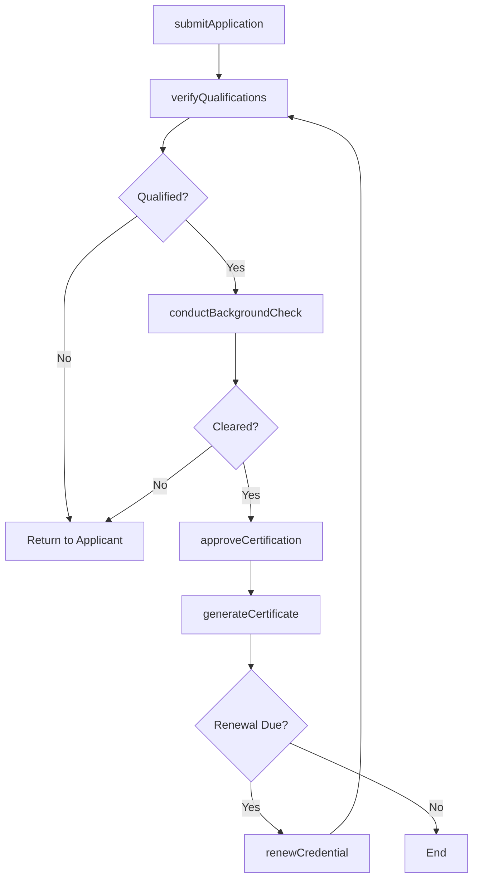
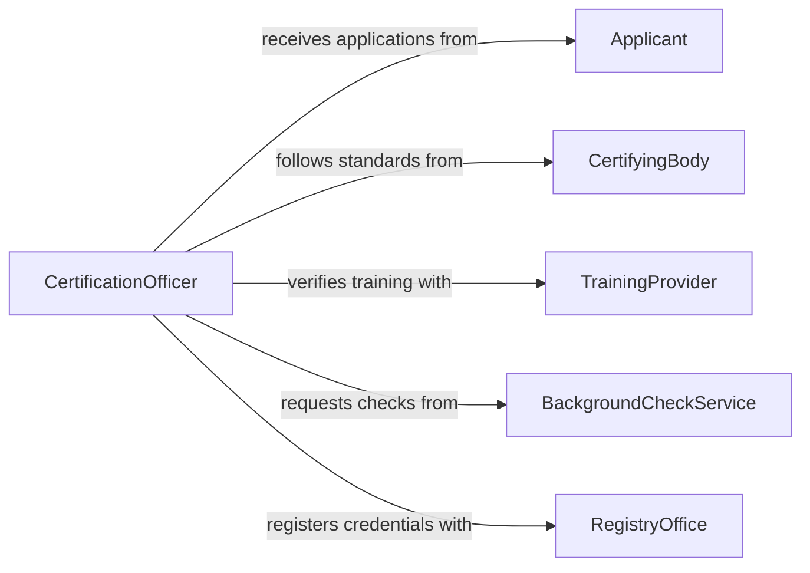

# Issue Certificates Licenses

> Business-as-Code definition for issuing certificates and licenses. Models the credential issuance lifecycle from application and verification through approval, generation, and renewal.

## Overview

Issuing certificates and licenses involves evaluating applicant qualifications, verifying compliance with standards or training requirements, and producing official credentials. This definition exposes actions for managing the full credential lifecycle including issuance, renewal, and revocation, events for tracking status transitions, and searches for retrieving credential records across categories and holders.

## Actors

| Actor | Description |
|-------|-------------|
| Applicant | The individual or organization applying for a certificate or license |
| CertifyingBody | The authority or board that defines certification standards |
| TrainingProvider | Organization that delivers required courses or examinations |
| BackgroundCheckService | Third-party service verifying applicant history and eligibility |
| RegistryOffice | Office maintaining the official registry of issued credentials |

## Roles

| Role | Description |
|------|-------------|
| CertificationOfficer | Reviews applications and manages the issuance process |
| QualificationsReviewer | Evaluates applicant credentials and training records |
| RegistryClerk | Maintains official records of issued certificates and licenses |
| RenewalCoordinator | Manages the renewal and continuing education tracking process |

## Entities

| Entity | Description |
|--------|-------------|
| CertificateApplication | A formal request for a certificate or license |
| Certificate | An official document attesting to qualifications or competency |
| License | A credential authorizing the holder to perform regulated activities |
| QualificationRecord | Documentation of an applicant's training, exams, or experience |
| RenewalNotice | A communication alerting a holder that their credential is expiring |
| CredentialRegistry | The master record of all active and expired credentials |

## Actions

| Action | Description |
|--------|-------------|
| submitApplication | Accept a new certificate or license application |
| verifyQualifications | Validate the applicant's training, exams, and experience |
| conductBackgroundCheck | Initiate a background verification for the applicant |
| approveCertification | Grant formal approval to issue the credential |
| generateCertificate | Create the official certificate or license document |
| renewCredential | Process a renewal for an expiring certificate or license |
| revokeCredential | Withdraw a previously issued certificate or license |

## Events

| Event | Description |
|-------|-------------|
| applicationSubmitted | A new certificate or license application has been received |
| qualificationsVerified | The applicant's qualifications have been confirmed |
| backgroundCheckCompleted | A background verification has been finalized |
| certificationApproved | The credential application has been formally approved |
| certificateGenerated | The official credential document has been created |
| credentialRenewed | An existing credential has been renewed for a new term |
| credentialRevoked | A previously issued credential has been withdrawn |

## Searches

| Search | Description |
|--------|-------------|
| findApplications | List applications by status, credential type, or applicant |
| findCredentials | Retrieve issued certificates or licenses by holder or category |
| getExpiringCredentials | Query credentials approaching their expiration date |
| getCredentialHistory | Look up the full lifecycle history of a specific credential |

## Workflow



## Actor Relationships



## Usage

### Calling Actions

```typescript
import { issueCertificatesLicenses } from '@headlessly/issue-certificates-licenses'

const credentials = issueCertificatesLicenses()

// Submit a professional license application
const application = await credentials.submitApplication({
  applicantId: 'person-7823',
  type: 'professional-license',
  category: 'real-estate-broker',
  qualifications: { examScore: 92, hoursCompleted: 180 }
})

// Verify and approve
await credentials.verifyQualifications({ applicationId: application.id })
await credentials.conductBackgroundCheck({ applicationId: application.id })
await credentials.approveCertification({ applicationId: application.id })

// Generate the license document
const license = await credentials.generateCertificate({
  applicationId: application.id,
  validFrom: '2026-03-01',
  validUntil: '2028-03-01'
})
```

### Event-Driven Automation

```typescript
// Notify holder when credential is approaching expiration
credentials.certificateGenerated(async ({ credentialId, holderId, validUntil }) => {
  await scheduleReminder({
    credentialId,
    recipientId: holderId,
    triggerDate: subtractDays(validUntil, 90),
    message: 'Your credential expires in 90 days. Please begin the renewal process.'
  })
})

// Auto-initiate renewal workflow
credentials.credentialRenewed(async ({ credentialId, holderId }) => {
  await notify({
    to: holderId,
    message: `Your credential ${credentialId} has been renewed successfully.`,
    channel: 'email'
  })
})
```
