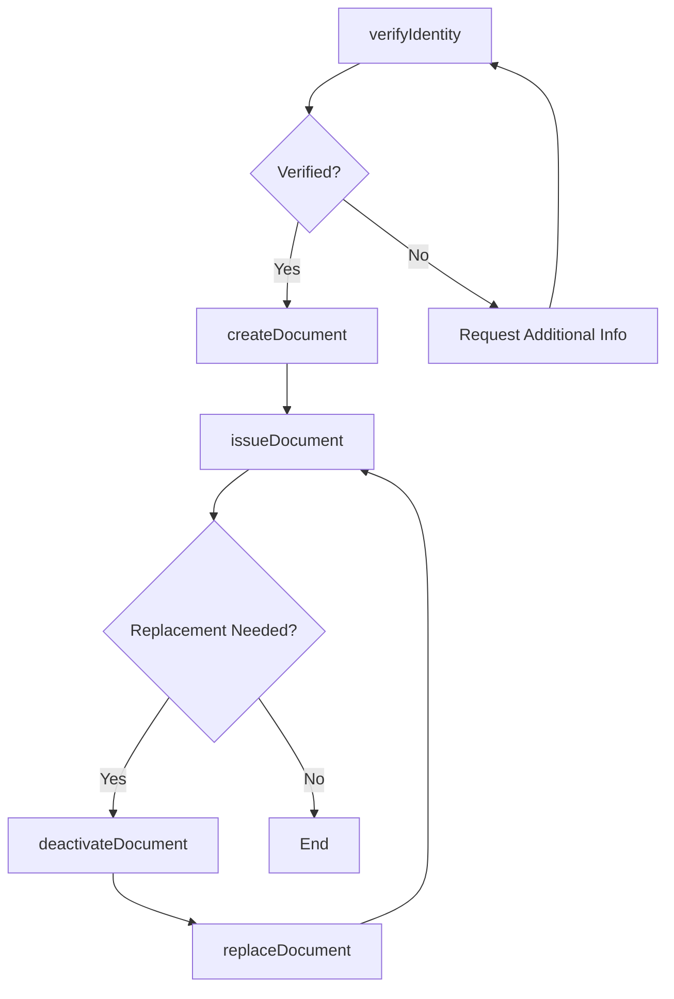
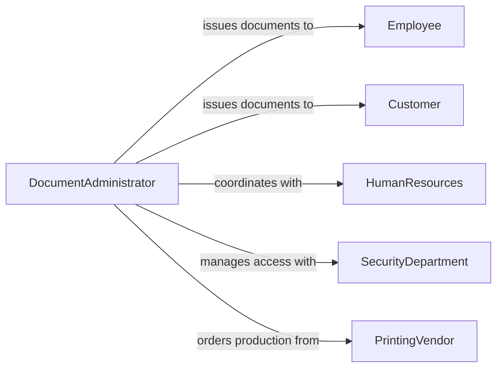

# Issue Documentation Identification Customers Employees

> Business-as-Code definition for issuing documentation and identification to customers or employees. Models the credential provisioning lifecycle from identity verification through document creation, distribution, and replacement.

## Overview

Issuing documentation and identification to customers or employees involves verifying identity, creating official credentials such as badges, ID cards, or membership documents, and managing their lifecycle including replacements and deactivations. This definition exposes actions for each step of the identification issuance process, events for tracking credential status, and searches for retrieving documentation records across holders and document types.

## Actors

| Actor | Description |
|-------|-------------|
| Employee | Staff member receiving identification or employment documentation |
| Customer | Client or member receiving identification or account documentation |
| HumanResources | Department managing employee records and onboarding documentation |
| SecurityDepartment | Team responsible for physical and logical access credentials |
| PrintingVendor | External service producing physical ID cards or badges |

## Roles

| Role | Description |
|------|-------------|
| DocumentAdministrator | Manages the issuance and tracking of all identification documents |
| IdentityVerifier | Confirms the identity of individuals before document issuance |
| BadgeCoordinator | Handles physical badge production and distribution |
| RecordsManager | Maintains the official registry of issued documentation |

## Entities

| Entity | Description |
|--------|-------------|
| IdentificationDocument | An official credential issued to a customer or employee |
| IdentityVerification | A record confirming an individual's identity prior to issuance |
| BadgeRequest | A formal request for a new or replacement ID badge |
| DocumentTemplate | A standardized format used for generating identification documents |
| IssuanceLog | An audit trail of all documents issued, replaced, or deactivated |
| AccessProfile | The set of permissions or entitlements associated with an ID |

## Actions

| Action | Description |
|--------|-------------|
| verifyIdentity | Confirm the identity of the individual requesting documentation |
| createDocument | Generate a new identification document or credential |
| issueDocument | Distribute the document to the intended recipient |
| replaceDocument | Issue a replacement for a lost, stolen, or damaged document |
| deactivateDocument | Revoke an active identification document |
| updateAccessProfile | Modify permissions or entitlements linked to an ID |
| auditIssuanceRecords | Review the log of all documents issued within a period |

## Events

| Event | Description |
|-------|-------------|
| identityVerified | The individual's identity has been confirmed |
| documentCreated | A new identification document has been generated |
| documentIssued | The document has been distributed to the recipient |
| documentReplaced | A replacement document has been issued |
| documentDeactivated | An identification document has been revoked |
| accessProfileUpdated | Permissions linked to a document have been changed |
| issuanceAudited | A review of issuance records has been completed |

## Searches

| Search | Description |
|--------|-------------|
| findDocuments | List issued documents by holder, type, or status |
| getIssuanceHistory | Retrieve the full issuance timeline for a specific individual |
| findExpiredDocuments | Query documents that have passed their validity date |
| getActiveCredentials | List all currently active identification documents |

## Workflow



## Actor Relationships



## Usage

### Calling Actions

```typescript
import { issueDocumentationIdentificationCustomersEmployees } from '@headlessly/issue-documentation-identification-customers-employees'

const docs = issueDocumentationIdentificationCustomersEmployees()

// Verify identity and issue an employee badge
await docs.verifyIdentity({
  personId: 'emp-4410',
  method: 'government-id',
  documentNumber: 'DL-9823741'
})

const badge = await docs.createDocument({
  holderId: 'emp-4410',
  type: 'employee-badge',
  template: 'corporate-standard',
  accessProfile: { building: 'HQ', floors: [1, 2, 3], parking: true }
})

await docs.issueDocument({
  documentId: badge.id,
  deliveryMethod: 'in-person',
  location: 'reception-desk'
})
```

### Event-Driven Automation

```typescript
// Deactivate old credentials when a replacement is issued
docs.documentReplaced(async ({ oldDocumentId, newDocumentId }) => {
  await docs.deactivateDocument({ documentId: oldDocumentId })
  await notify({
    to: 'security-team',
    message: `Document ${oldDocumentId} has been replaced by ${newDocumentId}`
  })
})

// Alert security when a document is deactivated
docs.documentDeactivated(async ({ documentId, holderId }) => {
  await updateAccessControl({
    holderId,
    action: 'revoke',
    documentId
  })
})
```
