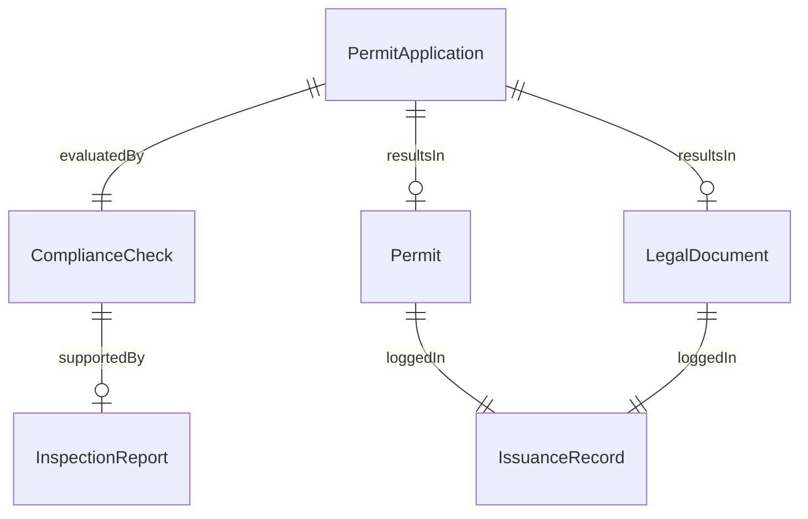
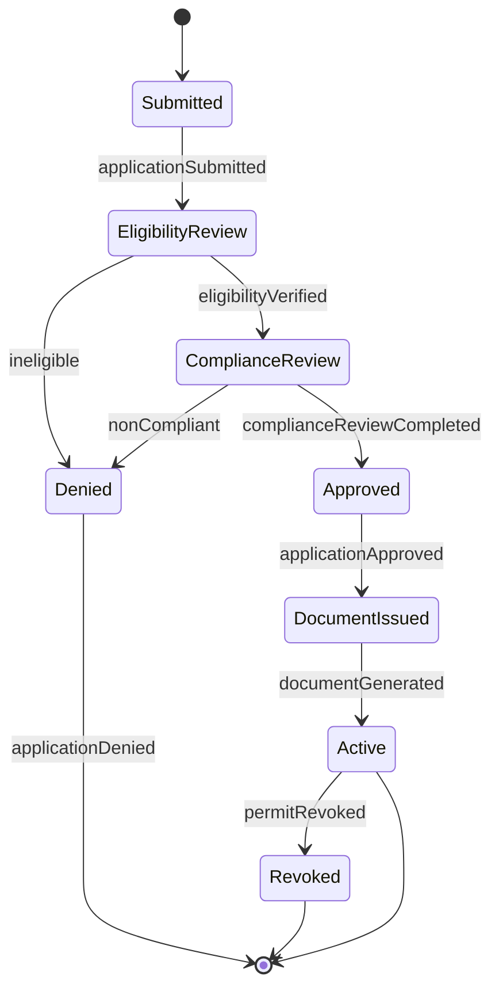
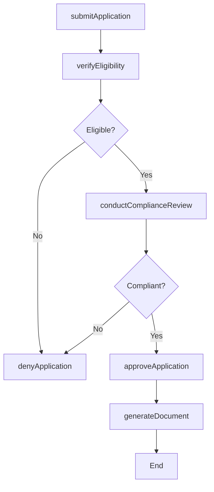
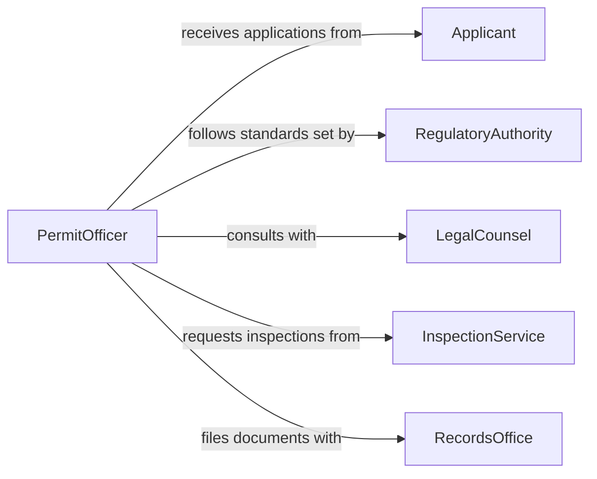

# Issue Permits Legal Documents

> Business-as-Code definition for issuing permits and legal documents. Models the complete permit issuance lifecycle from application intake through review, approval, and document generation.

## Overview

Issuing permits and legal documents involves receiving applications, verifying eligibility and compliance, processing approvals, and generating official documentation. This definition exposes actions for each stage of the permitting workflow, events for tracking application status changes, and searches for retrieving permit records across jurisdictions and document types.

## Actors

| Actor | Description |
|-------|-------------|
| Applicant | The individual or organization requesting a permit or legal document |
| RegulatoryAuthority | Government body or agency that defines permit requirements |
| LegalCounsel | Attorney or legal advisor verifying document accuracy |
| InspectionService | Third-party or internal team conducting site or compliance inspections |
| RecordsOffice | Office responsible for archiving and retrieving official documents |

## Roles

| Role | Description |
|------|-------------|
| PermitOfficer | Reviews applications and issues permits |
| ComplianceReviewer | Verifies that applications meet regulatory requirements |
| DocumentClerk | Prepares and files official legal documents |
| Approver | Grants final authorization for permit issuance |

## Entities

| Entity | Description |
|--------|-------------|
| PermitApplication | A formal request for a permit or legal document |
| Permit | An official authorization granting permission for a specific activity |
| LegalDocument | A formally issued document with legal standing |
| ComplianceCheck | A verification record confirming regulatory adherence |
| InspectionReport | A report from a site or document inspection |
| IssuanceRecord | An audit trail entry for a document that has been issued |

## Actions

| Action | Description |
|--------|-------------|
| submitApplication | Accept a new permit or document application |
| verifyEligibility | Check that the applicant meets all requirements |
| conductComplianceReview | Assess the application against regulatory standards |
| approveApplication | Grant formal approval for the permit or document |
| denyApplication | Reject an application with documented reasons |
| generateDocument | Create the official permit or legal document |
| revokePermit | Withdraw a previously issued permit |

## Events

| Event | Description |
|-------|-------------|
| applicationSubmitted | A new permit application has been received |
| eligibilityVerified | The applicant has been confirmed as eligible |
| complianceReviewCompleted | Regulatory review of the application is complete |
| applicationApproved | The permit application has been formally approved |
| applicationDenied | The permit application has been rejected |
| documentGenerated | The official permit or legal document has been created |
| permitRevoked | A previously issued permit has been withdrawn |

## Searches

| Search | Description |
|--------|-------------|
| findApplications | List applications by status, type, or applicant |
| findPermits | Retrieve issued permits by jurisdiction, type, or date range |
| getComplianceHistory | Look up compliance review records for an applicant |
| getIssuanceLog | Retrieve the audit trail of all documents issued |

## Entity Relationships



## State Diagram



## Workflow



## Actor Relationships



## Usage

### Calling Actions

```typescript
import { issuePermitsLegalDocuments } from '@headlessly/issue-permits-legal-documents'

const permits = issuePermitsLegalDocuments()

// Submit a building permit application
const application = await permits.submitApplication({
  applicantId: 'org-2045',
  type: 'building-permit',
  jurisdiction: 'county-harris',
  details: { address: '1200 Main St', projectType: 'commercial-renovation' }
})

// Verify eligibility
await permits.verifyEligibility({ applicationId: application.id })

// Approve and generate the document
await permits.approveApplication({ applicationId: application.id })
const document = await permits.generateDocument({
  applicationId: application.id,
  format: 'pdf',
  expirationDate: '2027-02-01'
})
```

### Event-Driven Automation

```typescript
// Notify applicant when application is approved
permits.applicationApproved(async ({ applicationId, applicantId }) => {
  await notify({
    to: applicantId,
    message: `Your permit application ${applicationId} has been approved.`,
    channel: 'email'
  })
})

// Schedule inspection when compliance review is completed
permits.complianceReviewCompleted(async ({ applicationId, result }) => {
  if (result === 'conditional') {
    await scheduleInspection({
      applicationId,
      type: 'site-visit',
      priority: 'standard'
    })
  }
})
```
