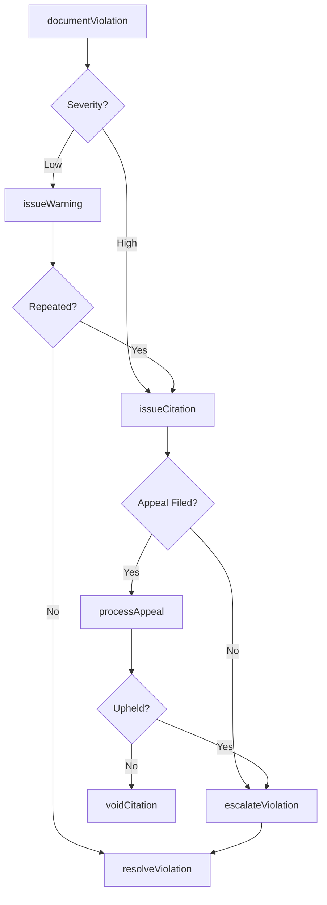
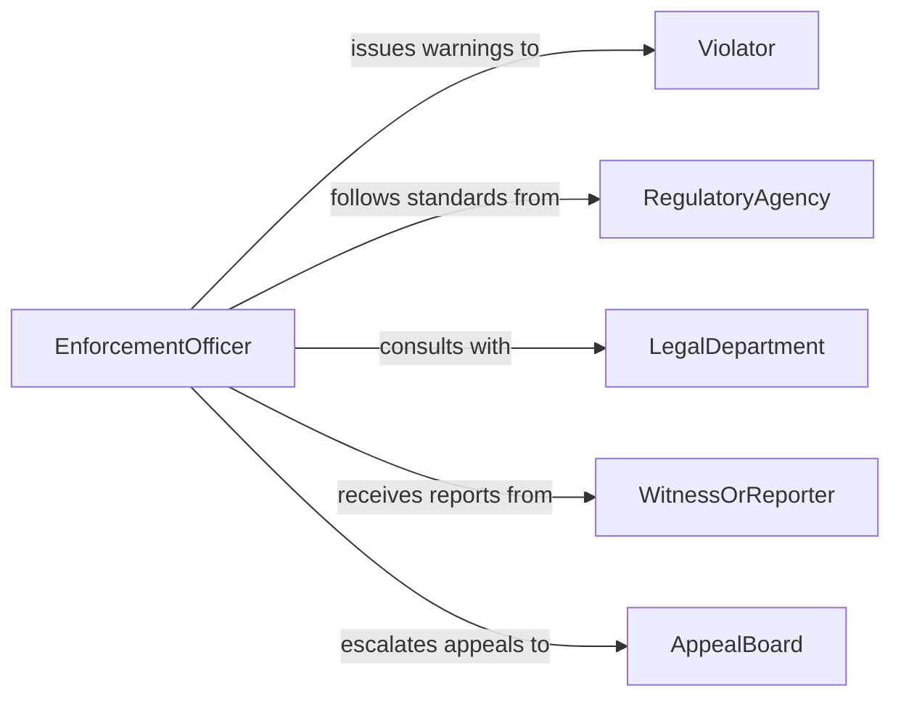

# Issue Warnings Citations

> Business-as-Code definition for issuing warnings and citations. Models the enforcement lifecycle from violation detection through documentation, issuance, escalation, and resolution.

## Overview

Issuing warnings and citations involves identifying violations or non-compliance, documenting the infraction, formally notifying the responsible party, and tracking the resolution or escalation of the matter. This definition exposes actions for each stage of the enforcement process, events for monitoring violation status changes, and searches for retrieving citation records across categories and recipients.

## Actors

| Actor | Description |
|-------|-------------|
| Violator | The individual or organization that committed the infraction |
| RegulatoryAgency | Government or industry body defining compliance standards |
| LegalDepartment | Internal or external legal counsel advising on enforcement actions |
| WitnessOrReporter | Party who observed or reported the violation |
| AppealBoard | Body that reviews contested warnings or citations |

## Roles

| Role | Description |
|------|-------------|
| EnforcementOfficer | Identifies violations and issues warnings or citations |
| ComplianceInspector | Conducts inspections and documents compliance findings |
| CitationAdministrator | Manages the processing and tracking of issued citations |
| ReviewOfficer | Evaluates appeals and determines resolution outcomes |

## Entities

| Entity | Description |
|--------|-------------|
| Violation | A documented infraction of a rule, regulation, or policy |
| Warning | A formal notice advising of a violation without penalty |
| Citation | An official document imposing a penalty or requiring corrective action |
| InspectionReport | A record of findings from a compliance inspection |
| Appeal | A formal request to contest a warning or citation |
| ResolutionRecord | Documentation of how a violation was addressed |

## Actions

| Action | Description |
|--------|-------------|
| documentViolation | Record the details of an observed infraction |
| issueWarning | Deliver a formal warning to the responsible party |
| issueCitation | Generate and deliver a citation with penalties or corrective requirements |
| escalateViolation | Elevate a repeated or severe violation to a higher authority |
| processAppeal | Review and adjudicate a contested warning or citation |
| resolveViolation | Close a violation after corrective action has been taken |
| voidCitation | Cancel a citation that was issued in error |

## Events

| Event | Description |
|-------|-------------|
| violationDocumented | A new violation has been formally recorded |
| warningIssued | A formal warning has been delivered to the violator |
| citationIssued | A citation with penalties has been generated and delivered |
| violationEscalated | A violation has been elevated to a higher authority |
| appealSubmitted | The violator has formally contested the warning or citation |
| appealResolved | An appeal has been adjudicated with a final decision |
| violationResolved | A violation has been closed after corrective action |

## Searches

| Search | Description |
|--------|-------------|
| findViolations | List violations by type, severity, or responsible party |
| findCitations | Retrieve citations by status, date range, or recipient |
| getAppeals | Query pending or resolved appeals for a given citation |
| getViolationHistory | Look up the complete violation record for an individual or entity |
| getOpenEnforcements | List all unresolved warnings and citations |

## Workflow



## Actor Relationships



## Usage

### Calling Actions

```typescript
import { issueWarningsCitations } from '@headlessly/issue-warnings-citations'

const enforcement = issueWarningsCitations()

// Document a safety violation
const violation = await enforcement.documentViolation({
  violatorId: 'contractor-2291',
  type: 'safety-violation',
  severity: 'high',
  description: 'Failure to wear required personal protective equipment',
  location: 'warehouse-b',
  observedBy: 'inspector-405'
})

// Issue a citation with corrective requirements
const citation = await enforcement.issueCitation({
  violationId: violation.id,
  penalty: { type: 'fine', amount: 2500, currency: 'USD' },
  correctiveAction: 'Complete safety training within 30 days',
  dueDate: '2026-03-07'
})

// Process an appeal if contested
await enforcement.processAppeal({
  citationId: citation.id,
  grounds: 'Equipment was provided but not yet distributed',
  evidence: ['distribution-log-feb.pdf']
})
```

### Event-Driven Automation

```typescript
// Escalate repeated violations automatically
enforcement.warningIssued(async ({ violatorId, violationType }) => {
  const history = await enforcement.getViolationHistory({ violatorId })
  const repeatCount = history.filter(v => v.type === violationType).length
  if (repeatCount >= 3) {
    await enforcement.escalateViolation({
      violatorId,
      reason: `${repeatCount} repeated ${violationType} violations`
    })
  }
})

// Notify legal when a citation is appealed
enforcement.appealSubmitted(async ({ citationId, violatorId }) => {
  await notify({
    to: 'legal-department',
    message: `Citation ${citationId} has been appealed by ${violatorId}`,
    channel: 'email'
  })
})
```
