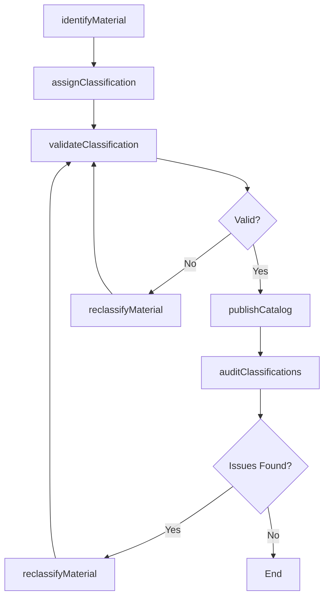
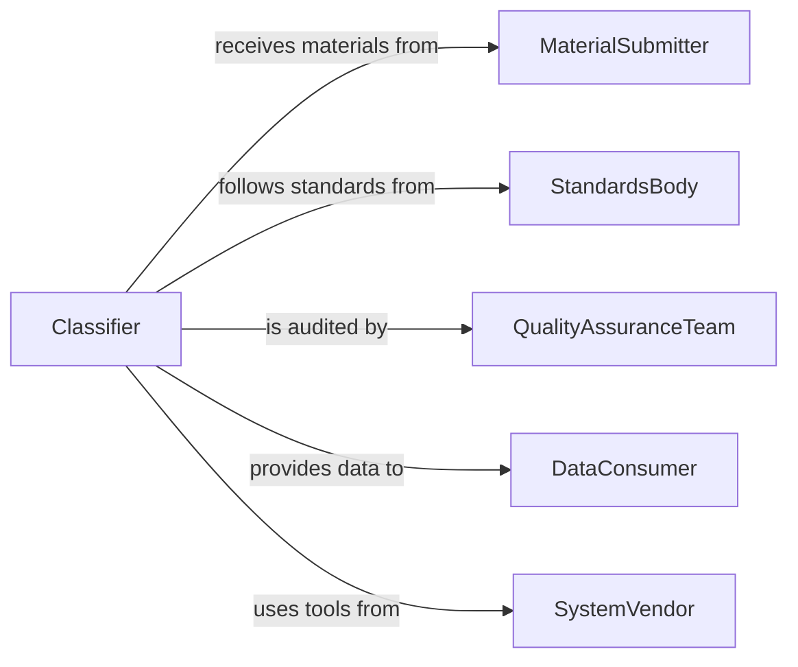

# Classify Materials According Standard Systems

> Business-as-Code definition for classifying materials according to standard systems. Models the classification workflow from material identification through taxonomy assignment, quality verification, and catalog integration.

## Overview

Classifying materials according to standard systems involves examining items or documents, determining their proper category within an established taxonomy or coding scheme, and recording the classification for retrieval and reporting. This definition exposes actions for each phase of the classification process, events for tracking assignment and review activities, and searches for retrieving materials by classification code, category, or status.

## Actors

| Actor | Description |
|-------|-------------|
| MaterialSubmitter | The individual or department providing materials for classification |
| StandardsBody | The organization that defines and maintains the classification system |
| QualityAssuranceTeam | Team that audits classification accuracy and consistency |
| DataConsumer | Internal or external party using classified data for analysis or operations |
| SystemVendor | Provider of the classification software or taxonomy tools |

## Roles

| Role | Description |
|------|-------------|
| Classifier | Examines materials and assigns classification codes |
| TaxonomyAdministrator | Maintains and updates the classification scheme and code tables |
| QualityReviewer | Audits classification assignments for accuracy |
| CatalogManager | Oversees the integration of classified materials into catalogs or databases |

## Entities

| Entity | Description |
|--------|-------------|
| Material | A physical item, document, or resource subject to classification |
| ClassificationCode | A code or label from a standard system assigned to a material |
| Taxonomy | The structured hierarchy of categories in the classification system |
| ClassificationRecord | The stored assignment linking a material to its classification |
| AuditReport | A review of classification accuracy across a batch or period |
| CodeTable | A reference table of valid classification codes and descriptions |

## Actions

| Action | Description |
|--------|-------------|
| identifyMaterial | Examine a material to determine its key attributes |
| assignClassification | Apply the appropriate classification code from the standard system |
| validateClassification | Check that the assigned code is accurate and consistent |
| updateTaxonomy | Add, modify, or deprecate codes in the classification scheme |
| reclassifyMaterial | Change the classification of a material based on new information |
| auditClassifications | Review a batch of classifications for accuracy and completeness |
| publishCatalog | Release the classified material data into the organizational catalog |

## Events

| Event | Description |
|-------|-------------|
| materialIdentified | A material has been examined and its attributes recorded |
| classificationAssigned | A classification code has been applied to a material |
| classificationValidated | The assigned classification has been confirmed as accurate |
| taxonomyUpdated | The classification scheme has been modified |
| materialReclassified | A material's classification has been changed |
| classificationsAudited | A batch audit of classification accuracy has been completed |
| catalogPublished | Classified material data has been released to the catalog |

## Searches

| Search | Description |
|--------|-------------|
| findByClassification | Retrieve materials by classification code or category |
| searchTaxonomy | Look up codes and descriptions in the classification scheme |
| getUnclassifiedMaterials | List materials that have not yet been assigned a code |
| getAuditResults | Retrieve audit findings by period, classifier, or accuracy rate |

## Workflow



## Actor Relationships



## Usage

### Calling Actions

```typescript
import { classifyMaterialsAccordingStandardSystems } from '@headlessly/classify-materials-according-standard-systems'

const classifier = classifyMaterialsAccordingStandardSystems()

// Identify and classify a new material
const material = await classifier.identifyMaterial({
  materialId: 'mat-55023',
  type: 'document',
  attributes: { title: 'Annual Safety Report', department: 'operations', year: 2026 }
})

await classifier.assignClassification({
  materialId: material.id,
  system: 'dewey-decimal',
  code: '363.11',
  category: 'Industrial Safety'
})

// Validate and publish
await classifier.validateClassification({ materialId: material.id })
await classifier.publishCatalog({ batch: 'weekly-2026-06' })
```

### Event-Driven Automation

```typescript
// Auto-validate when classification is assigned
classifier.classificationAssigned(async ({ materialId, code }) => {
  const taxonomy = await classifier.searchTaxonomy({ code })
  if (taxonomy.deprecated) {
    await classifier.reclassifyMaterial({
      materialId,
      reason: `Code ${code} is deprecated`,
      suggestedCode: taxonomy.replacementCode
    })
  }
})

// Notify quality team after batch audit
classifier.classificationsAudited(async ({ batchId, accuracyRate, issueCount }) => {
  if (accuracyRate < 0.95) {
    await notify({
      to: 'quality-assurance',
      message: `Classification audit for batch ${batchId} shows ${accuracyRate * 100}% accuracy with ${issueCount} issues.`,
      channel: 'internal'
    })
  }
})
```
