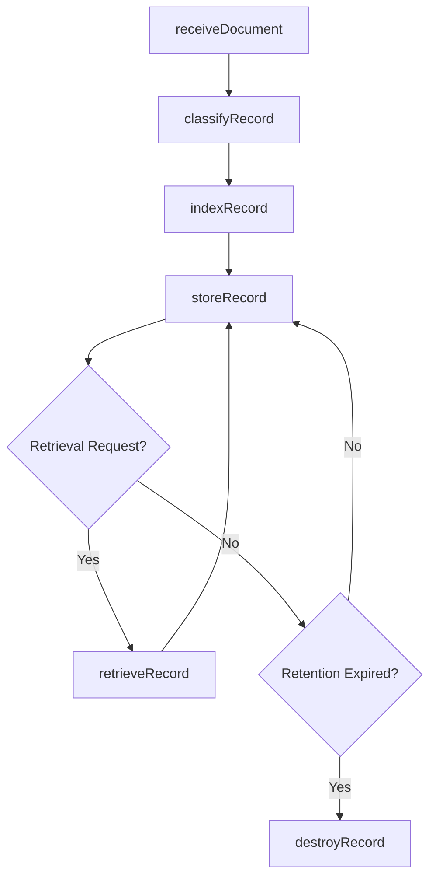
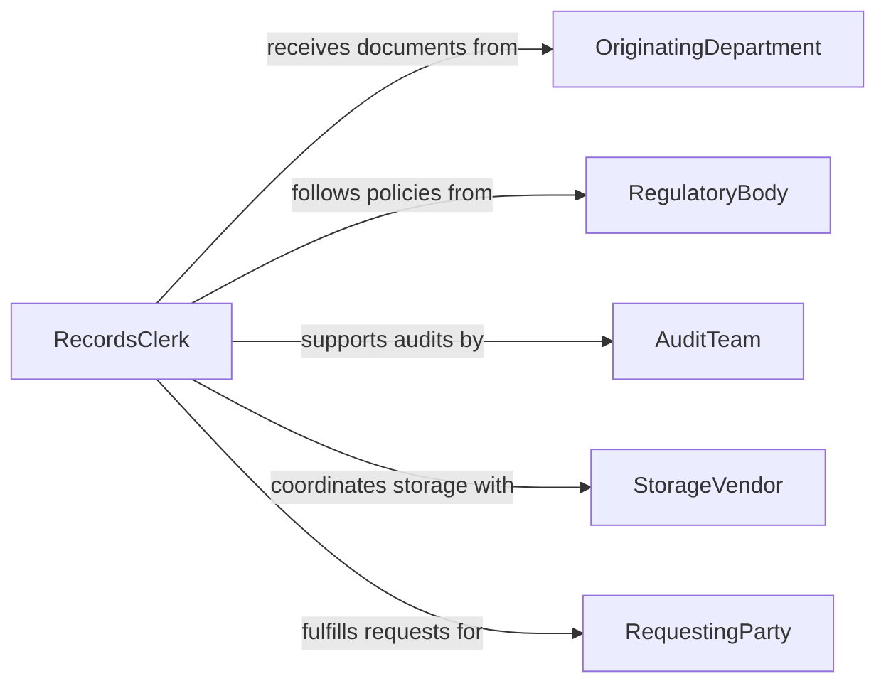

# File Documents Records

> Business-as-Code definition for filing documents and records. Models the classification, indexing, storage, and retrieval of organizational records across physical and digital repositories.

## Overview

Filing documents and records involves organizing, classifying, and storing business documents in structured repositories for efficient retrieval and regulatory compliance. This definition exposes actions for intake, classification, and archival of records, events for tracking filing milestones, and searches for locating records across filing systems.

## Actors

| Actor | Description |
|-------|-------------|
| OriginatingDepartment | The business unit that generates the document |
| RegulatoryBody | External authority that mandates retention requirements |
| AuditTeam | Reviews filing compliance during periodic audits |
| StorageVendor | Third-party provider of physical or cloud storage |
| RequestingParty | Individual or entity requesting retrieval of filed records |

## Roles

| Role | Description |
|------|-------------|
| RecordsClerk | Receives, classifies, and files incoming documents |
| RecordsManager | Oversees filing policies, retention schedules, and compliance |
| Archivist | Manages long-term storage and preservation of records |
| RetrievalSpecialist | Locates and fulfills requests for filed documents |

## Entities

| Entity | Description |
|--------|-------------|
| Record | A document or data object stored in the filing system |
| FileCategory | A classification label used to organize records |
| FilingIndex | A searchable catalog of all filed records |
| RetentionSchedule | Policy defining how long records must be kept |
| StorageLocation | Physical or digital location where a record is housed |
| RetrievalRequest | A formal request to locate and produce a filed record |

## Actions

| Action | Description |
|--------|-------------|
| receiveDocument | Accept an incoming document for filing |
| classifyRecord | Assign a category and metadata tags to the record |
| indexRecord | Add the record to the searchable filing index |
| storeRecord | Place the record in its designated storage location |
| retrieveRecord | Locate and produce a filed record upon request |
| transferRecord | Move a record between storage locations or systems |
| destroyRecord | Permanently remove a record per retention policy |

## Events

| Event | Description |
|-------|-------------|
| documentReceived | A new document has been accepted for filing |
| recordClassified | A record has been assigned its filing category |
| recordIndexed | A record has been added to the filing index |
| recordStored | A record has been placed in its storage location |
| recordRetrieved | A filed record has been located and produced |
| recordTransferred | A record has been moved to a new storage location |
| recordDestroyed | A record has been permanently removed per policy |

## Searches

| Search | Description |
|--------|-------------|
| findRecords | Search records by category, date, author, or keywords |
| getRetentionSchedule | Retrieve the retention policy for a record type |
| getPendingFilings | List documents received but not yet filed |
| getExpiringRecords | Find records approaching their retention expiration date |

## Workflow



## Actor Relationships



## Usage

### Calling Actions

```typescript
import { fileDocumentsRecords } from '@headlessly/file-documents-records'

const filing = fileDocumentsRecords()

// Receive and classify an incoming document
const record = await filing.receiveDocument({
  source: 'accounts-payable',
  documentType: 'invoice',
  fileName: 'INV-2026-00412.pdf'
})

await filing.classifyRecord({
  recordId: record.id,
  category: 'financial-invoices',
  tags: ['vendor-payment', 'q1-2026']
})

// Index and store
await filing.indexRecord({ recordId: record.id })
await filing.storeRecord({
  recordId: record.id,
  location: 'cloud-archive-tier-1'
})
```

### Event-Driven Automation

```typescript
// Auto-classify based on source department
filing.documentReceived(async ({ recordId, source, documentType }) => {
  const category = await resolveCategory(source, documentType)
  await filing.classifyRecord({ recordId, category })
})

// Notify compliance when records approach expiration
filing.getExpiringRecords(async ({ records }) => {
  for (const record of records) {
    await notify({
      to: 'compliance-team',
      message: `Record ${record.id} expires on ${record.expirationDate}`
    })
  }
})
```
