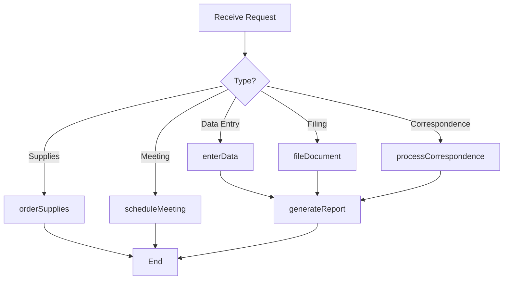
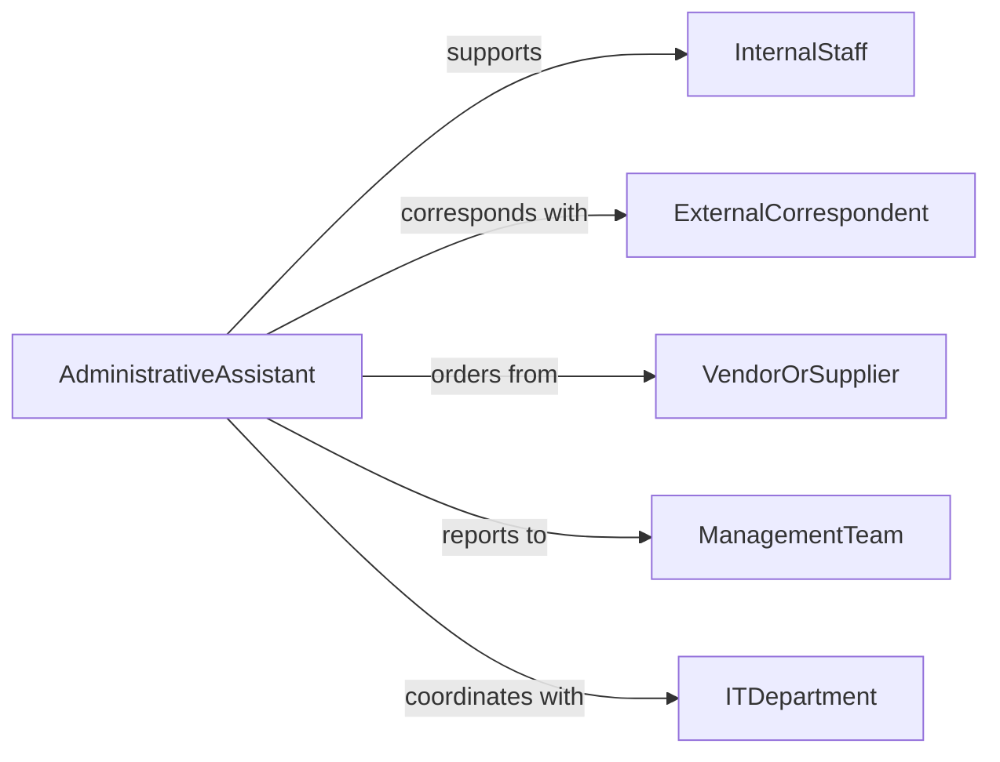

# Perform Administrative Clerical Tasks

> Business-as-Code definition for performing administrative and clerical tasks. Models general office operations including document management, data entry, record keeping, and correspondence handling.

## Overview

Administrative and clerical tasks encompass the routine office operations that keep an organization functioning, including filing, data entry, record maintenance, mail processing, and supply management. This definition exposes actions for common administrative operations, events for tracking task completion and workflow handoffs, and searches for retrieving records, correspondence, and office resource data.

## Actors

| Actor | Description |
|-------|-------------|
| InternalStaff | Employees requesting administrative support or services |
| ExternalCorrespondent | Outside parties sending or receiving correspondence |
| VendorOrSupplier | Provider of office supplies, equipment, or services |
| ManagementTeam | Leadership directing administrative priorities and policies |
| ITDepartment | Technology team supporting office systems and equipment |

## Roles

| Role | Description |
|------|-------------|
| AdministrativeAssistant | Performs day-to-day clerical and administrative duties |
| OfficeManager | Oversees administrative operations and resource allocation |
| DataEntryClerk | Enters and maintains data in organizational systems |
| FileClerk | Organizes and retrieves physical and digital records |
| Receptionist | Manages front-desk operations and visitor coordination |

## Entities

| Entity | Description |
|--------|-------------|
| Record | A stored piece of organizational information or documentation |
| Correspondence | Written communication sent or received by the organization |
| FileIndex | A catalog of documents organized by classification scheme |
| OfficeSupplyOrder | A request for replenishment of office materials |
| TaskAssignment | A specific administrative duty assigned to a staff member |
| MeetingMinutes | A written record of proceedings from a meeting |

## Actions

| Action | Description |
|--------|-------------|
| enterData | Input information into organizational databases or systems |
| fileDocument | Organize and store a document according to filing standards |
| retrieveRecord | Locate and pull a specific record from storage |
| processCorrespondence | Handle incoming or outgoing mail and communications |
| orderSupplies | Submit a request for office materials or equipment |
| scheduleMeeting | Coordinate and set up a meeting with attendees |
| generateReport | Compile data into a formatted report for stakeholders |

## Events

| Event | Description |
|-------|-------------|
| dataEntered | Information has been input into the system |
| documentFiled | A document has been organized and stored |
| recordRetrieved | A requested record has been located and delivered |
| correspondenceProcessed | Mail or communication has been handled |
| suppliesOrdered | An office supply order has been submitted |
| meetingScheduled | A meeting has been coordinated and added to calendars |
| reportGenerated | A report has been compiled and distributed |

## Searches

| Search | Description |
|--------|-------------|
| findRecords | List records by category, date, or department |
| findCorrespondence | Retrieve correspondence by sender, recipient, or date |
| getTaskAssignments | Query pending administrative tasks by assignee or status |
| getSupplyOrders | List office supply orders by status or date range |

## Workflow



## Actor Relationships



## Usage

### Calling Actions

```typescript
import { performAdministrativeClericalTasks } from '@headlessly/perform-administrative-clerical-tasks'

const admin = performAdministrativeClericalTasks()

// Enter data into the CRM
await admin.enterData({
  system: 'crm',
  recordType: 'contact',
  data: { name: 'Acme Corp', phone: '555-0142', category: 'prospect' }
})

// File a signed contract
await admin.fileDocument({
  documentId: 'contract-8821',
  classification: 'legal/contracts/active',
  retentionPeriod: '7-years'
})

// Order office supplies
await admin.orderSupplies({
  items: [
    { name: 'Copy Paper', quantity: 20, unit: 'ream' },
    { name: 'Toner Cartridge', quantity: 4, unit: 'each' }
  ],
  vendor: 'office-supplier-01',
  urgency: 'standard'
})
```

### Event-Driven Automation

```typescript
// Notify manager when a report is generated
admin.reportGenerated(async ({ reportId, reportType, generatedBy }) => {
  await notify({
    to: 'office-manager',
    message: `Report ${reportId} of type ${reportType} has been completed by ${generatedBy}`,
    channel: 'internal'
  })
})

// Auto-reorder supplies when stock runs low
admin.suppliesOrdered(async ({ items, orderId }) => {
  await updateInventory({
    orderId,
    items,
    status: 'pending-delivery'
  })
})
```
