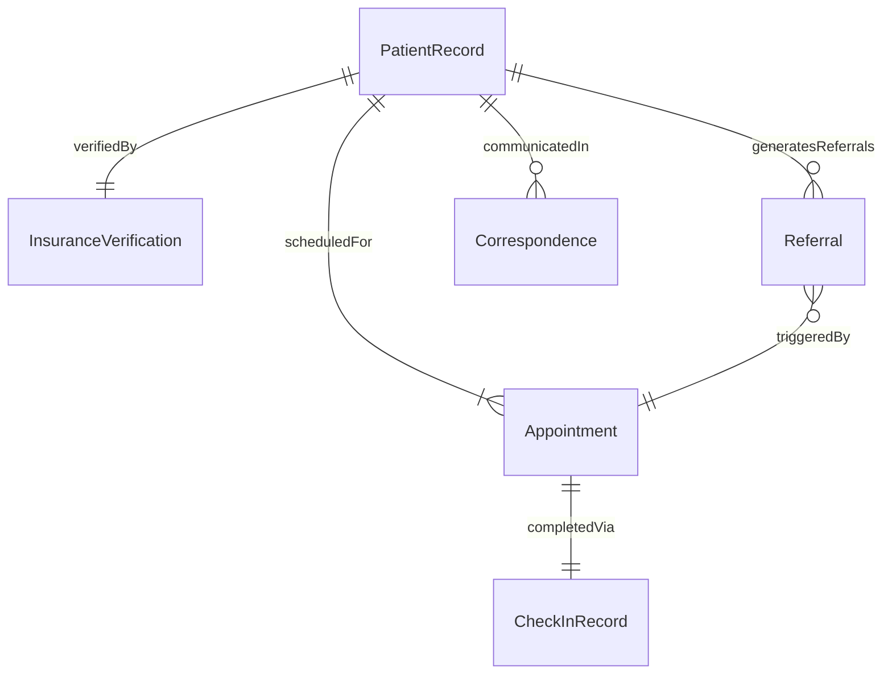
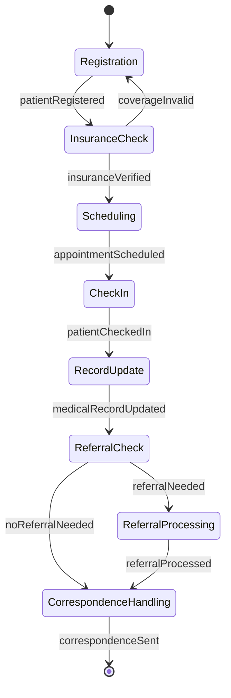
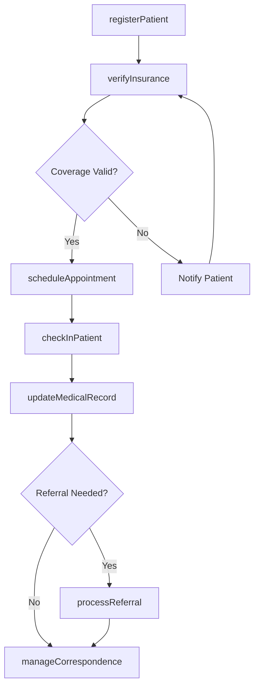
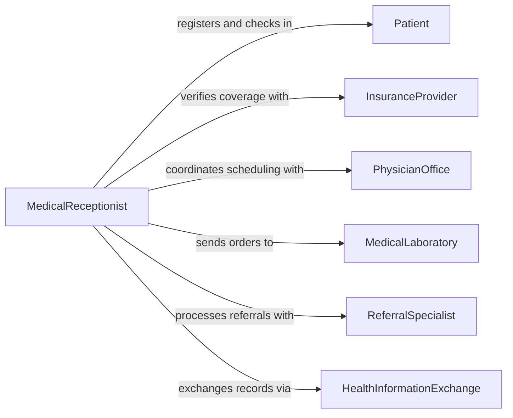

# Perform Clerical Work Medical Settings

> Business-as-Code definition for performing clerical work in medical settings. Models patient registration, appointment scheduling, medical records management, and administrative coordination within healthcare facilities.

## Overview

Performing clerical work in medical settings encompasses the administrative tasks required to support healthcare delivery, including patient intake, scheduling, medical records handling, insurance verification, and correspondence management. This definition exposes actions for each major clerical function, events for tracking patient and record processing milestones, and searches for retrieving patient and appointment data.

## Actors

| Actor | Description |
|-------|-------------|
| Patient | Individual receiving care who provides personal and insurance information |
| InsuranceProvider | Carrier that verifies coverage and processes claims |
| PhysicianOffice | Clinical staff who require patient records and scheduling support |
| MedicalLaboratory | External lab that sends and receives test orders and results |
| ReferralSpecialist | External provider receiving or sending patient referrals |
| HealthInformationExchange | Network for sharing electronic health records across facilities |

## Roles

| Role | Description |
|------|-------------|
| MedicalReceptionist | Handles patient check-in, scheduling, and front-desk operations |
| MedicalRecordsClerk | Manages filing, retrieval, and maintenance of patient records |
| InsuranceVerificationSpecialist | Confirms patient coverage and obtains pre-authorizations |
| AdministrativeCoordinator | Oversees clerical workflows and staff assignments |

## Entities

| Entity | Description |
|--------|-------------|
| PatientRecord | Comprehensive medical and demographic file for a patient |
| Appointment | A scheduled visit between a patient and a provider |
| InsuranceVerification | A confirmation of patient coverage and benefits |
| Referral | A formal request directing a patient to a specialist |
| Correspondence | Letters, faxes, or messages exchanged with external parties |
| CheckInRecord | A log of patient arrival and intake completion |

## Actions

| Action | Description |
|--------|-------------|
| registerPatient | Create or update a patient demographic and insurance profile |
| scheduleAppointment | Book a patient visit with a provider |
| verifyInsurance | Confirm patient coverage and eligibility with the carrier |
| processReferral | Handle incoming or outgoing specialist referrals |
| updateMedicalRecord | Add or modify entries in a patient medical record |
| manageCorrespondence | Draft, send, or file medical correspondence |
| checkInPatient | Record patient arrival and complete intake procedures |

## Events

| Event | Description |
|-------|-------------|
| patientRegistered | A new patient profile has been created or updated |
| appointmentScheduled | A patient visit has been booked with a provider |
| insuranceVerified | Patient coverage has been confirmed by the carrier |
| referralProcessed | A specialist referral has been completed |
| medicalRecordUpdated | A patient record has been modified |
| correspondenceSent | A letter or message has been dispatched |
| patientCheckedIn | A patient has completed the check-in process |

## Searches

| Search | Description |
|--------|-------------|
| findPatients | Locate patient records by name, date of birth, or ID |
| getAppointments | Retrieve appointments by provider, date, or patient |
| getPendingVerifications | List insurance verifications awaiting confirmation |
| getOpenReferrals | Find referrals not yet completed or acknowledged |
| getCorrespondenceLog | Retrieve sent and received correspondence by date or patient |

## Entity Relationships



## State Diagram



## Workflow



## Actor Relationships



## Usage

### Calling Actions

```typescript
import { performClericalWorkMedicalSettings } from '@headlessly/perform-clerical-work-medical-settings'

const clerical = performClericalWorkMedicalSettings()

// Register a new patient
const patient = await clerical.registerPatient({
  firstName: 'Maria',
  lastName: 'Chen',
  dateOfBirth: '1985-03-14',
  insuranceCarrier: 'BlueCross',
  policyNumber: 'BC-992841'
})

// Verify insurance and schedule appointment
await clerical.verifyInsurance({
  patientId: patient.id,
  carrierId: 'bluecross',
  serviceType: 'office-visit'
})

await clerical.scheduleAppointment({
  patientId: patient.id,
  providerId: 'dr-thompson',
  date: '2026-03-20',
  time: '10:30',
  visitType: 'follow-up'
})
```

### Event-Driven Automation

```typescript
// Auto-verify insurance when patient is registered
clerical.patientRegistered(async ({ patientId, insuranceCarrier, policyNumber }) => {
  await clerical.verifyInsurance({
    patientId,
    carrierId: insuranceCarrier,
    serviceType: 'general'
  })
})

// Send appointment confirmation after scheduling
clerical.appointmentScheduled(async ({ patientId, date, time, providerId }) => {
  await clerical.manageCorrespondence({
    patientId,
    type: 'appointment-confirmation',
    channel: 'sms',
    content: `Your appointment with ${providerId} is confirmed for ${date} at ${time}.`
  })
})
```
