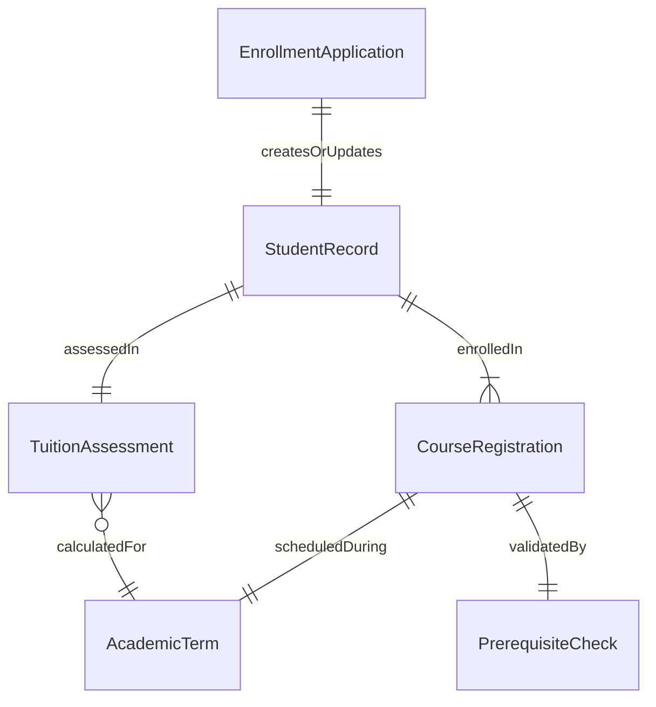
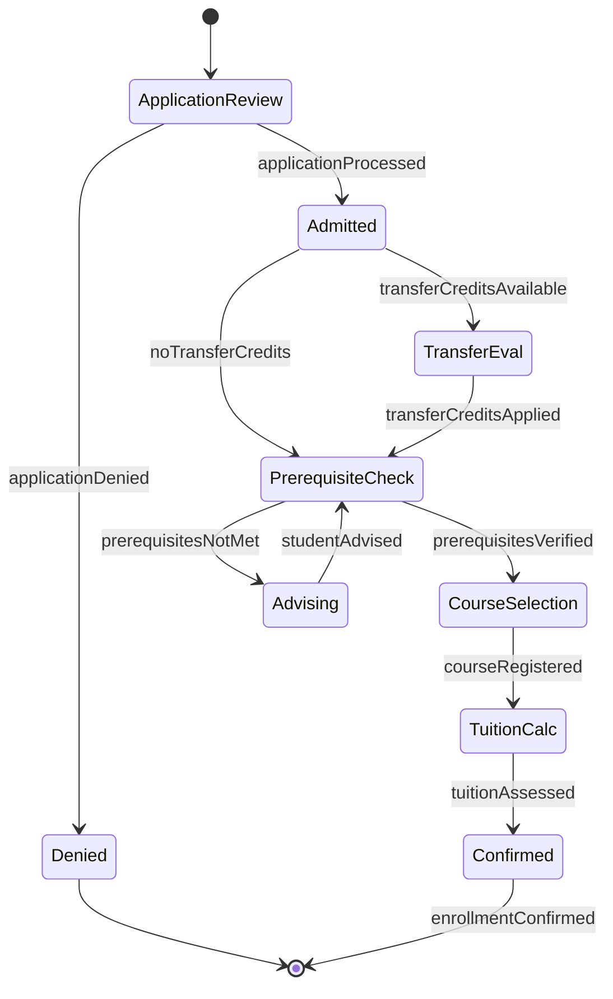
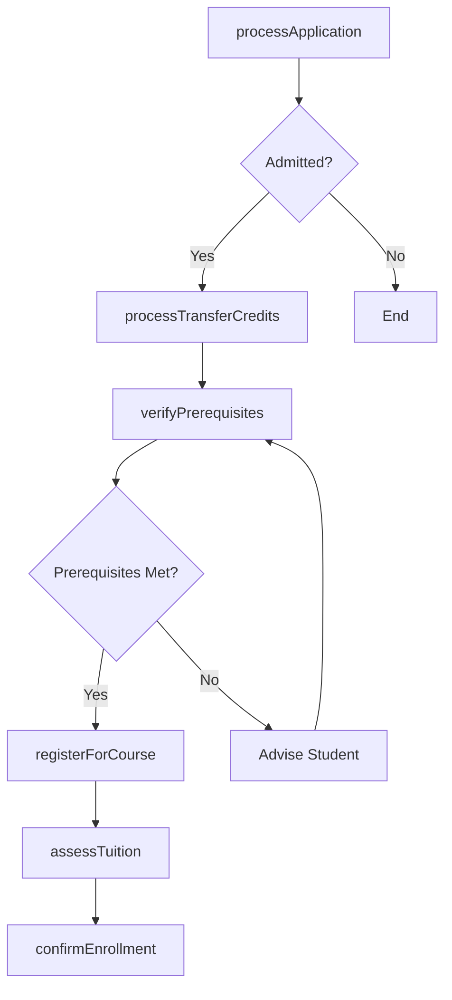
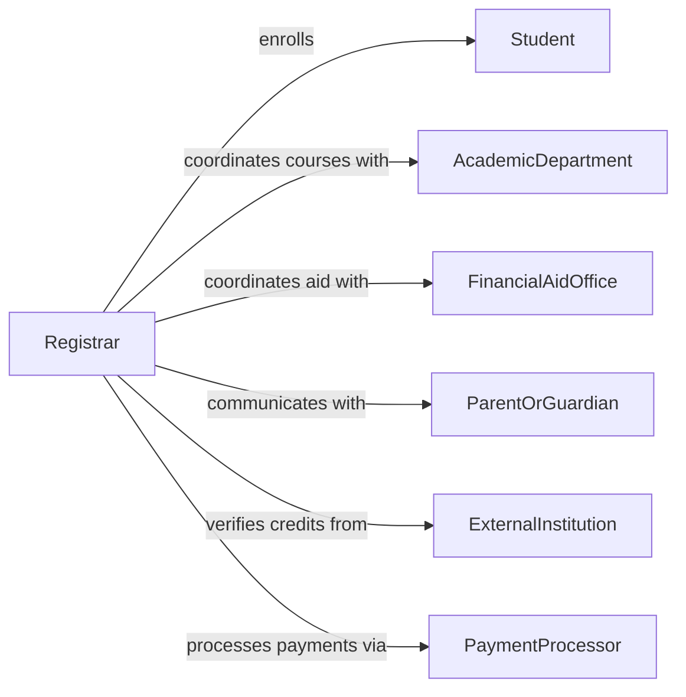

# Perform Student Enrollment Registration Activities

> Business-as-Code definition for performing student enrollment and registration activities. Models the complete student intake lifecycle from application processing through course registration, fee assessment, and enrollment confirmation.

## Overview

Student enrollment and registration activities involve processing admissions applications, registering students for courses and programs, managing prerequisite verification, and coordinating tuition and fee payments. This definition exposes actions for each phase of enrollment operations, events for tracking student status changes, and searches for retrieving enrollment records across terms, programs, and student populations.

## Actors

| Actor | Description |
|-------|-------------|
| Student | The individual applying for or enrolled in a program |
| AcademicDepartment | Faculty division offering courses and programs |
| FinancialAidOffice | Office managing scholarships, grants, and loan disbursements |
| ParentOrGuardian | Responsible party for minor students or financial guarantors |
| ExternalInstitution | Prior school or university providing transfer credit records |
| PaymentProcessor | Service handling tuition and fee transactions |

## Roles

| Role | Description |
|------|-------------|
| Registrar | Oversees enrollment records and academic registration |
| AdmissionsOfficer | Processes applications and makes enrollment decisions |
| EnrollmentCounselor | Guides students through the registration process |
| RecordsClerk | Maintains student records and processes transcript requests |

## Entities

| Entity | Description |
|--------|-------------|
| EnrollmentApplication | A formal application for admission to a program |
| StudentRecord | The comprehensive academic record for an enrolled student |
| CourseRegistration | A record linking a student to a specific course section |
| AcademicTerm | A defined period during which courses are offered |
| TuitionAssessment | A calculated statement of fees owed for enrolled courses |
| PrerequisiteCheck | A verification that a student meets course entry requirements |

## Actions

| Action | Description |
|--------|-------------|
| processApplication | Review and evaluate a student enrollment application |
| registerForCourse | Enroll a student in a specific course section |
| verifyPrerequisites | Check that a student meets all course requirements |
| assessTuition | Calculate tuition and fees for a student's course load |
| confirmEnrollment | Finalize a student's enrollment status for a term |
| dropCourse | Remove a student from a registered course |
| processTransferCredits | Evaluate and apply credits from external institutions |

## Events

| Event | Description |
|-------|-------------|
| applicationProcessed | An enrollment application has been reviewed |
| courseRegistered | A student has been enrolled in a course |
| prerequisitesVerified | A student's eligibility for a course has been confirmed |
| tuitionAssessed | Tuition and fees have been calculated for the student |
| enrollmentConfirmed | The student's enrollment for the term is finalized |
| courseDropped | A student has been removed from a course |
| transferCreditsApplied | External credits have been applied to the student record |

## Searches

| Search | Description |
|--------|-------------|
| findEnrollments | List enrolled students by term, program, or status |
| getStudentSchedule | Retrieve the registered course schedule for a student |
| findOpenSections | Query course sections with available seats |
| getApplicationStatus | Check the current status of an enrollment application |

## Entity Relationships



## State Diagram



## Workflow



## Actor Relationships



## Usage

### Calling Actions

```typescript
import { performStudentEnrollmentRegistrationActivities } from '@headlessly/perform-student-enrollment-registration-activities'

const enrollment = performStudentEnrollmentRegistrationActivities()

// Process a new student application
const application = await enrollment.processApplication({
  studentId: 'stu-20261045',
  program: 'computer-science-bs',
  term: 'fall-2026',
  transcripts: ['external-university-transcript.pdf']
})

// Register for courses after admission
await enrollment.verifyPrerequisites({
  studentId: 'stu-20261045',
  courseId: 'CS-301'
})

const registration = await enrollment.registerForCourse({
  studentId: 'stu-20261045',
  courseId: 'CS-301',
  sectionId: 'section-02',
  term: 'fall-2026'
})

// Assess tuition and confirm
await enrollment.assessTuition({ studentId: 'stu-20261045', term: 'fall-2026' })
await enrollment.confirmEnrollment({ studentId: 'stu-20261045', term: 'fall-2026' })
```

### Event-Driven Automation

```typescript
// Send welcome package when enrollment is confirmed
enrollment.enrollmentConfirmed(async ({ studentId, term }) => {
  await sendWelcomePackage({
    to: studentId,
    term,
    contents: ['orientation-schedule', 'campus-map', 'student-handbook']
  })
})

// Notify financial aid when tuition is assessed
enrollment.tuitionAssessed(async ({ studentId, amount, term }) => {
  await notify({
    to: 'financial-aid-office',
    message: `Tuition of $${amount} assessed for student ${studentId} in ${term}`,
    channel: 'internal'
  })
})
```
