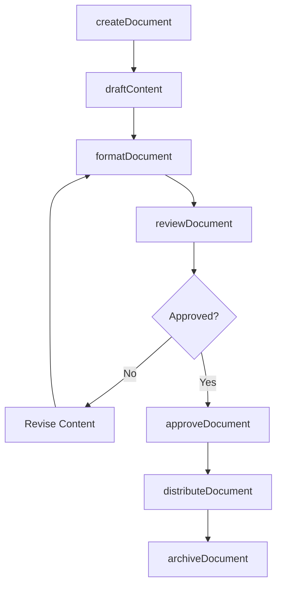
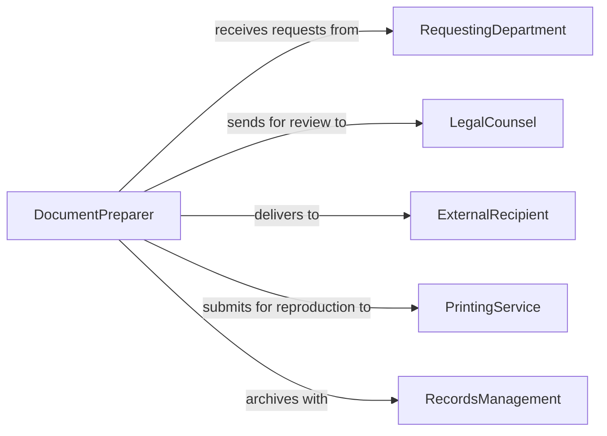

# Prepare Administrative Documents

> Business-as-Code definition for preparing administrative documents. Models the end-to-end lifecycle of drafting, formatting, reviewing, and distributing official business correspondence, reports, and forms.

## Overview

Preparing administrative documents encompasses creating, editing, formatting, and finalizing business correspondence, reports, memos, forms, and other official records. This definition exposes actions for document creation and revision, events for workflow triggers when documents reach key stages, and searches for locating documents by type, status, or author.

## Actors

| Actor | Description |
|-------|-------------|
| RequestingDepartment | Internal unit that requests document preparation |
| ExternalRecipient | Outside party who receives finalized documents |
| LegalCounsel | Reviews documents for regulatory and legal compliance |
| PrintingService | Handles physical reproduction and binding of documents |
| RecordsManagement | Archives finalized documents per retention policies |

## Roles

| Role | Description |
|------|-------------|
| DocumentPreparer | Drafts and formats administrative documents |
| ReviewingOfficer | Reviews documents for accuracy and completeness |
| Approver | Provides final sign-off before distribution |
| DistributionCoordinator | Manages routing and delivery of finalized documents |

## Entities

| Entity | Description |
|--------|-------------|
| Document | An administrative record such as a memo, report, or form |
| Template | A predefined layout used to standardize document creation |
| Revision | A tracked version of changes made to a document |
| Attachment | Supplemental files appended to a primary document |
| DistributionList | A set of recipients designated to receive the document |
| ApprovalRecord | A log entry capturing who approved and when |

## Actions

| Action | Description |
|--------|-------------|
| createDocument | Initialize a new document from a template or blank |
| draftContent | Write or compose the body of the document |
| formatDocument | Apply formatting standards, headers, and branding |
| reviewDocument | Submit the document for accuracy and compliance review |
| approveDocument | Grant formal approval for distribution |
| distributeDocument | Send finalized document to designated recipients |
| archiveDocument | Move the document to long-term records storage |

## Events

| Event | Description |
|-------|-------------|
| documentCreated | A new document has been initialized |
| contentDrafted | The document body has been composed |
| documentFormatted | Formatting and branding have been applied |
| documentReviewed | Review has been completed with feedback |
| documentApproved | Final approval has been granted |
| documentDistributed | Document has been sent to all recipients |
| documentArchived | Document has been moved to records storage |

## Searches

| Search | Description |
|--------|-------------|
| findDocuments | Locate documents by type, status, author, or date range |
| getRevisions | Retrieve the revision history for a specific document |
| getPendingApprovals | List documents awaiting approval sign-off |
| getDistributionStatus | Check delivery status across all recipients |

## Workflow



## Actor Relationships



## Usage

### Calling Actions

```typescript
import { prepareAdministrativeDocuments } from '@headlessly/prepare-administrative-documents'

const docs = prepareAdministrativeDocuments()

// Create a new memo from template
const memo = await docs.createDocument({
  type: 'memo',
  templateId: 'internal-memo-v3',
  subject: 'Q2 Office Policy Update',
  author: 'admin-services'
})

// Draft and format the content
await docs.draftContent({
  documentId: memo.id,
  body: 'Effective June 1, all departments must submit travel requests...',
  attachments: ['travel-form-2026.pdf']
})

await docs.formatDocument({
  documentId: memo.id,
  style: 'corporate-standard'
})

// Submit for review and distribute
await docs.reviewDocument({ documentId: memo.id, reviewer: 'legal-dept' })
```

### Event-Driven Automation

```typescript
// Auto-distribute once approved
docs.documentApproved(async ({ documentId, approvedBy }) => {
  const doc = await docs.findDocuments({ id: documentId })
  await docs.distributeDocument({
    documentId,
    recipients: doc.distributionList
  })
})

// Archive after distribution
docs.documentDistributed(async ({ documentId }) => {
  await docs.archiveDocument({
    documentId,
    retentionPolicy: 'standard-7-year'
  })
})
```
