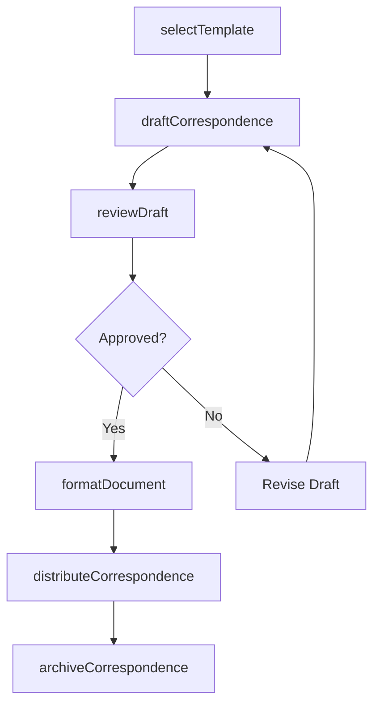
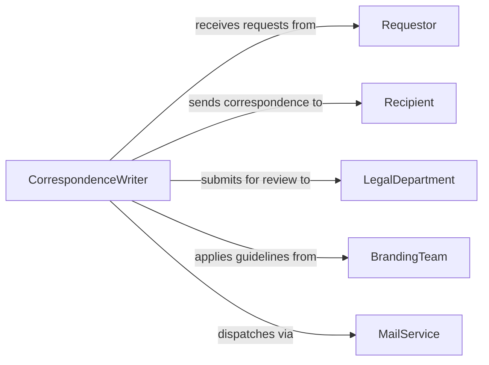

# Prepare Business Correspondence

> Business-as-Code definition for preparing business correspondence. Models the end-to-end correspondence lifecycle from drafting through review, approval, formatting, and distribution.

## Overview

Preparing business correspondence involves drafting, reviewing, and distributing formal written communications such as letters, memos, emails, and proposals on behalf of an organization. This definition exposes actions for composing and managing correspondence at each stage, events for tracking review and delivery status, and searches for retrieving correspondence history across recipients and categories.

## Actors

| Actor | Description |
|-------|-------------|
| Recipient | The individual or organization receiving the correspondence |
| Requestor | The internal party who initiates the correspondence request |
| LegalDepartment | Reviews correspondence for legal accuracy and compliance |
| BrandingTeam | Ensures correspondence adheres to corporate style guidelines |
| MailService | Internal or external service handling physical or digital delivery |

## Roles

| Role | Description |
|------|-------------|
| CorrespondenceWriter | Drafts and formats business communications |
| ExecutiveAssistant | Prepares correspondence on behalf of senior leadership |
| ReviewApprover | Reviews and approves correspondence before distribution |
| MailroomCoordinator | Manages the physical or digital dispatch of outgoing correspondence |

## Entities

| Entity | Description |
|--------|-------------|
| Correspondence | A formal written communication prepared for delivery |
| Template | A reusable format for standard types of business letters or memos |
| DraftVersion | A working copy of correspondence under review |
| Attachment | A supplementary document included with the correspondence |
| DistributionList | A set of recipients for a given communication |
| CorrespondenceLog | An audit record of all sent correspondence |

## Actions

| Action | Description |
|--------|-------------|
| draftCorrespondence | Create an initial version of a business communication |
| selectTemplate | Choose an appropriate template for the correspondence type |
| reviewDraft | Submit a draft for accuracy and compliance review |
| approveDraft | Grant final approval for the correspondence |
| formatDocument | Apply corporate branding and formatting standards |
| distributeCorrespondence | Send the correspondence to all intended recipients |
| archiveCorrespondence | File the sent correspondence for record keeping |

## Events

| Event | Description |
|-------|-------------|
| correspondenceDrafted | An initial draft has been created |
| templateSelected | A correspondence template has been applied |
| draftReviewed | The draft has been reviewed for accuracy |
| draftApproved | The correspondence has received final approval |
| documentFormatted | Corporate formatting has been applied |
| correspondenceDistributed | The correspondence has been sent to recipients |
| correspondenceArchived | The correspondence has been filed in the records system |

## Searches

| Search | Description |
|--------|-------------|
| findCorrespondence | List correspondence by recipient, type, or date range |
| getTemplates | Retrieve available templates by category or purpose |
| getDrafts | Query drafts by status, author, or requestor |
| getDistributionHistory | Look up delivery records for a specific correspondence |

## Workflow



## Actor Relationships



## Usage

### Calling Actions

```typescript
import { prepareBusinessCorrespondence } from '@headlessly/prepare-business-correspondence'

const correspondence = prepareBusinessCorrespondence()

// Select a template and draft a letter
const template = await correspondence.selectTemplate({
  category: 'client-proposal',
  format: 'formal-letter'
})

const draft = await correspondence.draftCorrespondence({
  templateId: template.id,
  requestorId: 'exec-vp-sales',
  recipient: { name: 'Meridian Industries', attention: 'Procurement Director' },
  subject: 'Partnership Proposal for Q3 2026',
  body: 'We are pleased to present our proposal for...',
  attachments: ['proposal-deck.pdf', 'pricing-schedule.xlsx']
})

// Review, approve, and distribute
await correspondence.reviewDraft({ draftId: draft.id, reviewer: 'legal-dept' })
await correspondence.approveDraft({ draftId: draft.id })
await correspondence.formatDocument({ draftId: draft.id })
await correspondence.distributeCorrespondence({
  correspondenceId: draft.id,
  channels: ['email', 'certified-mail']
})
```

### Event-Driven Automation

```typescript
// Auto-archive correspondence after distribution
correspondence.correspondenceDistributed(async ({ correspondenceId, recipients }) => {
  await correspondence.archiveCorrespondence({
    correspondenceId,
    classification: 'outgoing/client',
    retentionPeriod: '5-years'
  })
})

// Notify requestor when draft is approved
correspondence.draftApproved(async ({ draftId, requestorId }) => {
  await notify({
    to: requestorId,
    message: `Your correspondence draft ${draftId} has been approved and is ready for distribution.`,
    channel: 'internal'
  })
})
```
