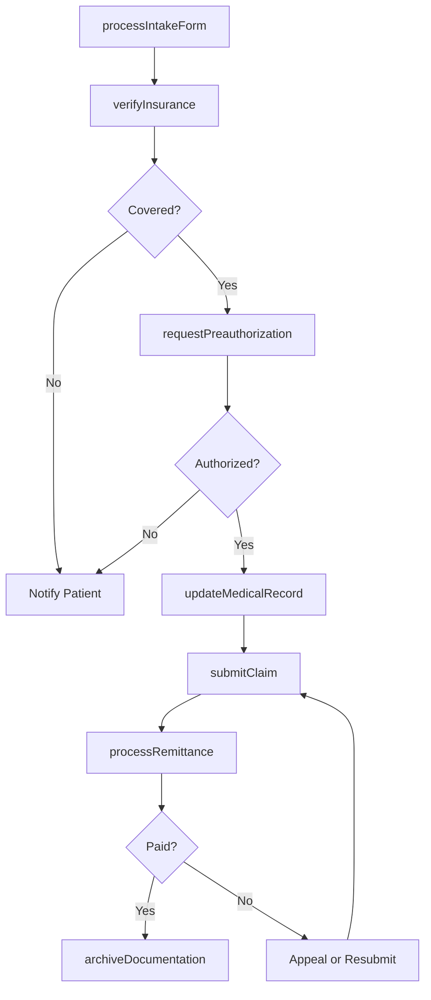
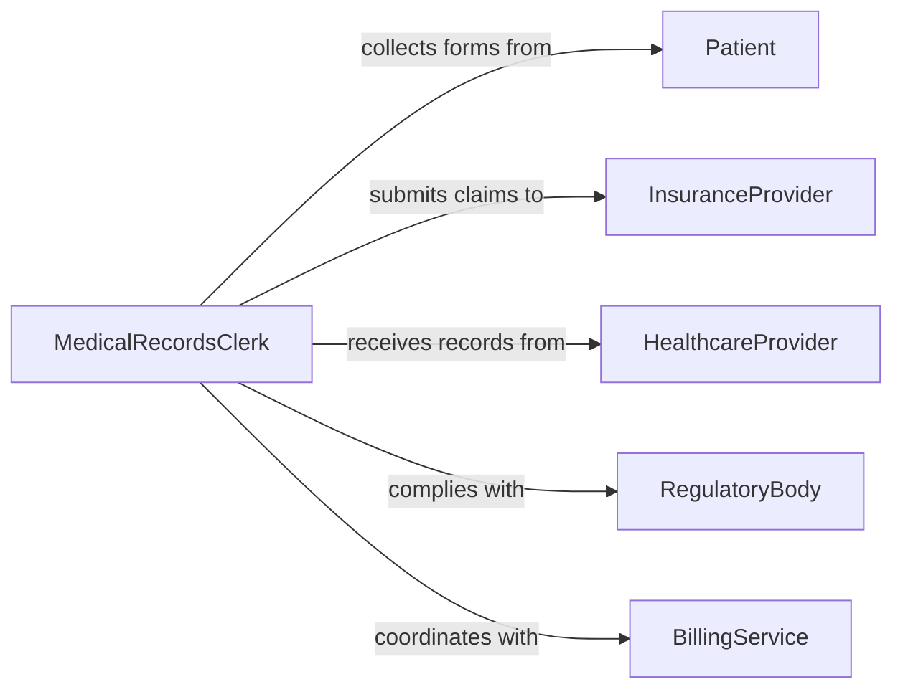

# Process Healthcare Paperwork

> Business-as-Code definition for processing healthcare paperwork. Models the administrative workflow for patient intake forms, insurance claims, medical records, and compliance documentation.

## Overview

Processing healthcare paperwork involves managing the flow of administrative documents required for patient care, billing, and regulatory compliance. This includes intake forms, insurance verification, claims submissions, consent forms, and medical record updates. This definition exposes actions for each stage of document processing, events for tracking submission and approval status, and searches for retrieving patient and claims records.

## Actors

| Actor | Description |
|-------|-------------|
| Patient | The individual whose health information is being documented |
| InsuranceProvider | The payer responsible for reimbursing healthcare services |
| HealthcareProvider | The physician or clinic delivering care and generating documentation |
| RegulatoryBody | Government agency enforcing healthcare documentation standards |
| BillingService | Internal or external team handling claims and payment processing |

## Roles

| Role | Description |
|------|-------------|
| MedicalRecordsClerk | Manages patient files and ensures record accuracy |
| InsuranceCoordinator | Handles insurance verification and claims submissions |
| ComplianceOfficer | Ensures all paperwork meets regulatory requirements |
| IntakeSpecialist | Processes patient intake forms and consent documents |
| BillingSpecialist | Prepares and submits claims for reimbursement |

## Entities

| Entity | Description |
|--------|-------------|
| PatientIntakeForm | Documentation collected at the point of patient registration |
| InsuranceClaim | A formal request for payment submitted to an insurance provider |
| MedicalRecord | The comprehensive health record for a patient |
| ConsentForm | Documentation of patient authorization for treatment or data use |
| PreauthorizationRequest | A request for advance approval of a procedure by the insurer |
| RemittanceAdvice | A response from the insurer detailing payment or denial |

## Actions

| Action | Description |
|--------|-------------|
| processIntakeForm | Review and enter patient intake information into the system |
| verifyInsurance | Confirm patient insurance coverage and eligibility |
| submitClaim | Send a claim to the insurance provider for reimbursement |
| requestPreauthorization | Seek advance approval for a planned procedure or service |
| updateMedicalRecord | Add or modify information in the patient's health record |
| processRemittance | Record and reconcile insurance payment or denial responses |
| archiveDocumentation | File completed paperwork in compliance with retention policies |

## Events

| Event | Description |
|-------|-------------|
| intakeFormProcessed | Patient intake documentation has been entered into the system |
| insuranceVerified | Patient insurance eligibility has been confirmed |
| claimSubmitted | An insurance claim has been sent to the payer |
| preauthorizationRequested | A preauthorization request has been submitted |
| medicalRecordUpdated | A patient's health record has been modified |
| remittanceProcessed | An insurance payment or denial has been recorded |
| documentationArchived | Completed paperwork has been filed for retention |

## Searches

| Search | Description |
|--------|-------------|
| findClaims | List claims by patient, status, or date range |
| getPatientRecords | Retrieve medical records by patient identifier |
| findPendingPreauthorizations | Query outstanding preauthorization requests |
| getRemittanceHistory | Look up payment and denial records by claim or payer |

## Workflow



## Actor Relationships



## Usage

### Calling Actions

```typescript
import { processHealthcarePaperwork } from '@headlessly/process-healthcare-paperwork'

const healthcare = processHealthcarePaperwork()

// Process a new patient intake form
await healthcare.processIntakeForm({
  patientId: 'pat-90421',
  formType: 'new-patient-registration',
  data: {
    demographics: { name: 'Jane Smith', dob: '1985-03-15' },
    insuranceInfo: { provider: 'BlueCross', memberId: 'BC-445821' },
    consents: ['treatment', 'hipaa-notice']
  }
})

// Verify insurance and submit a claim
await healthcare.verifyInsurance({ patientId: 'pat-90421' })

const claim = await healthcare.submitClaim({
  patientId: 'pat-90421',
  providerId: 'dr-chen-ortho',
  services: [
    { code: 'CPT-99213', description: 'Office visit', amount: 150 },
    { code: 'CPT-73560', description: 'Knee X-ray', amount: 275 }
  ],
  dateOfService: '2026-02-04'
})
```

### Event-Driven Automation

```typescript
// Auto-submit claims after medical records are updated
healthcare.medicalRecordUpdated(async ({ patientId, visitId }) => {
  const pendingServices = await getPendingBillingItems({ patientId, visitId })
  if (pendingServices.length > 0) {
    await healthcare.submitClaim({
      patientId,
      services: pendingServices,
      dateOfService: new Date().toISOString().split('T')[0]
    })
  }
})

// Alert billing team on claim denials
healthcare.remittanceProcessed(async ({ claimId, status, reason }) => {
  if (status === 'denied') {
    await notify({
      to: 'billing-team',
      message: `Claim ${claimId} denied: ${reason}. Review for appeal.`,
      channel: 'internal'
    })
  }
})
```
