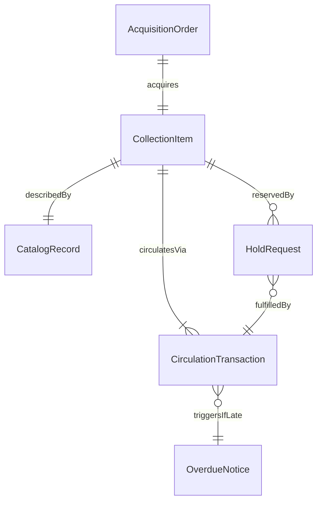
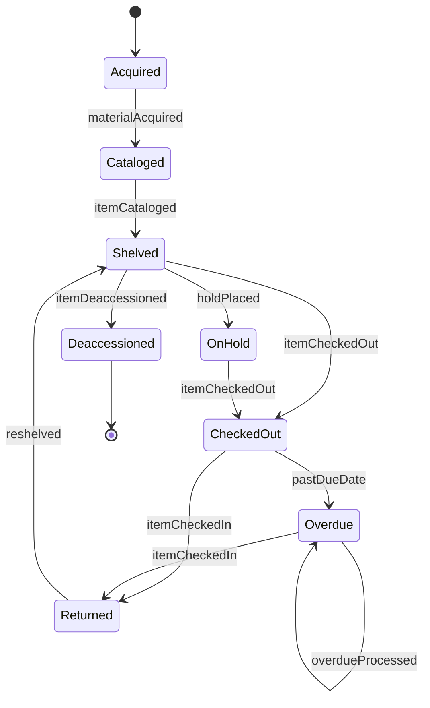
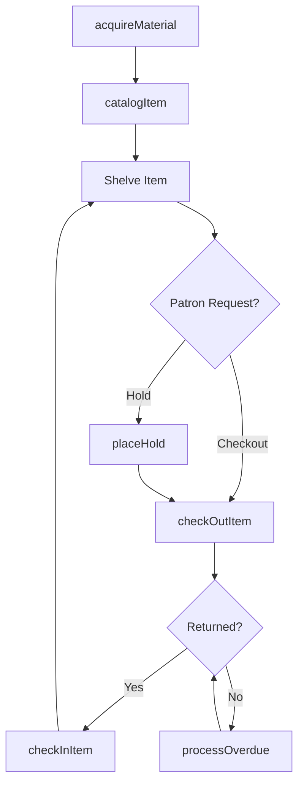
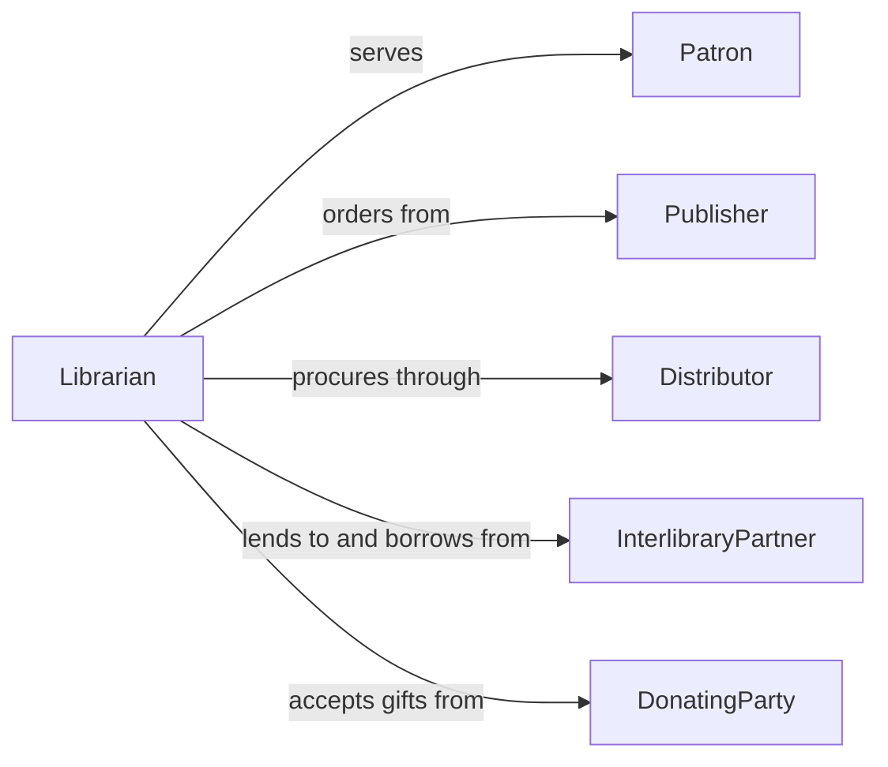

# Process Library Materials

> Business-as-Code definition for processing library materials. Models the complete lifecycle of library acquisitions, cataloging, circulation, and disposition of physical and digital collection items.

## Overview

Processing library materials involves acquiring, cataloging, shelving, circulating, and maintaining collections of books, periodicals, media, and digital resources. This definition exposes actions for each stage of the library material workflow, events for tracking acquisitions and circulation changes, and searches for retrieving catalog and inventory data across collections and branches.

## Actors

| Actor | Description |
|-------|-------------|
| Patron | A library member borrowing or accessing materials |
| Publisher | Organization supplying books, periodicals, or media |
| Distributor | Vendor handling procurement and delivery of library materials |
| InterlibraryPartner | Another library participating in shared lending programs |
| DonatingParty | Individual or organization donating materials to the collection |

## Roles

| Role | Description |
|------|-------------|
| Librarian | Oversees collection development and patron services |
| Cataloger | Classifies and records materials in the library catalog system |
| CirculationClerk | Manages check-out, check-in, and holds for library materials |
| AcquisitionsSpecialist | Handles purchasing and receiving of new materials |

## Entities

| Entity | Description |
|--------|-------------|
| CatalogRecord | A bibliographic entry describing a library item |
| CirculationTransaction | A record of a material being checked out or returned |
| AcquisitionOrder | A purchase order for new library materials |
| HoldRequest | A patron request to reserve a currently unavailable item |
| CollectionItem | A physical or digital item in the library's holdings |
| OverdueNotice | A communication sent to a patron about late returns |

## Actions

| Action | Description |
|--------|-------------|
| acquireMaterial | Purchase or receive a new item for the collection |
| catalogItem | Create a bibliographic record and assign classification codes |
| checkOutItem | Record the lending of a material to a patron |
| checkInItem | Process the return of a borrowed material |
| placeHold | Reserve an item for a patron when it becomes available |
| processOverdue | Identify and notify patrons with overdue materials |
| deaccessionItem | Remove an item from the collection through withdrawal or disposal |

## Events

| Event | Description |
|-------|-------------|
| materialAcquired | A new item has been received into the collection |
| itemCataloged | A bibliographic record has been created for an item |
| itemCheckedOut | A material has been lent to a patron |
| itemCheckedIn | A borrowed material has been returned |
| holdPlaced | A patron hold has been placed on an item |
| overdueProcessed | An overdue notice has been sent to a patron |
| itemDeaccessioned | An item has been removed from the collection |

## Searches

| Search | Description |
|--------|-------------|
| searchCatalog | Query the catalog by title, author, subject, or classification |
| findAvailableItems | List items currently available for checkout at a branch |
| getPatronHistory | Retrieve the borrowing history for a specific patron |
| getOverdueItems | List all materials currently past their due date |

## Entity Relationships



## State Diagram



## Workflow



## Actor Relationships



## Usage

### Calling Actions

```typescript
import { processLibraryMaterials } from '@headlessly/process-library-materials'

const library = processLibraryMaterials()

// Acquire and catalog a new book
const item = await library.acquireMaterial({
  type: 'book',
  title: 'Systems Design for Large-Scale Applications',
  author: 'Park, S.',
  isbn: '978-0-13-123456-7',
  source: 'distributor-ingram',
  cost: 45.99
})

await library.catalogItem({
  itemId: item.id,
  classification: '005.12',
  subjects: ['software engineering', 'systems design'],
  location: 'branch-central',
  shelf: 'nonfiction-500s'
})

// Check out to a patron
await library.checkOutItem({
  itemId: item.id,
  patronId: 'patron-8832',
  dueDate: '2026-03-05'
})
```

### Event-Driven Automation

```typescript
// Notify patrons when a held item becomes available
library.itemCheckedIn(async ({ itemId }) => {
  const holds = await library.searchCatalog({ itemId, hasHold: true })
  if (holds.length > 0) {
    await notify({
      to: holds[0].patronId,
      message: `Your held item is now available for pickup.`,
      channel: 'email'
    })
  }
})

// Auto-generate overdue notices
library.overdueProcessed(async ({ patronId, itemId, daysOverdue }) => {
  const fineAmount = daysOverdue * 0.25
  await assessFine({
    patronId,
    itemId,
    amount: fineAmount,
    reason: `${daysOverdue} days overdue`
  })
})
```
