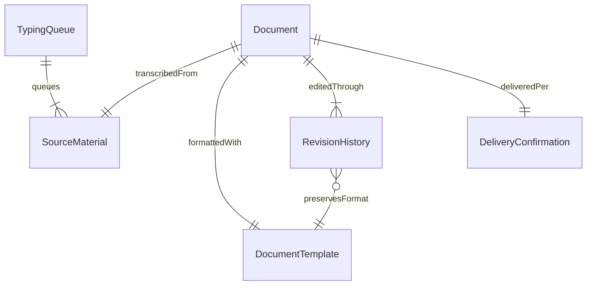
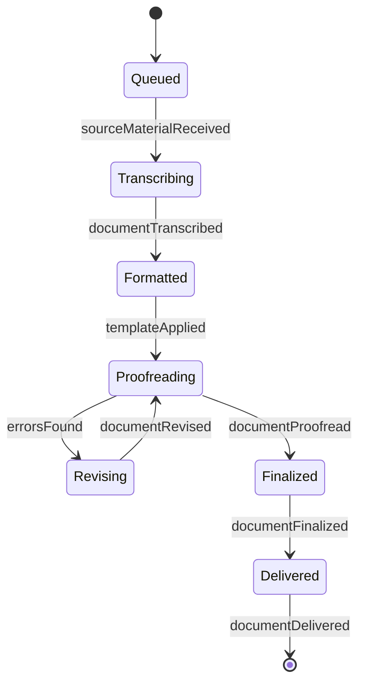
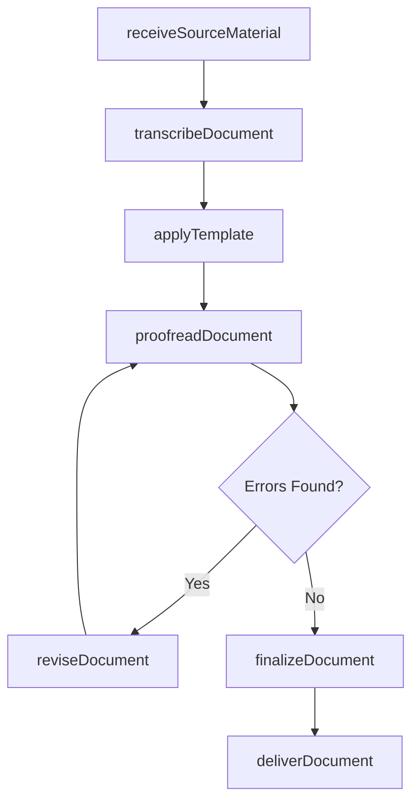
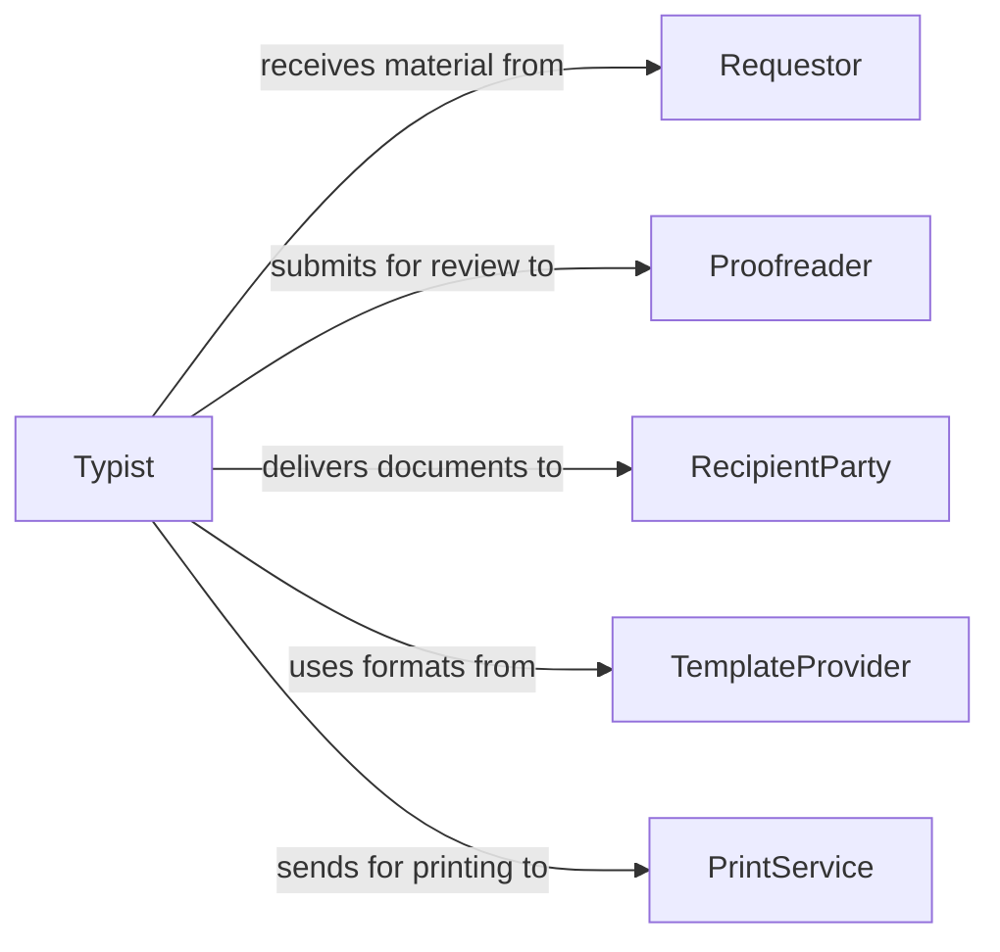

# Type Documents

> Business-as-Code definition for typing documents. Models the document preparation workflow from source material intake through transcription, formatting, proofreading, and final delivery.

## Overview

Typing documents involves transcribing, composing, and formatting written materials such as reports, letters, forms, and records from dictation, handwritten notes, or other source inputs. This definition exposes actions for each stage of document preparation, events for tracking progress and review milestones, and searches for retrieving documents by type, status, or author.

## Actors

| Actor | Description |
|-------|-------------|
| Requestor | The individual or department providing source material for typing |
| Proofreader | A reviewer who checks the typed document for errors |
| RecipientParty | The intended audience for the final typed document |
| TemplateProvider | Source of standardized document formats and style guides |
| PrintService | Internal or external service producing physical copies |

## Roles

| Role | Description |
|------|-------------|
| Typist | Transcribes and composes documents from source materials |
| DocumentEditor | Reviews and corrects typed documents for accuracy and style |
| FormattingSpecialist | Applies layout, styling, and template standards to documents |
| DocumentCoordinator | Manages document queues, priorities, and delivery timelines |

## Entities

| Entity | Description |
|--------|-------------|
| Document | The typed output in draft or final form |
| SourceMaterial | The original input such as handwritten notes, audio, or rough drafts |
| DocumentTemplate | A standardized layout applied to specific document types |
| RevisionHistory | A record of changes made during the editing process |
| TypingQueue | A prioritized list of documents awaiting transcription |
| DeliveryConfirmation | A record that the final document was delivered to the requestor |

## Actions

| Action | Description |
|--------|-------------|
| receiveSourceMaterial | Accept and log incoming material for transcription |
| transcribeDocument | Type the content from source material into a digital document |
| applyTemplate | Format the document using the appropriate template |
| proofreadDocument | Review the typed document for spelling, grammar, and accuracy |
| reviseDocument | Make corrections or edits based on proofreading feedback |
| finalizeDocument | Mark the document as complete and ready for delivery |
| deliverDocument | Send the finished document to the requestor or recipient |

## Events

| Event | Description |
|-------|-------------|
| sourceMaterialReceived | Source material has been logged into the typing queue |
| documentTranscribed | The content has been typed into a digital document |
| templateApplied | The document has been formatted with the designated template |
| documentProofread | The document has been reviewed for errors |
| documentRevised | Corrections have been applied to the document |
| documentFinalized | The document has been marked as complete |
| documentDelivered | The final document has been sent to the recipient |

## Searches

| Search | Description |
|--------|-------------|
| findDocuments | List documents by type, status, or requestor |
| getTypingQueue | Retrieve the current queue of documents awaiting transcription |
| getRevisionHistory | Look up the editing timeline for a specific document |
| findCompletedDocuments | Query finalized documents by date range or recipient |

## Entity Relationships



## State Diagram



## Workflow



## Actor Relationships



## Usage

### Calling Actions

```typescript
import { typeDocuments } from '@headlessly/type-documents'

const docs = typeDocuments()

// Receive source material and transcribe
const source = await docs.receiveSourceMaterial({
  requestorId: 'manager-legal',
  type: 'handwritten-notes',
  priority: 'high',
  deadline: '2026-02-07'
})

const document = await docs.transcribeDocument({
  sourceId: source.id,
  outputFormat: 'docx'
})

// Apply template and proofread
await docs.applyTemplate({
  documentId: document.id,
  template: 'legal-memo'
})

const review = await docs.proofreadDocument({ documentId: document.id })
if (review.errorCount === 0) {
  await docs.finalizeDocument({ documentId: document.id })
  await docs.deliverDocument({
    documentId: document.id,
    recipientId: 'manager-legal',
    method: 'email'
  })
}
```

### Event-Driven Automation

```typescript
// Notify requestor when document is finalized
docs.documentFinalized(async ({ documentId, requestorId }) => {
  await notify({
    to: requestorId,
    message: `Your document ${documentId} is complete and ready for delivery.`,
    channel: 'internal'
  })
})

// Auto-escalate overdue items in the typing queue
docs.sourceMaterialReceived(async ({ sourceId, deadline, priority }) => {
  if (priority === 'urgent') {
    await escalateInQueue({
      sourceId,
      deadline,
      reason: 'Urgent priority typing request'
    })
  }
})
```
