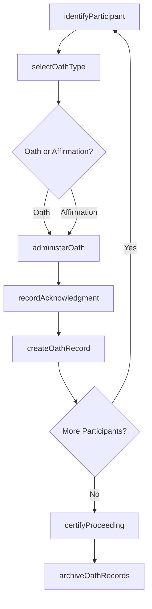
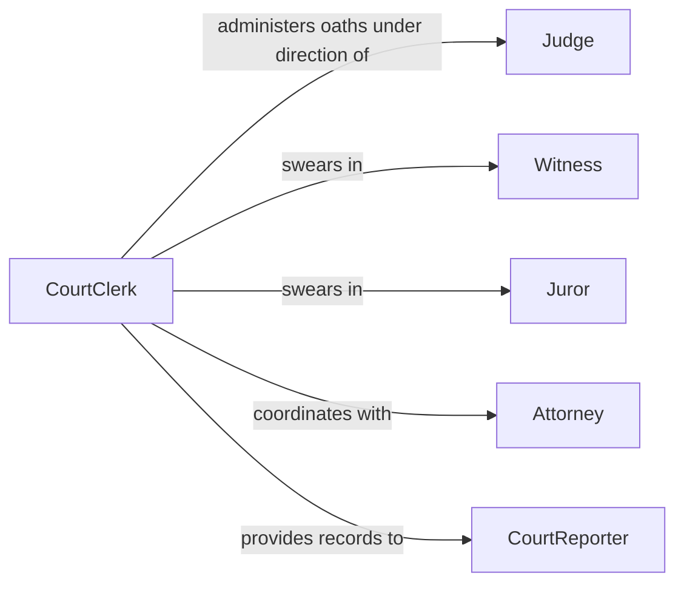

# Administer Oaths Court Participants

> Business-as-Code definition for administering oaths to court participants. Models the complete oath administration process from participant identification through oath delivery, acknowledgment recording, and compliance documentation.

## Overview

Administering oaths to court participants involves verifying participant identity, delivering the appropriate oath or affirmation based on proceeding type, recording the participant's acknowledgment, and maintaining official records. This definition exposes actions for managing the oath administration workflow, events for tracking proceedings, and searches for retrieving oath records and participant histories.

## Actors

| Actor | Description |
|-------|-------------|
| Judge | Presiding judicial officer overseeing the proceeding |
| Witness | Individual called to provide sworn testimony |
| Juror | Member of the jury panel required to take an oath of service |
| Attorney | Legal counsel participating in the court proceeding |
| CourtReporter | Official transcriber documenting the proceedings |

## Roles

| Role | Description |
|------|-------------|
| CourtClerk | Administers oaths and manages courtroom procedural records |
| BailiffOfficer | Maintains courtroom order and assists with participant identification |
| RecordsAdministrator | Archives oath records and proceeding documentation |
| JudicialAdministrator | Oversees court administrative procedures and compliance |

## Entities

| Entity | Description |
|--------|-------------|
| Oath | A formal sworn statement binding a participant to truthfulness |
| Affirmation | A solemn declaration serving as an alternative to a religious oath |
| Proceeding | A court session in which oaths are administered |
| OathRecord | A documented record of an administered oath with participant details |
| ParticipantIdentification | Verified identity information for the oath recipient |
| ProceedingTranscript | The official written record of the court proceeding |

## Actions

| Action | Description |
|--------|-------------|
| identifyParticipant | Verify the identity of the individual receiving the oath |
| selectOathType | Determine the appropriate oath or affirmation based on context |
| administerOath | Deliver the oath or affirmation to the court participant |
| recordAcknowledgment | Document the participant's acceptance of the oath |
| createOathRecord | Generate an official record of the administered oath |
| certifyProceeding | Attest that all required oaths were properly administered |
| archiveOathRecords | Store oath records in the permanent court archive |

## Events

| Event | Description |
|-------|-------------|
| participantIdentified | A court participant's identity has been verified |
| oathTypeSelected | The appropriate oath or affirmation type has been determined |
| oathAdministered | An oath or affirmation has been delivered to a participant |
| acknowledgmentRecorded | The participant's acceptance of the oath has been documented |
| oathRecordCreated | An official oath record has been generated |
| proceedingCertified | All required oaths have been confirmed as properly administered |
| oathRecordsArchived | Oath records have been stored in the permanent archive |

## Searches

| Search | Description |
|--------|-------------|
| findOathRecords | List oath records by proceeding, participant, date, or type |
| getParticipantOathHistory | Retrieve oath history for a specific court participant |
| findProceedingsRequiringOaths | Locate upcoming proceedings where oaths must be administered |
| getOathsByProceeding | Retrieve all oaths administered during a specific proceeding |

## Workflow



## Actor Relationships



## Usage

### Calling Actions

```typescript
import { administerOathsCourtParticipants } from '@headlessly/administer-oaths-court-participants'

const oaths = administerOathsCourtParticipants()

// Identify participant and select oath type
const participant = await oaths.identifyParticipant({
  proceedingId: 'PROC-2026-0531',
  name: 'Jane Smith',
  role: 'witness',
  identificationMethod: 'government-id'
})

await oaths.selectOathType({
  participantId: participant.id,
  proceedingType: 'criminal-trial',
  preference: 'oath'
})

// Administer the oath and record acknowledgment
await oaths.administerOath({
  participantId: participant.id,
  proceedingId: 'PROC-2026-0531',
  administeredAt: '2026-02-05T09:15:00Z'
})

await oaths.recordAcknowledgment({
  participantId: participant.id,
  acknowledged: true
})

await oaths.createOathRecord({
  participantId: participant.id,
  proceedingId: 'PROC-2026-0531'
})
```

### Event-Driven Automation

```typescript
// Certify proceeding when all participants have taken oaths
oaths.oathRecordCreated(async ({ proceedingId }) => {
  const pending = await oaths.findProceedingsRequiringOaths({ proceedingId })
  if (pending.remainingParticipants === 0) {
    await oaths.certifyProceeding({ proceedingId })
  }
})

// Auto-archive records after certification
oaths.proceedingCertified(async ({ proceedingId }) => {
  await oaths.archiveOathRecords({ proceedingId })
})
```
