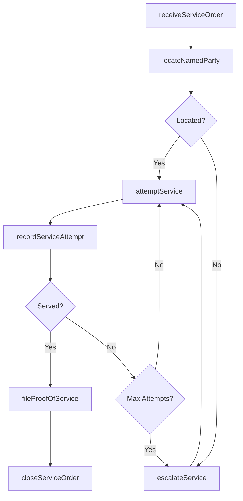
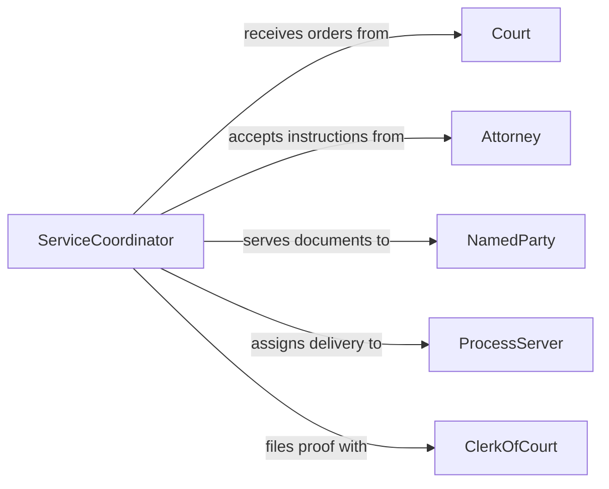

# Serve Court Ordered Documents

> Business-as-Code definition for serving court-ordered documents. Models the complete service of process lifecycle from document receipt through delivery attempts, proof of service filing, and compliance verification.

## Overview

Serving court-ordered documents involves receiving legal documents from the court or attorneys, locating the named parties, delivering the documents in compliance with jurisdictional rules, and filing proof of service. This definition exposes actions for managing each stage of the service process, events for tracking delivery attempts and outcomes, and searches for retrieving case and service records.

## Actors

| Actor | Description |
|-------|-------------|
| Court | Judicial body issuing the documents requiring service |
| Attorney | Legal counsel requesting service of process on behalf of a client |
| NamedParty | Individual or entity designated to receive the court documents |
| ProcessServer | Licensed individual authorized to deliver legal documents |
| ClerkOfCourt | Court official who receives and files proof of service |

## Roles

| Role | Description |
|------|-------------|
| ServiceCoordinator | Manages the assignment and tracking of document service |
| ProcessAgent | Physically delivers court-ordered documents to named parties |
| LegalAdministrator | Maintains records and ensures compliance with service rules |
| ComplianceOfficer | Verifies that service methods meet jurisdictional requirements |

## Entities

| Entity | Description |
|--------|-------------|
| ServiceOrder | An instruction to serve specific documents on a named party |
| CourtDocument | A legal document issued by the court requiring formal delivery |
| ServiceAttempt | A recorded instance of attempting to deliver documents |
| ProofOfService | A sworn affidavit confirming that documents were served |
| ServiceMethod | The manner of delivery such as personal, substituted, or by publication |
| CaseRecord | The associated legal case linked to the service order |

## Actions

| Action | Description |
|--------|-------------|
| receiveServiceOrder | Accept a new service order with documents and party details |
| locateNamedParty | Research and verify the current address of the party to be served |
| attemptService | Make a delivery attempt to serve documents on the named party |
| recordServiceAttempt | Document the details and outcome of a delivery attempt |
| fileProofOfService | Submit a sworn affidavit confirming successful service |
| escalateService | Request alternative service methods when standard delivery fails |
| closeServiceOrder | Finalize the service order after proof of service is filed |

## Events

| Event | Description |
|-------|-------------|
| serviceOrderReceived | A new service order has been accepted for processing |
| namedPartyLocated | The current address of the named party has been verified |
| serviceAttempted | A delivery attempt has been made on the named party |
| serviceCompleted | Documents have been successfully served on the named party |
| proofOfServiceFiled | A sworn affidavit of service has been submitted to the court |
| serviceEscalated | Alternative service methods have been requested |
| serviceOrderClosed | The service order has been finalized and archived |

## Searches

| Search | Description |
|--------|-------------|
| findServiceOrders | List service orders by case, status, named party, or date |
| getServiceAttempts | Retrieve delivery attempt history for a specific service order |
| findPendingService | Locate service orders awaiting initial or further attempts |
| getProofOfService | Retrieve filed proof of service documents by case or order |

## Workflow



## Actor Relationships



## Usage

### Calling Actions

```typescript
import { serveCourtOrderedDocuments } from '@headlessly/serve-court-ordered-documents'

const service = serveCourtOrderedDocuments()

// Receive a new service order
const order = await service.receiveServiceOrder({
  caseNumber: 'CV-2026-01234',
  documents: ['summons', 'complaint'],
  namedParty: {
    name: 'John Doe',
    lastKnownAddress: '123 Main St, Springfield, IL 62701'
  },
  deadline: '2026-03-15'
})

// Locate and attempt service
await service.locateNamedParty({ serviceOrderId: order.id })
const attempt = await service.attemptService({
  serviceOrderId: order.id,
  method: 'personal',
  date: '2026-02-06',
  time: '14:30'
})

// File proof of service
await service.fileProofOfService({
  serviceOrderId: order.id,
  attemptId: attempt.id,
  affidavit: { servedTo: 'John Doe', method: 'personal', date: '2026-02-06' }
})
```

### Event-Driven Automation

```typescript
// Alert when service deadline is approaching
service.serviceOrderReceived(async ({ serviceOrderId, deadline }) => {
  const warningDate = subtractDays(deadline, 7)
  await scheduleAt(warningDate, async () => {
    const order = await service.findServiceOrders({ id: serviceOrderId })
    if (order.status !== 'completed') {
      await notify({
        to: 'service-coordinator',
        message: `Service order ${serviceOrderId} deadline in 7 days`
      })
    }
  })
})

// Auto-escalate after three failed attempts
service.serviceAttempted(async ({ serviceOrderId, attemptNumber, success }) => {
  if (!success && attemptNumber >= 3) {
    await service.escalateService({
      serviceOrderId,
      reason: 'Three consecutive unsuccessful attempts'
    })
  }
})
```
