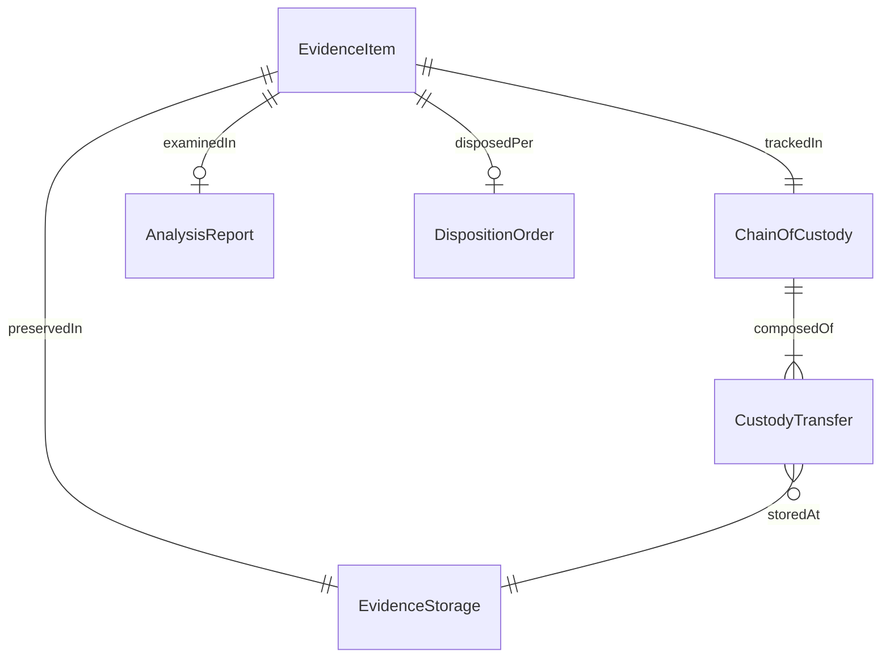
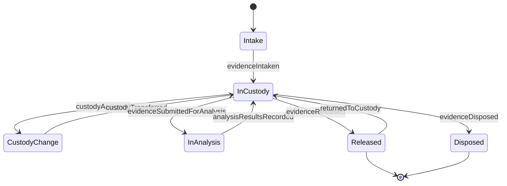
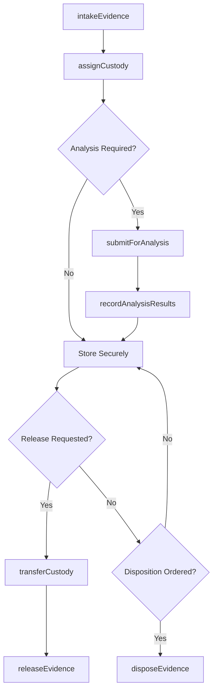
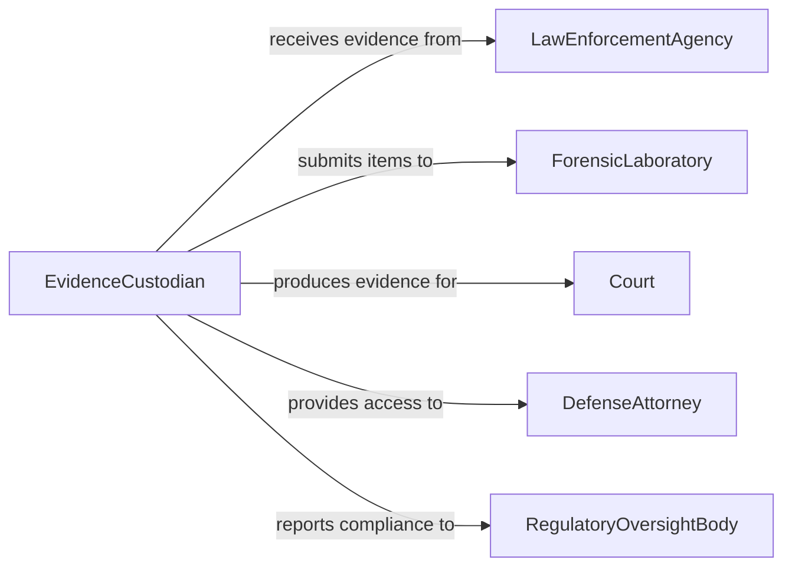

# Process Forensic Legal Evidence

> Business-as-Code definition for processing forensic and legal evidence. Models the complete evidence handling lifecycle from collection through chain-of-custody management, analysis, and archival.

## Overview

Processing forensic or legal evidence involves collecting, cataloging, preserving, and transferring evidence items while maintaining a strict chain of custody. This definition exposes actions for each phase of the evidence handling process, events for compliance tracking and audit triggers, and searches for retrieving evidence records and custody histories.

## Actors

| Actor | Description |
|-------|-------------|
| LawEnforcementAgency | Investigative body that collects and submits evidence |
| ForensicLaboratory | Facility that performs scientific analysis on evidence items |
| Court | Judicial body requiring evidence for legal proceedings |
| DefenseAttorney | Legal counsel requesting access to evidence for case review |
| RegulatoryOversightBody | Agency auditing evidence handling for procedural compliance |

## Roles

| Role | Description |
|------|-------------|
| EvidenceCustodian | Manages the intake, storage, and release of evidence items |
| ForensicAnalyst | Conducts scientific examination and testing of evidence |
| ChainOfCustodyOfficer | Maintains the documented transfer history of each evidence item |
| ComplianceAuditor | Verifies adherence to evidence handling procedures and standards |

## Entities

| Entity | Description |
|--------|-------------|
| EvidenceItem | A physical or digital item collected for forensic or legal purposes |
| ChainOfCustody | A documented record of every transfer and handler of an evidence item |
| CustodyTransfer | A single handoff event within the chain of custody |
| AnalysisReport | The results of forensic examination performed on evidence |
| EvidenceStorage | A secure location or vault where evidence items are preserved |
| DispositionOrder | A legal directive authorizing the release, return, or destruction of evidence |

## Actions

| Action | Description |
|--------|-------------|
| intakeEvidence | Accept and catalog a new evidence item into the system |
| assignCustody | Designate a custodian responsible for an evidence item |
| transferCustody | Record the handoff of an evidence item between authorized parties |
| submitForAnalysis | Send an evidence item to a forensic laboratory for examination |
| recordAnalysisResults | Document the findings from forensic analysis of an evidence item |
| releaseEvidence | Authorize the release of evidence to a requesting party |
| disposeEvidence | Execute the final disposition of evidence per legal directive |

## Events

| Event | Description |
|-------|-------------|
| evidenceIntaken | A new evidence item has been accepted and cataloged |
| custodyAssigned | A custodian has been designated for an evidence item |
| custodyTransferred | An evidence item has been handed off between authorized parties |
| evidenceSubmittedForAnalysis | An evidence item has been sent to a forensic laboratory |
| analysisResultsRecorded | Forensic findings have been documented for an evidence item |
| evidenceReleased | An evidence item has been released to a requesting party |
| evidenceDisposed | Final disposition of an evidence item has been executed |

## Searches

| Search | Description |
|--------|-------------|
| findEvidenceItems | List evidence items by case, type, status, or custodian |
| getChainOfCustody | Retrieve the full custody transfer history for an evidence item |
| findPendingAnalysis | Locate evidence items awaiting forensic examination |
| getDispositionOrders | Retrieve pending or completed disposition directives |
| findEvidenceByCase | List all evidence items associated with a specific case |

## Entity Relationships



## State Diagram



## Workflow



## Actor Relationships



## Usage

### Calling Actions

```typescript
import { processForensicLegalEvidence } from '@headlessly/process-forensic-legal-evidence'

const evidence = processForensicLegalEvidence()

// Intake new evidence item
const item = await evidence.intakeEvidence({
  caseId: 'CASE-2026-0847',
  description: 'Digital storage device recovered from scene',
  type: 'digital-media',
  collectedBy: 'Officer Martinez',
  collectionDate: '2026-02-04'
})

// Assign custody and submit for analysis
await evidence.assignCustody({
  evidenceId: item.id,
  custodianId: 'custodian-johnson'
})

await evidence.submitForAnalysis({
  evidenceId: item.id,
  laboratoryId: 'lab-forensics-central',
  analysisType: 'digital-forensics'
})

// Record results when analysis completes
await evidence.recordAnalysisResults({
  evidenceId: item.id,
  findings: 'Recovered 2,847 files including 312 relevant documents',
  reportUrl: 'https://lab.example.com/reports/FR-2026-0412'
})
```

### Event-Driven Automation

```typescript
// Maintain chain of custody on every transfer
evidence.custodyTransferred(async ({ evidenceId, fromCustodian, toCustodian, timestamp }) => {
  await auditLog({
    entity: 'evidence',
    action: 'custody-transfer',
    evidenceId,
    from: fromCustodian,
    to: toCustodian,
    timestamp
  })
})

// Alert compliance when disposition is executed
evidence.evidenceDisposed(async ({ evidenceId, dispositionType, caseId }) => {
  await notify({
    to: 'compliance-team',
    message: `Evidence ${evidenceId} for case ${caseId} disposed via ${dispositionType}`
  })
})
```
