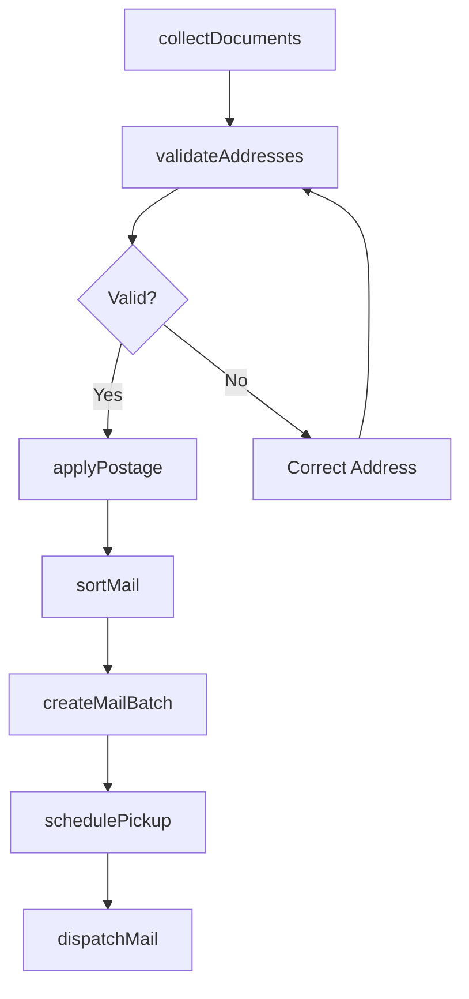
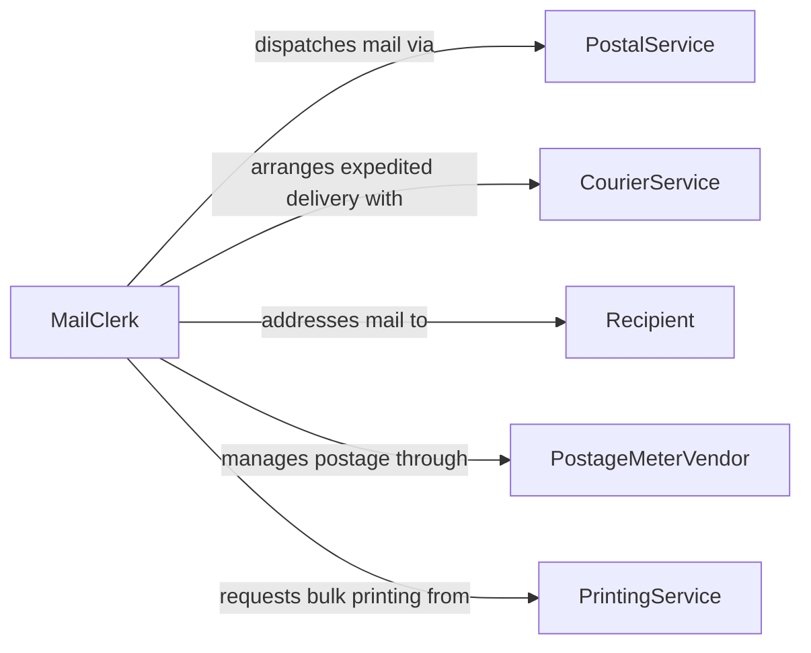

# Prepare Outgoing Mail

> Business-as-Code definition for preparing outgoing mail. Models the complete outbound mail process from document collection through postage application and carrier handoff.

## Overview

Preparing outgoing mail involves collecting documents and correspondence, verifying addresses, applying postage, and arranging carrier pickup or drop-off. This definition exposes actions for each stage of the outbound mail preparation process, events for tracking mail through the pipeline, and searches for retrieving mail batch and delivery data.

## Actors

| Actor | Description |
|-------|-------------|
| PostalService | National mail carrier responsible for standard delivery |
| CourierService | Private carrier providing expedited delivery options |
| Recipient | Individual or organization receiving the outgoing mail |
| PostageMeterVendor | Supplier of postage metering equipment and funds |
| PrintingService | External provider for bulk document printing and finishing |

## Roles

| Role | Description |
|------|-------------|
| MailClerk | Prepares, sorts, and dispatches outgoing mail items |
| OfficeAdministrator | Oversees mail operations and manages mail room procedures |
| DocumentCoordinator | Collects and organizes materials for mailing |
| MailroomSupervisor | Manages mail room staff and ensures timely dispatch |

## Entities

| Entity | Description |
|--------|-------------|
| MailItem | An individual piece of outgoing correspondence or package |
| MailBatch | A grouped collection of mail items prepared for dispatch |
| AddressRecord | Validated recipient address with delivery specifications |
| PostageAccount | Account for tracking postage usage and expenditures |
| MailingLabel | Printed label with destination address and tracking information |
| PickupSchedule | Scheduled time for carrier collection of outbound mail |

## Actions

| Action | Description |
|--------|-------------|
| collectDocuments | Gather documents and materials designated for mailing |
| validateAddresses | Verify recipient addresses against postal standards |
| applyPostage | Calculate and affix correct postage to each mail item |
| sortMail | Organize mail items by destination, class, or carrier |
| createMailBatch | Group sorted mail items into a batch for dispatch |
| schedulePickup | Arrange carrier pickup of prepared mail batches |
| dispatchMail | Release prepared mail to the carrier for delivery |

## Events

| Event | Description |
|-------|-------------|
| documentsCollected | Documents have been gathered for mailing |
| addressesValidated | Recipient addresses have been verified |
| postageApplied | Correct postage has been affixed to mail items |
| mailSorted | Mail items have been organized by destination or class |
| mailBatchCreated | A batch of mail items has been grouped for dispatch |
| pickupScheduled | Carrier pickup has been arranged for a mail batch |
| mailDispatched | Prepared mail has been released to the carrier |

## Searches

| Search | Description |
|--------|-------------|
| findMailBatches | List mail batches by date, carrier, status, or destination |
| getPostageUsage | Retrieve postage expenditure by period or department |
| findPendingMail | Locate mail items awaiting preparation or dispatch |
| getPickupSchedule | Retrieve upcoming carrier pickup times and locations |

## Workflow



## Actor Relationships



## Usage

### Calling Actions

```typescript
import { prepareOutgoingMail } from '@headlessly/prepare-outgoing-mail'

const mail = prepareOutgoingMail()

// Collect and validate documents for mailing
const documents = await mail.collectDocuments({
  department: 'accounts-receivable',
  documentType: 'invoice-statements',
  period: '2026-01'
})

await mail.validateAddresses({ documentIds: documents.map(d => d.id) })

// Apply postage and create batch
await mail.applyPostage({
  documentIds: documents.map(d => d.id),
  mailClass: 'first-class'
})

const batch = await mail.createMailBatch({
  documentIds: documents.map(d => d.id),
  carrier: 'usps'
})

await mail.schedulePickup({ batchId: batch.id, date: '2026-02-06' })
```

### Event-Driven Automation

```typescript
// Auto-dispatch when pickup is scheduled
mail.pickupScheduled(async ({ batchId, pickupTime }) => {
  await mail.dispatchMail({ batchId })
  await notify({
    to: 'mailroom',
    message: `Batch ${batchId} ready for carrier pickup at ${pickupTime}`
  })
})

// Track postage spending by department
mail.postageApplied(async ({ batchId, totalPostage, department }) => {
  await recordExpense({
    department,
    category: 'postage',
    amount: totalPostage,
    reference: batchId
  })
})
```
