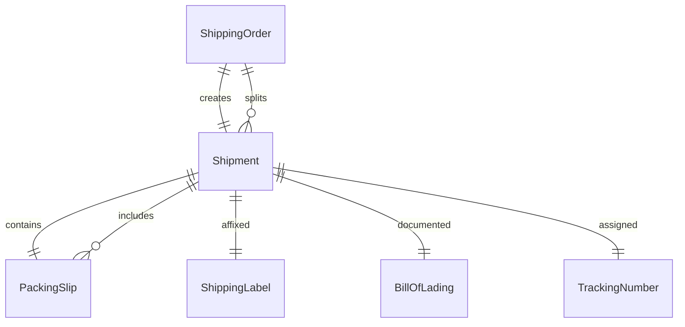
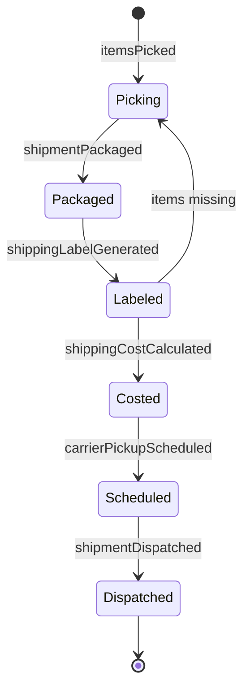
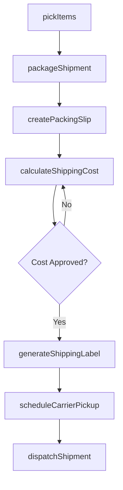
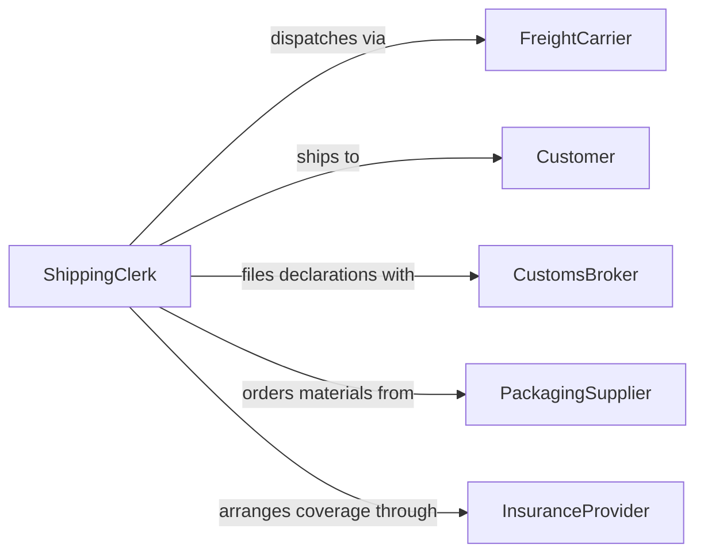

# Prepare Outgoing Shipments

> Business-as-Code definition for preparing outgoing shipments. Models the complete outbound shipping process from order picking through packaging, labeling, and carrier dispatch.

## Overview

Preparing outgoing shipments involves picking ordered items from inventory, packaging them securely, generating shipping labels and documentation, and coordinating carrier pickup or drop-off. This definition exposes actions for each stage of the outbound shipping pipeline, events for tracking shipment preparation progress, and searches for retrieving shipment and logistics data.

## Actors

| Actor | Description |
|-------|-------------|
| FreightCarrier | Transportation company providing shipping and delivery services |
| Customer | Individual or organization receiving the shipment |
| CustomsBroker | Agent handling customs declarations for international shipments |
| PackagingSupplier | Vendor providing boxes, padding, and packing materials |
| InsuranceProvider | Company offering cargo insurance for shipments in transit |

## Roles

| Role | Description |
|------|-------------|
| ShippingClerk | Packs, labels, and dispatches outgoing shipments |
| WarehousePicker | Retrieves ordered items from inventory storage locations |
| ShippingManager | Oversees shipping operations and carrier relationships |
| LogisticsCoordinator | Plans shipping routes and schedules carrier pickups |

## Entities

| Entity | Description |
|--------|-------------|
| Shipment | A collection of items packaged and dispatched to a destination |
| ShippingOrder | An instruction to ship specific items to a designated recipient |
| PackingSlip | A document listing the contents of a shipment |
| ShippingLabel | A label with carrier, tracking, and destination information |
| BillOfLading | A legal document between shipper and carrier for freight |
| TrackingNumber | A unique identifier for monitoring shipment transit status |

## Actions

| Action | Description |
|--------|-------------|
| pickItems | Retrieve ordered items from warehouse storage locations |
| packageShipment | Secure items in appropriate packaging materials |
| generateShippingLabel | Create carrier-specific labels with tracking information |
| createPackingSlip | Generate a document listing shipment contents |
| calculateShippingCost | Determine freight costs based on weight, dimensions, and destination |
| scheduleCarrierPickup | Arrange for the carrier to collect prepared shipments |
| dispatchShipment | Release the shipment to the carrier for transit |

## Events

| Event | Description |
|-------|-------------|
| itemsPicked | Ordered items have been retrieved from storage |
| shipmentPackaged | Items have been secured in packaging |
| shippingLabelGenerated | Carrier label with tracking has been created |
| packingSlipCreated | Shipment contents document has been generated |
| shippingCostCalculated | Freight costs have been determined |
| carrierPickupScheduled | Carrier collection has been arranged |
| shipmentDispatched | Shipment has been released to the carrier |

## Searches

| Search | Description |
|--------|-------------|
| findShipments | List shipments by status, carrier, destination, or date |
| getTrackingStatus | Retrieve current transit status for a shipment |
| findPendingShipments | Locate shipping orders awaiting preparation |
| getShippingCosts | Retrieve shipping expense data by period, carrier, or destination |

## Entity Relationships



## State Diagram



## Workflow



## Actor Relationships



## Usage

### Calling Actions

```typescript
import { prepareOutgoingShipments } from '@headlessly/prepare-outgoing-shipments'

const shipping = prepareOutgoingShipments()

// Pick and pack items for an order
const picked = await shipping.pickItems({
  orderId: 'ORD-20260205-001',
  items: [
    { sku: 'WIDGET-A100', quantity: 5, location: 'A3-B2' },
    { sku: 'WIDGET-B200', quantity: 2, location: 'C1-D4' }
  ]
})

await shipping.packageShipment({
  pickId: picked.id,
  packagingType: 'corrugated-box',
  weight: 12.5,
  dimensions: { length: 24, width: 18, height: 12 }
})

// Generate label and dispatch
const label = await shipping.generateShippingLabel({
  shipmentId: picked.shipmentId,
  carrier: 'fedex',
  service: 'ground'
})

await shipping.dispatchShipment({ shipmentId: picked.shipmentId })
```

### Event-Driven Automation

```typescript
// Notify customer when shipment is dispatched
shipping.shipmentDispatched(async ({ shipmentId, trackingNumber, customerId }) => {
  await notify({
    to: customerId,
    message: `Your order has shipped. Tracking: ${trackingNumber}`
  })
})

// Auto-schedule carrier pickup when batch is ready
shipping.shippingLabelGenerated(async ({ shipmentId, carrier }) => {
  const pending = await shipping.findPendingShipments({ carrier, status: 'labeled' })
  if (pending.length >= 10) {
    await shipping.scheduleCarrierPickup({ carrier, shipmentIds: pending.map(s => s.id) })
  }
})
```
