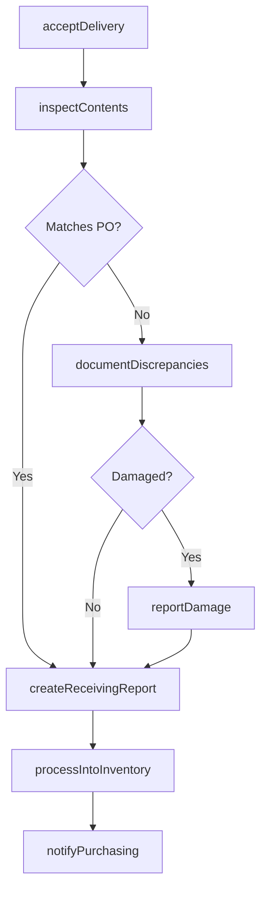
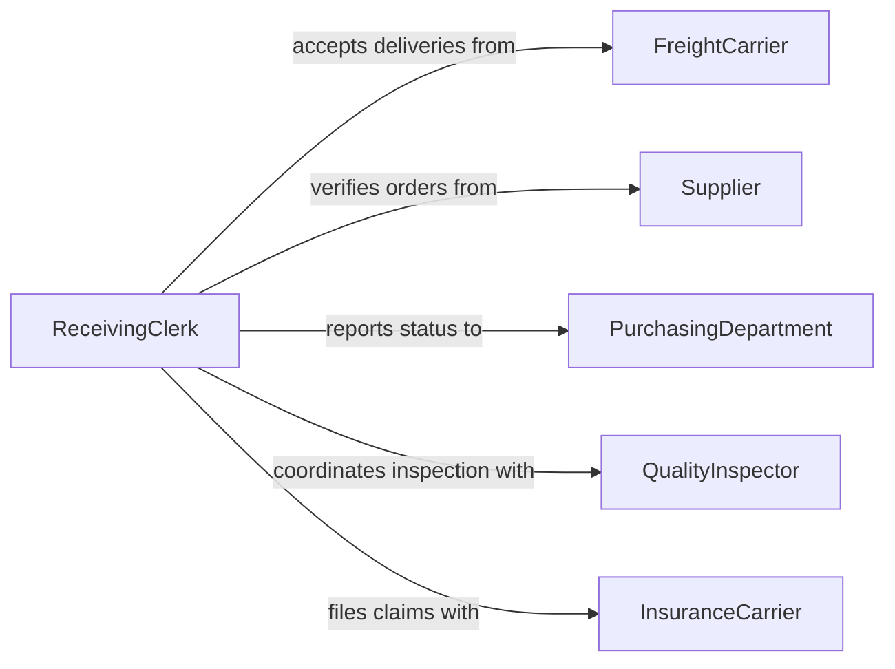

# Receive Shipments

> Business-as-Code definition for receiving shipments. Models the complete inbound receiving process from delivery acceptance through inspection, documentation, and inventory intake.

## Overview

Receiving shipments involves accepting deliveries from carriers, inspecting contents against purchase orders and packing slips, documenting any discrepancies or damage, and processing items into inventory. This definition exposes actions for each phase of the receiving workflow, events for triggering downstream processes, and searches for retrieving receiving and shipment data.

## Actors

| Actor | Description |
|-------|-------------|
| FreightCarrier | Transportation company delivering inbound shipments |
| Supplier | Vendor or manufacturer who originated the shipment |
| PurchasingDepartment | Internal team that placed the purchase order |
| QualityInspector | External or internal party verifying shipment quality standards |
| InsuranceCarrier | Company covering claims for damaged or lost goods in transit |

## Roles

| Role | Description |
|------|-------------|
| ReceivingClerk | Accepts deliveries, inspects contents, and logs receipts |
| WarehouseManager | Oversees the receiving dock and inventory intake operations |
| InventorySpecialist | Updates inventory records based on received items |
| ProcurementOfficer | Coordinates with suppliers on order fulfillment and discrepancies |

## Entities

| Entity | Description |
|--------|-------------|
| Shipment | An inbound delivery consisting of one or more packages |
| ReceivingReport | A document recording what was received, inspected, and accepted |
| PurchaseOrder | The original order document authorizing the procurement |
| PackingSlip | A supplier-provided list of shipment contents |
| DamageReport | A record of items found damaged or defective upon receipt |
| InventoryReceipt | A record updating stock levels based on received goods |

## Actions

| Action | Description |
|--------|-------------|
| acceptDelivery | Sign for and take possession of an inbound shipment |
| inspectContents | Verify shipment contents against the packing slip and purchase order |
| documentDiscrepancies | Record any differences between expected and received items |
| reportDamage | File a damage report for items found defective on arrival |
| createReceivingReport | Generate a formal record of the received shipment |
| processIntoInventory | Update inventory records with the received items |
| notifyPurchasing | Inform the purchasing department of receipt status |

## Events

| Event | Description |
|-------|-------------|
| deliveryAccepted | A shipment has been signed for and accepted at the dock |
| contentsInspected | Shipment contents have been verified against documentation |
| discrepanciesDocumented | Differences between expected and received items have been recorded |
| damageReported | A damage report has been filed for defective items |
| receivingReportCreated | A formal receiving record has been generated |
| processedIntoInventory | Received items have been added to inventory records |
| purchasingNotified | The purchasing department has been informed of receipt status |

## Searches

| Search | Description |
|--------|-------------|
| findShipments | List inbound shipments by carrier, supplier, date, or status |
| getReceivingReports | Retrieve receiving reports by date, supplier, or purchase order |
| findDiscrepancies | Locate shipments with documented discrepancies or shortages |
| getDamageReports | Retrieve damage reports by supplier, carrier, or date range |
| getPendingDeliveries | List expected shipments that have not yet arrived |

## Workflow



## Actor Relationships



## Usage

### Calling Actions

```typescript
import { receiveShipments } from '@headlessly/receive-shipments'

const receiving = receiveShipments()

// Accept and inspect a delivery
const delivery = await receiving.acceptDelivery({
  carrier: 'fedex',
  trackingNumber: 'FX-789456123',
  purchaseOrderId: 'PO-2026-0412'
})

const inspection = await receiving.inspectContents({
  shipmentId: delivery.id,
  expectedItems: [
    { sku: 'PART-A100', expectedQty: 100 },
    { sku: 'PART-B200', expectedQty: 50 }
  ]
})

// Handle discrepancies and process into inventory
if (inspection.discrepancies.length > 0) {
  await receiving.documentDiscrepancies({
    shipmentId: delivery.id,
    discrepancies: inspection.discrepancies
  })
}

await receiving.createReceivingReport({ shipmentId: delivery.id })
await receiving.processIntoInventory({ shipmentId: delivery.id })
```

### Event-Driven Automation

```typescript
// Auto-notify purchasing when discrepancies are found
receiving.discrepanciesDocumented(async ({ shipmentId, supplierId, discrepancies }) => {
  await receiving.notifyPurchasing({
    shipmentId,
    supplierId,
    issue: `${discrepancies.length} line items with quantity or item discrepancies`
  })
})

// File insurance claim when damage exceeds threshold
receiving.damageReported(async ({ shipmentId, carrierId, damageValue }) => {
  if (damageValue > 500) {
    await fileClaim({
      carrier: carrierId,
      shipmentId,
      amount: damageValue,
      type: 'transit-damage'
    })
  }
})
```
