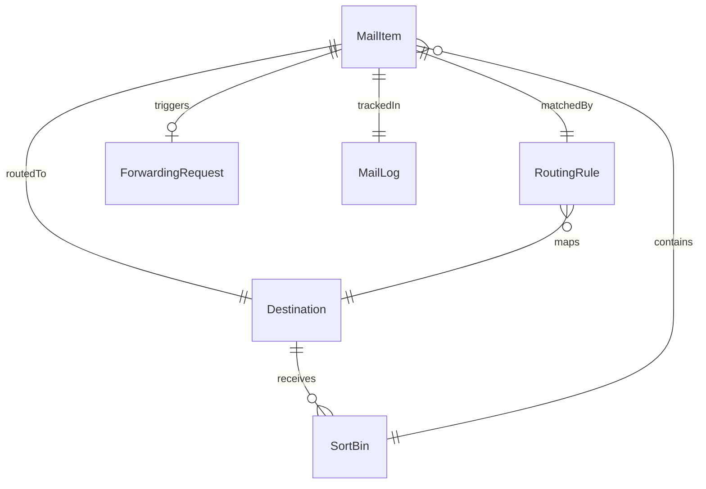
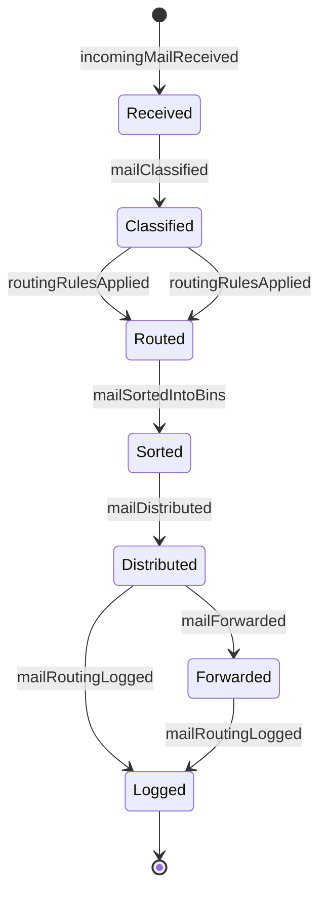
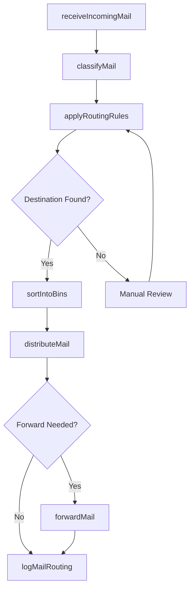
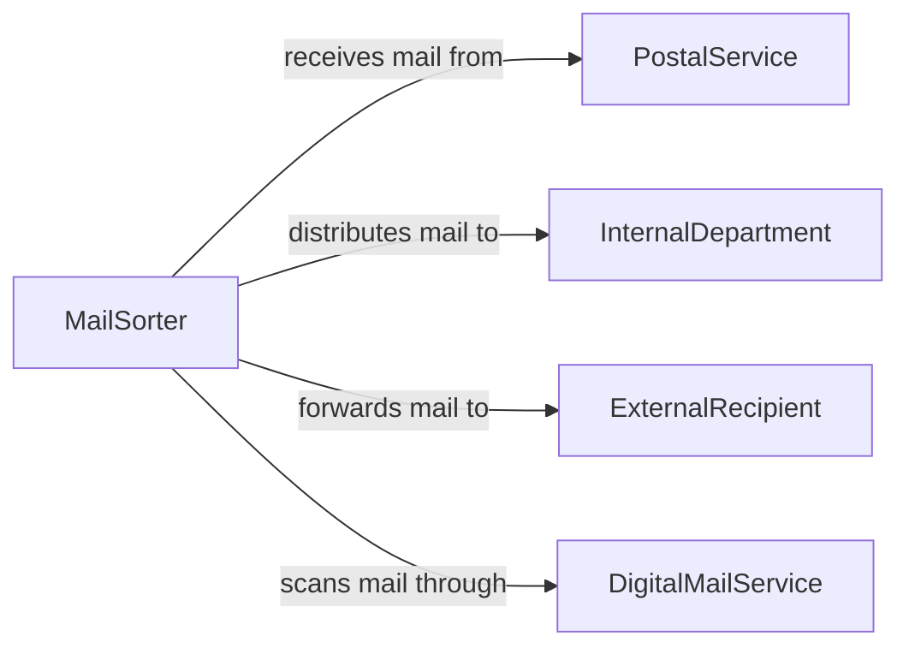

# Route Mail Correct Destinations

> Business-as-Code definition for routing mail to correct destinations. Models the complete mail sorting and distribution process from intake through classification, routing, and final delivery to internal or external recipients.

## Overview

Routing mail to correct destinations involves receiving incoming mail, classifying it by type and urgency, determining the appropriate recipient or department, and distributing it through internal or external channels. This definition exposes actions for each step of the mail routing process, events for tracking distribution status, and searches for auditing mail flow across the organization.

## Actors

| Actor | Description |
|-------|-------------|
| PostalService | External carrier delivering incoming mail to the organization |
| InternalDepartment | Business unit or team receiving routed mail items |
| ExternalRecipient | Party outside the organization to whom mail is forwarded |
| DigitalMailService | Platform for scanning and digitizing physical mail |

## Roles

| Role | Description |
|------|-------------|
| MailSorter | Classifies and routes incoming mail to appropriate destinations |
| MailroomSupervisor | Oversees mail distribution operations and resolves routing issues |
| ReceptionCoordinator | Manages front-desk mail intake and initial sorting |
| RecordsAdministrator | Logs and tracks mail routing for compliance and audit purposes |

## Entities

| Entity | Description |
|--------|-------------|
| MailItem | An individual piece of incoming or internal correspondence |
| RoutingRule | A configured rule mapping mail attributes to destinations |
| Destination | A department, individual, or address to which mail is directed |
| MailLog | An audit record of mail received, sorted, and distributed |
| SortBin | A physical or logical container for grouped mail items |
| ForwardingRequest | An instruction to redirect mail to an alternate destination |

## Actions

| Action | Description |
|--------|-------------|
| receiveIncomingMail | Accept and log mail delivered to the organization |
| classifyMail | Categorize mail by type, urgency, and intended recipient |
| applyRoutingRules | Match mail items to configured routing destinations |
| sortIntoBins | Place classified mail into distribution bins by destination |
| distributeMail | Deliver sorted mail to the designated recipients or departments |
| forwardMail | Redirect mail to an alternate address or recipient |
| logMailRouting | Record routing details for compliance and tracking |

## Events

| Event | Description |
|-------|-------------|
| incomingMailReceived | Mail has been accepted and logged at the mailroom |
| mailClassified | Mail has been categorized by type and urgency |
| routingRulesApplied | Mail items have been matched to their destinations |
| mailSortedIntoBins | Mail has been placed in distribution bins |
| mailDistributed | Mail has been delivered to the designated recipients |
| mailForwarded | Mail has been redirected to an alternate destination |
| mailRoutingLogged | Routing details have been recorded in the audit trail |

## Searches

| Search | Description |
|--------|-------------|
| findMailItems | List mail items by date, sender, recipient, or status |
| getRoutingRules | Retrieve configured routing rules by department or mail type |
| findUndeliveredMail | Locate mail items that have not yet been distributed |
| getMailLog | Retrieve the routing audit trail for a specific mail item or period |

## Entity Relationships



## State Diagram



## Workflow



## Actor Relationships



## Usage

### Calling Actions

```typescript
import { routeMailCorrectDestinations } from '@headlessly/route-mail-correct-destinations'

const mailRouting = routeMailCorrectDestinations()

// Receive and classify incoming mail
const mailItem = await mailRouting.receiveIncomingMail({
  sender: 'State Tax Authority',
  type: 'certified',
  receivedDate: '2026-02-05'
})

await mailRouting.classifyMail({
  mailItemId: mailItem.id,
  category: 'legal-correspondence',
  urgency: 'high'
})

// Apply routing and distribute
await mailRouting.applyRoutingRules({ mailItemId: mailItem.id })
await mailRouting.sortIntoBins({ mailItemIds: [mailItem.id] })
await mailRouting.distributeMail({ binId: 'legal-department' })
```

### Event-Driven Automation

```typescript
// Auto-route mail based on classification
mailRouting.mailClassified(async ({ mailItemId, category, urgency }) => {
  await mailRouting.applyRoutingRules({ mailItemId })
  if (urgency === 'high') {
    await notify({
      to: 'mailroom-supervisor',
      message: `Urgent ${category} mail requires immediate distribution`
    })
  }
})

// Log all distributed mail for compliance
mailRouting.mailDistributed(async ({ mailItemId, destination, distributedAt }) => {
  await mailRouting.logMailRouting({
    mailItemId,
    destination,
    distributedAt,
    status: 'delivered'
  })
})
```
