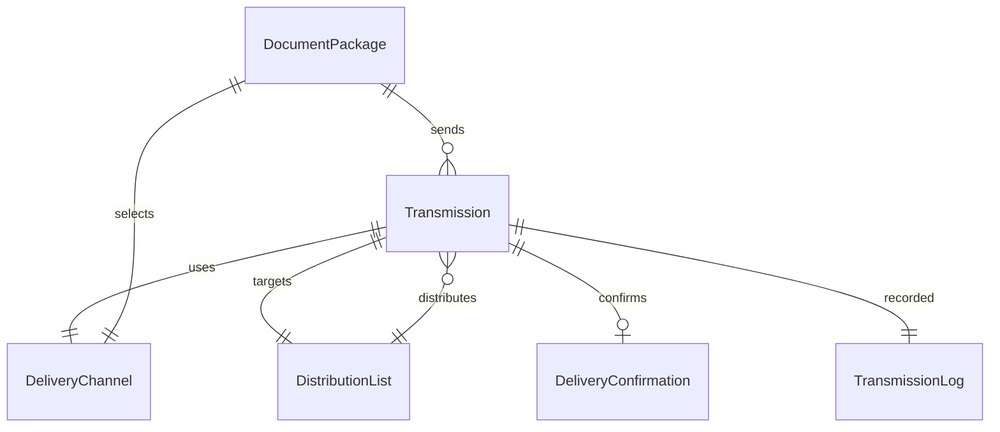
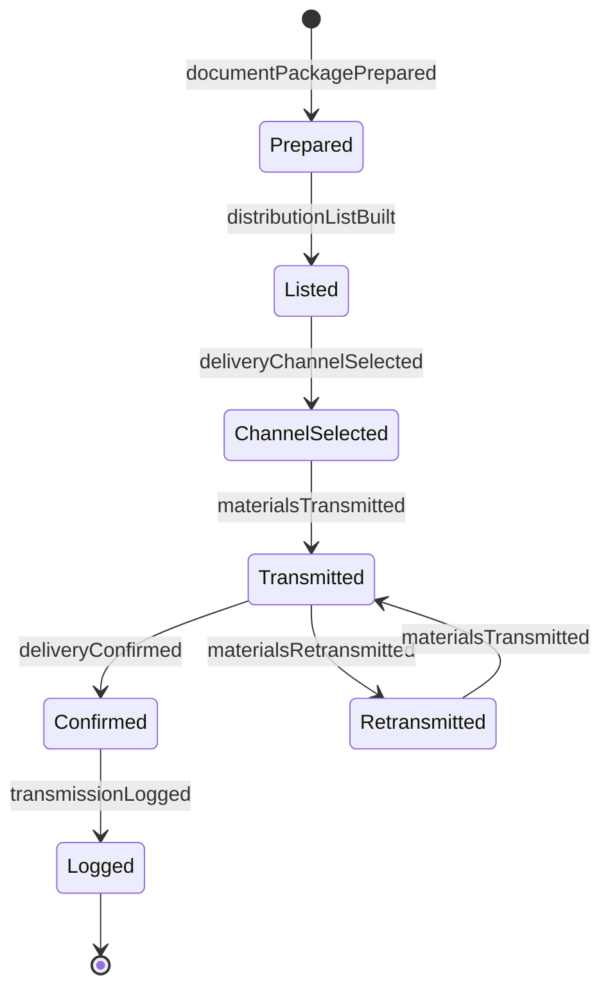
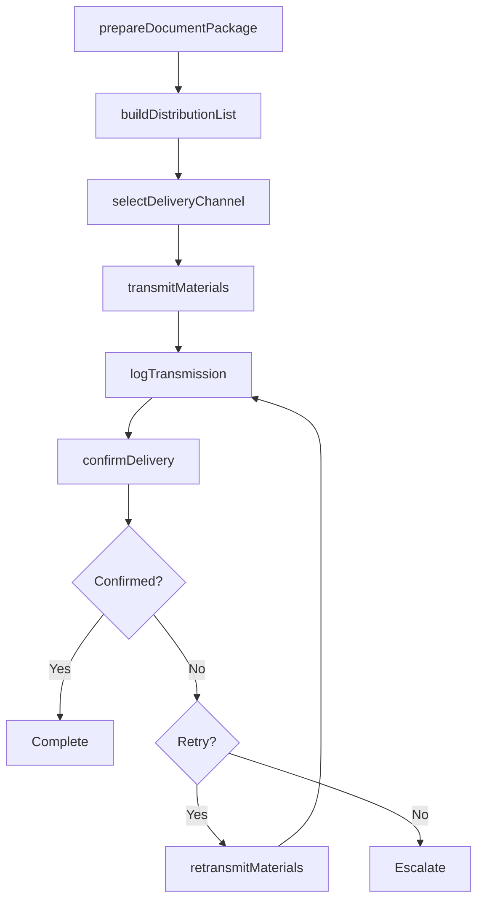
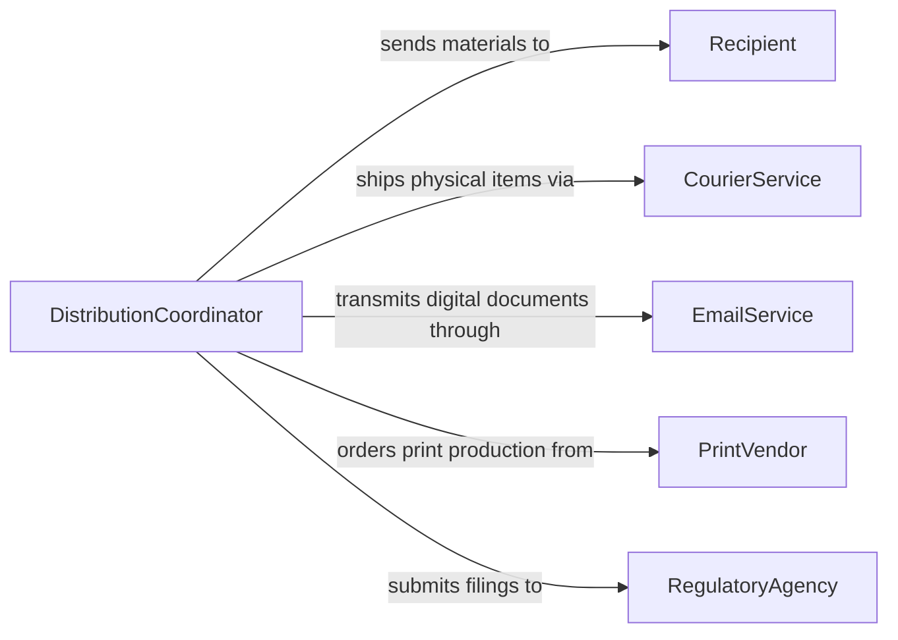

# Send Information Materials Documentation

> Business-as-Code definition for sending information, materials, or documentation. Models the complete distribution lifecycle from content preparation through delivery confirmation across physical and digital channels.

## Overview

Sending information, materials, or documentation involves identifying the content to distribute, selecting the appropriate delivery channel, preparing materials for transmission, and confirming receipt. This definition exposes actions for managing multi-channel distribution workflows, events for tracking delivery status, and searches for auditing sent materials.

## Actors

| Actor | Description |
|-------|-------------|
| Recipient | Individual or organization receiving the information or materials |
| CourierService | Carrier handling physical delivery of documents and materials |
| EmailService | Platform for electronic delivery of digital documents |
| PrintVendor | External provider for document reproduction and binding |
| RegulatoryAgency | Government body requiring mandated document submissions |

## Roles

| Role | Description |
|------|-------------|
| DistributionCoordinator | Manages the end-to-end process of sending materials |
| ContentPreparer | Assembles and formats information for distribution |
| RecordsClerk | Logs and tracks all outbound transmissions |
| ComplianceSpecialist | Ensures regulated documents meet submission requirements |

## Entities

| Entity | Description |
|--------|-------------|
| Transmission | A record of an outbound information delivery event |
| DocumentPackage | A bundled set of materials prepared for distribution |
| DeliveryChannel | The method used to transmit materials such as mail, email, or portal |
| DistributionList | A curated list of recipients for a given transmission |
| DeliveryConfirmation | Proof that materials were received by the intended recipient |
| TransmissionLog | An audit trail of all sent materials with timestamps |

## Actions

| Action | Description |
|--------|-------------|
| prepareDocumentPackage | Assemble and format materials for distribution |
| selectDeliveryChannel | Determine the appropriate channel based on content and urgency |
| buildDistributionList | Compile the list of recipients for a given transmission |
| transmitMaterials | Send the prepared materials through the selected channel |
| confirmDelivery | Verify that the recipient has received the materials |
| logTransmission | Record the transmission details in the audit trail |
| retransmitMaterials | Resend materials that failed to reach the recipient |

## Events

| Event | Description |
|-------|-------------|
| documentPackagePrepared | Materials have been assembled and formatted for sending |
| deliveryChannelSelected | The transmission method has been determined |
| distributionListBuilt | The recipient list has been compiled |
| materialsTransmitted | Materials have been sent through the selected channel |
| deliveryConfirmed | Recipient has acknowledged receipt of the materials |
| transmissionLogged | Transmission details have been recorded in the audit trail |
| materialsRetransmitted | Previously failed materials have been resent |

## Searches

| Search | Description |
|--------|-------------|
| findTransmissions | List transmissions by recipient, date, channel, or status |
| getDeliveryStatus | Check the current delivery status of a specific transmission |
| findUnconfirmedDeliveries | Locate transmissions awaiting delivery confirmation |
| getTransmissionHistory | Retrieve the full send history for a document or recipient |

## Entity Relationships



## State Diagram



## Workflow



## Actor Relationships



## Usage

### Calling Actions

```typescript
import { sendInformationMaterialsDocumentation } from '@headlessly/send-information-materials-documentation'

const distribution = sendInformationMaterialsDocumentation()

// Prepare and send a document package
const pkg = await distribution.prepareDocumentPackage({
  title: 'Q1 Compliance Report',
  documents: ['report-q1-2026.pdf', 'appendix-a.pdf'],
  format: 'pdf'
})

const recipients = await distribution.buildDistributionList({
  groups: ['board-of-directors', 'regulatory-contacts']
})

await distribution.selectDeliveryChannel({
  packageId: pkg.id,
  channel: 'secure-email'
})

await distribution.transmitMaterials({
  packageId: pkg.id,
  distributionListId: recipients.id
})
```

### Event-Driven Automation

```typescript
// Auto-confirm delivery for digital channels
distribution.materialsTransmitted(async ({ transmissionId, channel }) => {
  if (channel === 'secure-email') {
    await distribution.confirmDelivery({ transmissionId, method: 'read-receipt' })
  }
})

// Retry failed deliveries automatically
distribution.transmissionLogged(async ({ transmissionId, status }) => {
  if (status === 'failed') {
    await distribution.retransmitMaterials({ transmissionId })
  }
})
```
